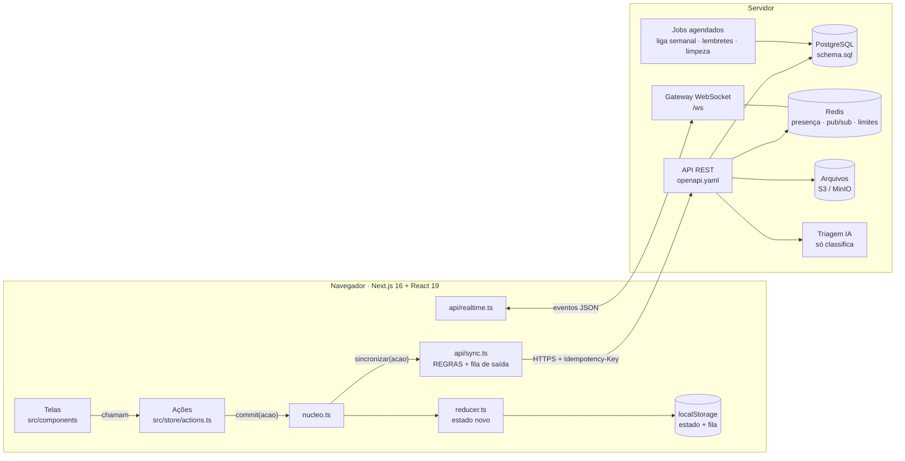
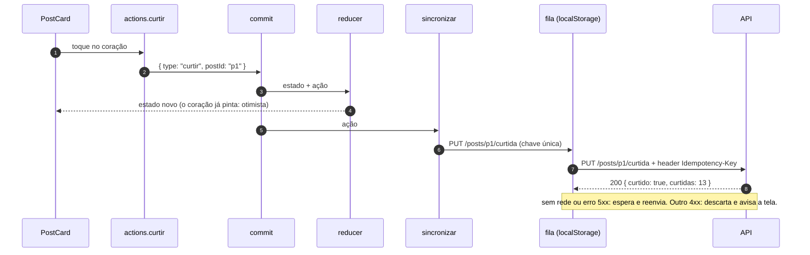
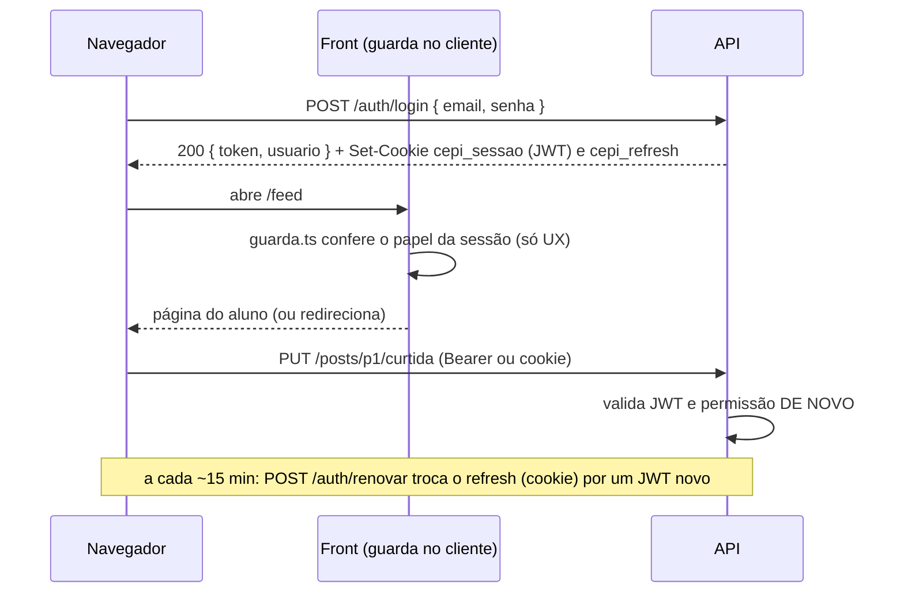

# Backend do Portal do Aluno — guia de integração

> Para quem vai construir a API do Portal do Aluno CEPI. O front já está pronto e funciona sozinho no navegador;
> este guia explica **o que o backend precisa fazer, em que ordem e por quê**. Leia de cima para baixo na primeira vez.

**Arquivos que acompanham este guia**

| Arquivo | Para que serve |
| --- | --- |
| [`docs/api/openapi.yaml`](api/openapi.yaml) | Contrato REST completo (OpenAPI 3.1): 117 endpoints, schemas, erros, exemplos. Abra no [Swagger Editor](https://editor.swagger.io) para navegar. |
| [`docs/api/schema.sql`](api/schema.sql) | Banco PostgreSQL pronto para rodar: tabelas, enums, chaves, índices, gatilhos e views de ranking. |
| [`src/api/endpoints.ts`](../src/api/endpoints.ts) | O mesmo catálogo em TypeScript, tipado: o front chama `chamar(ENDPOINTS.feed.curtir, …)`. |
| [`src/api/dto.ts`](../src/api/dto.ts) | Formatos dos corpos e respostas que diferem do estado do app. |
| [`src/api/sync.ts`](../src/api/sync.ts) | Ponte ação → requisição, com fila de saída offline (outbox). |
| [`src/api/realtime.ts`](../src/api/realtime.ts) | Cliente WebSocket para salas, notificações e campeonatos (hoje ligado só para notificações, só no modo http). |
| [`.env.example`](../.env.example) | Variáveis para ligar o front na API. |

## Sumário

1. [Visão geral](#1-visão-geral)
2. [Arquitetura](#2-arquitetura)
3. [Como o front está organizado](#3-como-o-front-está-organizado)
4. [Como ligar a API](#4-como-ligar-a-api)
5. [Autenticação e papéis](#5-autenticação-e-papéis)
6. [Modelo de dados](#6-modelo-de-dados)
7. [Endpoints ↔ ações do front](#7-endpoints--ações-do-front) (inclui o [feed do professor](#72-feed-do-professor-feed-compartilhado) e os [estados de erro e simulações](#73-estados-de-erro-e-simulações))
8. [Tempo real](#8-tempo-real)
9. [Regras de negócio que o backend DEVE garantir](#9-regras-de-negócio-que-o-backend-deve-garantir) (inclui [jobs do servidor](#912-virada-do-dia-lembretes-e-fechamentos-tarefas-do-servidor) e [segurança de arquivos e cabeçalhos](#913-segurança-de-arquivos-planilhas-e-cabeçalhos))
10. [Sugestão de stack](#10-sugestão-de-stack)
11. [Checklist de integração](#11-checklist-de-integração)
12. [Dados iniciais (seed)](#12-dados-iniciais-seed)
13. [Perguntas frequentes](#13-perguntas-frequentes)

---

## 1. Visão geral

**Hoje** o Portal é um protótipo 100% no navegador: todo o estado (posts, pontos, salas, campeonatos…) vive num
objeto único, muda por um *reducer* puro e é salvo no `localStorage`. Colegas, professores e adversários são
**simulados** por temporizadores (`agendar(...)` nas ações). Isso faz a demo funcionar sem servidor.

**O que já está pronto para o backend ("meio caminho andado")**

- O front já sabe falar HTTP: `src/api/client.ts` (Bearer + cookie, erros `{ codigo, mensagem }`).
- O login já chama `POST /auth/login` quando a API está configurada.
- **Toda** mudança de estado já passa por um único ponto (`commit`) que chama `sincronizar(acao)`: o
  `sync.ts` traduz cada ação numa requisição e a coloca numa **fila de saída** que funciona offline.
- O contrato está escrito (OpenAPI + tipos TS) e o banco está modelado (SQL testado em PostgreSQL).

**O que falta**

1. Construir a API seguindo `openapi.yaml` e as [regras da seção 9](#9-regras-de-negócio-que-o-backend-deve-garantir).
2. Pequenos ajustes no front, listados no [checklist](#11-checklist-de-integração) (carregar o estado inicial do
   servidor, desligar simulações, chamar os endpoints de quiz direto).

> **Princípio de ouro:** o front é "otimista" — ele mostra o resultado na hora e avisa o servidor depois.
> Por isso **o servidor nunca confia em números vindos do cliente**: pontos, XP, placar, nota → pontos, gabarito,
> voucher e triagem são sempre calculados no servidor. O cliente só diz **o que o usuário fez**.

---

## 2. Arquitetura



- **API REST**: recebe as ações, aplica as regras, grava no PostgreSQL e publica eventos no Redis.
- **Gateway WebSocket**: assina os canais do Redis e entrega os eventos a quem está conectado.
- **Jobs**: fechamento semanal das ligas (domingo 23:59), lembretes de prazo, limpeza (idempotência, retenção LGPD).
- **Triagem IA**: classifica denúncias e sinaliza textos ofensivos. **Nunca decide** — quem decide é uma pessoa.

---

## 3. Como o front está organizado

| Arquivo | Papel |
| --- | --- |
| `src/store/types.ts` | Tipos do domínio (`Post`, `Usuario`, `Campeonato`…). A API devolve estes mesmos formatos. |
| `src/store/reducer.ts` | O tipo `Acao` (todas as mudanças possíveis) e o reducer puro. |
| `src/store/store.ts` | Guarda o estado, salva no `localStorage`, `despachar(acao)`, hooks `useEstado`/`useSeletor`. |
| `src/store/nucleo.ts` | `commit(acao)`: roda o reducer **e** chama `sincronizar(acao)`; também `premiar`, `notificar`. |
| `src/store/actions.ts` + `acoes/*.ts` | Fluxos de usuário (curtir, publicar, entregar atividade…). As telas só chamam isto. |
| `src/store/seed.ts` + `src/data/*` | Estado inicial da demonstração (vira o seed do banco — seção 12). |
| `src/api/*` | Tudo que fala com o backend (este guia). |

### O caminho de uma ação até a API

Exemplo: a aluna curte um post.



Em `src/api/sync.ts` existe **uma regra para cada tipo de ação** (o TypeScript não compila se faltar uma).
Cada regra devolve uma requisição ou `null`. Há quatro famílias:

| Família | Exemplos | O que acontece |
| --- | --- | --- |
| **Criação** com id do cliente | `publicar`, `responder`, `comprar`, `registrarSessao` | `POST` com o `id` gerado no front; a chave de idempotência é fixa (`post:p1…`). |
| **Evento** | `missaoProgresso`, `responderCarta`, `entrarSala` | Um fato novo a cada vez; chave aleatória. |
| **Estado desejado** | `curtir`, `salvar`, `equipar`, `definirPrivacidade` | `PUT`/`DELETE` idempotentes; se houver outro pedido do mesmo recurso na fila, **o mais novo substitui** (curtir → descurtir → curtir offline = 1 pedido). |
| **Não sobe** (`null`) | `premiar`, `notificar`, `notificarVarios`, `desbloquearMedalha`, `virarDia`, `confirmarEnvio`, `virarCarta`, `adiantarTimer`, `ajustarSaida`, `dispensarFocoPerdido`, `selecionarEspaco`, `membrosSala` | Calculado pelo servidor (pontos, XP, medalhas, notificações, virada do dia), só visual, só da demo ou chega pelo tempo real. |

### A fila de saída (outbox)

- Salva em `localStorage["cepi-api-fila"]`: sobrevive a recarregar a página e a ficar sem internet.
- Envia **um por vez, em ordem** (a criação do post chega antes da curtida nele).
- Rede caiu / 408 / 429 / 401 / 5xx → espera **1 s, 2 s, 4 s… até 5 min** (mais 0–20 % de variação, para os aparelhos
  não voltarem todos juntos) e tenta de novo; também tenta na hora em que o navegador volta a ficar `online` ou a aba
  volta a ficar visível. **Erro 5xx não descarta o pedido** (deploy ou queda do servidor não pode perder o que o aluno
  fez): só a validade de 7 dias o remove.
- Outros 4xx → descarta, guarda em `cepi-api-rejeitadas` (sem o corpo, por privacidade) e dispara o evento de janela
  `cepi:sync-rejeitada`, que vira um aviso na tela. O estado otimista **ainda não é desfeito** (pendência, §11).
- 401 dispara `cepi:sessao-expirada` (aviso na tela; hora de chamar `POST /auth/renovar` ou voltar ao login).
- Cada pedido guarda o `usuarioId`: se outra pessoa entrar no mesmo computador, nada sai com o token errado. A fila é
  compartilhada por todas as contas do navegador, então **`sair()` apaga só os pedidos de quem saiu** (evento
  `cepi:sessao-encerrada`, `detail: { usuarioId }`) e nunca os da conta aberta em outra aba. O login dispara
  `cepi:sessao-iniciada` (`detail: { usuarioId, papel }`), que liga o tempo real. `lib/auth.ts` não importa
  `api/sync.ts` (sem ciclo): os dois conversam por esses eventos de janela.
- Só uma aba envia por vez (Web Locks). Pedidos com mais de 7 dias são descartados.
- Publicação feita sem conexão: o post aparece com o selo "Aguardando envio · salvo neste aparelho"
  (`Post.aguardandoEnvio`) até a fila entregar, e uma faixa "Sem conexão. Tentando retransmitir…" avisa no topo
  (`navigator.onLine`). Veja §7.3.
- **Arquivos reais**: anexos escolhidos pela pessoa ficam no IndexedDB do navegador (`src/lib/arquivos.ts`, `anexo.arquivoId`).
  Quando a ação leva um anexo (`publicar` de material, `criarAtividade`, entrega de atividade), o pedido na fila traz `arquivo`:
  antes de enviá-lo, a fila faz `POST /anexos` (multipart, campo `arquivo`, `Idempotency-Key: <chave>:anexo`), grava o `anexoId`
  devolvido no corpo (`anexoId` de `NovoPostCorpo`, `NovaAtividadeCorpo`, `EntregaCorpo`) e só então envia o pedido. O id do upload fica
  na própria fila, então um reenvio não sobe o arquivo de novo. Se o arquivo não existe neste navegador, o pedido segue sem anexo;
  se o upload for recusado de forma definitiva (413/415…), o pedido segue sem anexo e a recusa vai para `cepi-api-rejeitadas`.

### IDs gerados no cliente

O front cria os ids (`gerarId("p")` → `"p1kq2x9ab"`) antes de falar com o servidor — é isso que permite a tela
mudar na hora e a fila funcionar offline (a curtida no post `p1kq2x9ab` pode ser enviada antes de o servidor
"conhecer" o post, porque a fila respeita a ordem). O servidor deve:

1. aceitar ids de 1 a 64 caracteres `[A-Za-z0-9_:-]`;
2. se o id **não existe** → criar;
3. se o id **existe e é do mesmo dono com o mesmo conteúdo** → responder como se tivesse criado agora (idempotente);
4. se o id existe e é de outra pessoa → `409 conflito`.

### Idempotency-Key

Todo pedido da fila leva o header `Idempotency-Key`. Implementação sugerida (tabela `idempotencia` do SQL):

```text
middleware idempotencia(req):
  chave = req.headers["idempotency-key"]
  se não tem chave → segue normal
  salvo = SELECT status, resposta FROM idempotencia WHERE pessoa_id = req.usuario.id AND chave = chave
  se salvo → devolve salvo.status + salvo.resposta (NÃO executa de novo)
  senão → executa; se status < 500, INSERT (pessoa_id, chave, metodo, caminho, status, resposta)
job diário: DELETE FROM idempotencia WHERE criado_em < now() - interval '24 hours'
```

Se preferir não guardar a resposta, devolva `409` com `{ "codigo": "ja_processado" }` — a fila entende como sucesso.

### Duas regras de ouro para o front integrado

1. **Eventos que vêm do servidor** (tempo real, respostas) entram no estado com `despachar(acao)` de
   `src/store/store.ts`, **não** com `commit` — senão voltariam para o servidor pelo sync.
2. **Algumas telas precisam chamar a API direto** (não dá para ser "otimista" quando o servidor decide o resultado):

| Tela / fluxo | Chamada direta |
| --- | --- |
| Abrir o app | `chamar(ENDPOINTS.perfil.bootstrap)` → substitui o estado inicial |
| Duelo de campeonato | `abrirDuelo` → mostra perguntas → `responderDuelo` → mostra resultado |
| Rodada de pontos corridos | `abrirRodada` → `responderRodada` |
| Desafios personalizados | `desafios.abrir` → `desafios.responder` |
| Material com arquivo / entrega com anexo | `feed.enviarAnexo` (multipart) e depois o post/entrega com `anexoId` |
| Busca, ranking, listas paginadas, painel do professor | `GET` correspondente |
| Lembrar pendentes (professor) | `atividades.lembrarPendentes` (hoje sobe pela fila: `lembrarAlunos` com `atividadeId`) |

> **Pendência documentada (modo integrado):** a camada de **leitura** (`/me/bootstrap`, `GET /posts`, `GET /ranking/*`…)
> e as telas de **duelo, desafio e rodada** ainda **não** chamam os endpoints do servidor: com a API ligada, o app lê
> do estado local e joga duelos e desafios no navegador (o gabarito ainda está no pacote do front). Veja o
> [checklist](#11-checklist-de-integração), fases 2 e 7.

---

## 4. Como ligar a API

1. Crie `.env.local` na raiz do front (copie de `.env.example`):

   ```bash
   NEXT_PUBLIC_API_URL=http://localhost:3333
   NEXT_PUBLIC_WS_URL=ws://localhost:3333/ws
   ```

2. Reinicie o `npm run dev` (variáveis `NEXT_PUBLIC_*` são lidas na inicialização).
3. No backend, libere o CORS **para a origem exata** do front (não use `*`, porque o front envia cookies):

   ```text
   Access-Control-Allow-Origin: http://localhost:3000
   Access-Control-Allow-Credentials: true
   Access-Control-Allow-Headers: Authorization, Content-Type, Idempotency-Key
   Access-Control-Allow-Methods: GET, POST, PUT, PATCH, DELETE, OPTIONS
   ```

4. Teste: entre com `ana.moura@aluno.cepi.edu.br` / `cepi2026` (criada pelo seed). No DevTools → Network deve
   aparecer `POST /auth/login`. Curta um post e veja o `PUT /posts/…/curtida`. Em Application → Local Storage,
   a chave `cepi-api-fila` deve esvaziar sozinha.

| Modo | Quando | Comportamento |
| --- | --- | --- |
| `mock` | sem `NEXT_PUBLIC_API_URL` | Demo completa no navegador; `sync.ts` e `realtime.ts` não fazem nada. |
| `http` | com `NEXT_PUBLIC_API_URL` | Login real (`Authorization: Bearer` em todo pedido); ações vão para a fila; o tempo real conecta (notificações); os botões de acesso rápido da demo (token `"demo"`) não sincronizam. |

> Enquanto o passo "bootstrap" do checklist não for feito, o front em modo `http` ainda começa com os dados do
> seed local — por isso o seed do banco deve usar **os mesmos ids** de `src/data` (seção 12).

---

## 5. Autenticação e papéis

### Fluxo



- **JWT de acesso** (15 min), assinado de preferência com **ES256** (o front só precisa da chave pública).
  Claims: `sub` (id), `papel` (`aluno`/`professor`), `coord` (coordenação), `exp`.
- **Refresh token** opaco (30 dias), guardado **só o hash** em `sessoes_auth`, com rotação a cada uso
  (reuso de um refresh antigo = roubo → revoga todas as sessões da pessoa).
- **Cookies** emitidos pela API: `cepi_sessao` (JWT; `HttpOnly; Secure; SameSite=Lax; Path=/`) e
  `cepi_refresh` (`HttpOnly; Secure; SameSite=Strict; Path=/auth`).
- Senhas com **argon2id**; limite de 5 tentativas/min por e-mail+IP; mensagens que não revelam se o e-mail existe.

### Onde fica a guarda de rotas

O front **não usa mais `proxy.ts` nem o cookie `cepi_papel`**. A regra de acesso (login, home por papel, rotas
compartilhadas `/feed`, `/estudos/salas`, `/campeonatos`, `/pessoas`; aluno fora de `/professor/*`; professor fora das
áreas só da aluna — `/estudos`, `/missoes`, `/ranking`, `/loja`, `/perfil`, `/estatisticas` — e rota desconhecida =
página 404) está em `src/lib/guarda.ts` e roda **no cliente**, no `AppShell` (Next) e na demo em HTML único. O `/feed`
é **uma rota só para os dois papéis** (o professor também participa; veja §7.2); um link `/feed?post=id` sem sessão
leva ao login e volta ao post. A sessão fica no `sessionStorage` (uma por aba) e `src/lib/auth.ts` só apaga o cookie
antigo, se existir. `src/api/client.ts` lê o token dessa sessão (`sessionStorage["cepi-sessao"]`) e o envia em
`Authorization: Bearer` (cookie também, `credentials: "include"`). `sair()` chama `POST /auth/sair` (revoga o refresh
token; um erro ali não trava a saída) e apaga a sessão da aba.
Isso é **só UX** (não piscar a tela errada): qualquer pessoa pode editar o `sessionStorage`; a segurança está no backend.

Na integração com a API real:

1. **A API valida tudo de novo em cada endpoint** — assinatura do JWT (ES256, chave pública em variável de ambiente),
   expiração, papel (`aluno`/`professor`), flag `coord` e dono do recurso. Esta é a única barreira de segurança.
2. **Opcional — checagem otimista no servidor do Next** (para não entregar nem o HTML de `/professor/*` a quem não é
   professor): recriar um `src/proxy.ts` que valide o JWT do cookie `cepi_sessao` (o proxy do Next 16 roda em Node e
   pode ser `async`; `crypto.subtle` já existe). Só funciona se API e site estiverem no mesmo domínio
   (ex.: `portal.cepiexpansao.com.br` e `api.cepiexpansao.com.br` com `Domain=cepiexpansao.com.br`); senão use um
   *route handler* do Next como intermediário (padrão BFF — `node_modules/next/dist/docs/01-app/02-guides/backend-for-frontend.md`).
   Não é solução de autorização: a própria documentação do Next diz isso.
3. **`src/lib/auth.ts`**: com o cookie httpOnly, pare de guardar o `token` no `sessionStorage` (um XSS poderia
   roubá-lo) — guarde só `{ papel, usuarioId, nome }` e deixe `credentials: "include"` levar o cookie.

### Papéis e permissões

| Recurso | Aluno | Professor | Coordenação (`coord`) |
| --- | --- | --- | --- |
| Feed: publicar, responder, curtir, salvar, denunciar | ✔ (espaços em que participa) | ✔ (curtir e salvar são por usuário) | ✔ |
| Feed: publicar Aviso / Material / Publicação **com destino** (toda a escola, 9º A, 9º B, 8º A) | — | ✔ (só turmas dele e escola) | ✔ |
| Aviso oficial | — | ✔ (turmas dele / escola) | ✔ |
| Resposta oficial fixada | — | ✔ (automático em dúvidas) | ✔ |
| Marcar resposta como útil | ✔ (autor da dúvida) | ✔ (resposta de aluno de dúvida das turmas dele) | ✔ |
| Remover publicação de aluno pelo feed (com motivo) | — | ✔ (turmas dele) | ✔ |
| Contestar a retenção de uma publicação | ✔ (só o autor, uma vez) | ✔ (só o autor) | — |
| Chat de sala | ✔ (na sala em que está) | ✔ | ✔ + mensagens retidas |
| Perfil (foto, bio, @), flashcards próprios | ✔ | ✔ (perfil) | ✔ |
| Estatísticas | ✔ (as suas) | ✔ (turmas dele) | ✔ |
| Entregar troca da loja, lembrar alunos | — | ✔ (turmas dele) | ✔ |
| Loja, sequência, missões, prática, desafios | ✔ | — | — |
| Salas: criar | ✔ (não oficial) | ✔ (oficial) | ✔ |
| Campeonatos: criar | ✔ amistoso (sem prêmio) | ✔ oficial | ✔ |
| Atividades: criar, corrigir, lembrar | — | ✔ **só nas suas turmas** | — |
| Atribuir pontos/XP | — | ✔ **só a alunos das suas turmas**, com limite | — |
| Painel da turma (métricas) | — | ✔ só suas turmas | ✔ |
| Moderação de posts | — | ✔ espaços das suas turmas | ✔ escola toda |
| Validar relatos da ouvidoria | — | — | ✔ |

Cada endpoint do `openapi.yaml` tem `x-acesso` (e cada entrada de `endpoints.ts` tem `acesso`) com o papel mínimo.

---

## 6. Modelo de dados

O [`schema.sql`](api/schema.sql) tem os detalhes (tipos, CHECKs, índices). O diagrama mostra **todas** as tabelas e
como se ligam:

```mermaid
erDiagram
  TURMAS ||--o{ PESSOAS : "alunos"
  TURMAS ||--o{ PROFESSOR_TURMAS : "tem"
  PESSOAS ||--o{ PROFESSOR_TURMAS : "leciona"
  PESSOAS ||--o{ CONSENTIMENTOS : "autorizado por responsável"
  PESSOAS ||--o| PERFIS_ALUNO : "gamificação"
  PESSOAS ||--o{ DOMINIOS : "domínio por disciplina"
  PESSOAS ||--o{ LANCAMENTOS : "extrato de pontos e XP"
  TURMAS ||--o{ ESPACOS : "espaço da turma"
  ESPACOS ||--o{ ESPACO_MEMBROS : "membros"
  PESSOAS ||--o{ ESPACO_MEMBROS : "participa"
  ESPACOS ||--o{ POSTS : "contém"
  PESSOAS ||--o{ POSTS : "escreve"
  ANEXOS |o--o{ POSTS : "arquivo"
  PESSOAS ||--o{ ANEXOS : "envia"
  POSTS ||--o{ RESPOSTAS : "tem"
  RESPOSTAS ||--o{ RESPOSTAS_UTEIS : "marcada útil"
  POSTS ||--o{ CURTIDAS : "recebe"
  POSTS ||--o{ SALVOS : "salvo por"
  POSTS ||--o{ MATERIAIS_ABERTOS : "aberto por"
  POSTS ||--o{ DENUNCIAS : "denunciado"
  POSTS ||--o{ MODERACOES : "decisões"
  SALA_MENSAGENS ||--o{ MODERACOES : "decisões (chat de sala)"
  PESSOAS ||--o{ FLASHCARDS_PROPRIOS : "cria"
  PESSOAS ||--o{ FLASHCARDS_CAIXAS : "Leitner"
  PESSOAS ||--o{ LEMBRETES_PROFESSOR : "avisada (trava 6 h)"
  MISSOES ||--o{ MISSAO_PROGRESSO : "progresso por dia"
  PESSOAS ||--o{ MISSAO_PROGRESSO : "cumpre"
  TURMAS ||--o{ MISSOES_COLETIVAS : "maratona"
  MISSOES_COLETIVAS ||--o{ COLETIVA_CONTRIBUICOES : "contribuições"
  PESSOAS ||--o| SEQUENCIAS : "sequência"
  PESSOAS ||--o{ SEQUENCIA_DIAS : "dias"
  PESSOAS ||--o| PRATICAS : "rodada atual"
  FLASHCARDS ||--o{ PRATICA_RESPOSTAS : "respondido"
  PESSOAS ||--o{ PRATICA_RESPOSTAS : "responde"
  QUESTOES }o--o{ DESAFIO_TENTATIVAS : "sorteadas"
  PESSOAS ||--o{ DESAFIO_TENTATIVAS : "tenta"
  PESSOAS ||--o{ RELATOS : "relata"
  ITENS_LOJA ||--o{ COMPRAS : "vendido"
  PESSOAS ||--o{ COMPRAS : "compra"
  COMPRAS ||--|| LANCAMENTOS : "débito"
  COMPRAS ||--o| ITENS_EQUIPADOS : "equipado"
  MEDALHAS ||--o{ MEDALHAS_ALUNO : "conquistada"
  PESSOAS ||--o{ MEDALHAS_ALUNO : "conquista"
  TURMAS ||--o{ EVENTOS : "calendário"
  EVENTOS ||--o{ LEMBRETES : "lembrete"
  PESSOAS ||--o{ LEMBRETES : "ativa"
  PESSOAS ||--o{ SALAS : "cria"
  SALAS ||--o{ SALA_PRESENCAS : "presenças"
  SALAS ||--o{ SALA_MENSAGENS : "chat"
  PESSOAS ||--o{ SESSOES_ESTUDO : "estuda"
  SALAS |o--o{ SESSOES_ESTUDO : "foco em sala"
  PESSOAS ||--o| TIMERS_ATIVOS : "timer"
  PESSOAS ||--o{ CAMPEONATOS : "organiza"
  CAMPEONATOS ||--o{ CAMPEONATO_TURMAS : "turmas elegíveis"
  CAMPEONATOS ||--o{ CAMPEONATO_PARTICIPANTES : "inscritos"
  CAMPEONATOS ||--o{ PARTIDAS : "chaveamento"
  CAMPEONATOS ||--o{ QUIZZES : "quizzes"
  PARTIDAS |o--o| QUIZZES : "duelo"
  QUESTOES }o--o{ QUIZZES : "perguntas"
  QUIZZES ||--o{ QUIZ_PARTICIPACOES : "tentativas"
  PESSOAS ||--o{ ATIVIDADES : "publica"
  TURMAS ||--o{ ATIVIDADES : "recebe"
  ATIVIDADES ||--o{ ENTREGAS : "entregas"
  PESSOAS ||--o{ ENTREGAS : "entrega"
  PESSOAS ||--o{ ATRIBUICOES : "recebe bônus"
  ATRIBUICOES ||--|| LANCAMENTOS : "crédito"
  PESSOAS ||--o{ NOTIFICACOES : "recebe"
  PESSOAS ||--o{ LIGAS_SEMANA : "histórico de liga"
  PESSOAS ||--o{ SESSOES_AUTH : "refresh tokens"
  PESSOAS ||--o{ IDEMPOTENCIA : "pedidos já feitos"
  PESSOAS ||--o{ AUDITORIA : "age"
```



**Ideias-chave do modelo**

- **Livro-razão (`lancamentos`)**: pontos e XP nunca são editados direto. Cada ganho ou gasto é uma linha
  (com `origem` e `referencia`), e um gatilho atualiza o saldo em `perfis_aluno`. Resultado: extrato auditável,
  nada é creditado duas vezes (índice único em `aluno + origem + referencia`) e uma compra sem saldo falha inteira
  (CHECK `pontos >= 0`). O extrato é **somente-inserção**: correção = lançamento de estorno.
- **O estado do front é uma "visão"**: `Post.curtido`, `Post.curtidas`, `Usuario.xpSemana`, `Sequencia.semana`… são
  calculados na consulta (joins/contagens) para quem pediu — não são colunas.
- **Views de ranking** (`v_ranking_liga_publico`, `v_ranking_foco_publico`) já aplicam anônimo e Modo Sombra no SQL.
- **Presença ao vivo** das salas fica no Redis; `sala_presencas` guarda o histórico (e garante 1 sala por vez).
- O `schema.sql` foi executado num PostgreSQL real e testado contra as regras da seção 9 (saldo, extrato imutável,
  correção proporcional, professor da turma, sessões sobrepostas, amistoso sem prêmio, Modo Sombra, anônimo).

---

## 7. Endpoints ↔ ações do front

Todas as ações do tipo `Acao` (`src/store/reducer.ts`) e o que o `sync.ts` faz com cada uma.
Nomes de endpoint = chaves de `ENDPOINTS` em `src/api/endpoints.ts`.

| `acao.type` | Disparada por | Requisição | Observação |
| --- | --- | --- | --- |
| `premiar` | várias (`premiar()`) | — | O servidor calcula pontos/XP a partir do evento original. |
| `curtir` | `curtir` | `PUT`/`DELETE /posts/{id}/curtida` | Estado desejado, **por pessoa** (`por`; o professor também curte). Só o gesto de quem está logado na aba sobe; o contador `curtidas` é único. |
| `salvar` | `salvar` | `PUT`/`DELETE /posts/{id}/salvo` | Estado desejado, por pessoa (igual a `curtir`). |
| `publicar` | `publicar`, `publicarAviso` | `POST /posts` ou `POST /professor/avisos` | Aviso vai para o endpoint do professor (`espaco` = destino: `escola`, `9A`, `9B` ou `8A`); material e publicação do professor usam `POST /posts` com o mesmo `espaco`. Arquivo ou imagem real sobe antes por `POST /anexos` (`anexoId`); `anexoDescricao` leva o texto alternativo da imagem. No aviso, `disciplina` (a do professor, mostrada no card), `tags` e `anexoDescricao` também seguem no corpo de `POST /professor/avisos`. Mensagem de sala retida pela triagem sobe como mensagem da sala, não como post. Triagem US06 no servidor. |
| `responder` | `responder` | `POST /posts/{id}/respostas` | Só respostas da própria pessoa (as simuladas não sobem). |
| `marcarUtil` | `marcarUtil` (autor da dúvida), `marcarRespostaUtil` (professor) | `POST /posts/{id}/respostas/{respostaId}/util` ou, se quem marca é professor, `POST /professor/respostas/{respostaId}/util` `{ postId }` | +25 pontos e +25 XP ao autor da resposta, uma vez, não importa quem marcou. |
| `respostaAjudou` | resposta marcada como útil | mesmo pedido de `marcarUtil` | A ação só difere por contar a resposta útil da aluna; a recompensa é do servidor. |
| `denunciar` | `denunciar` | `POST /posts/{id}/denuncias` | Triagem (categoria/prioridade) no servidor. `semTriagem?` (opcional): `true` quando a IA do cliente estava indisponível (tela 73) — vale o motivo informado, prioridade média (`denuncias.triagem_indisponivel`). |
| `contestar` | `contestarRetencao` | `POST /posts/{id}/contestacao` `{ texto? }` | Só o autor de publicação retida, uma vez; vai para a fila da coordenação (`posts.contestado_em`, `posts.contestacao_texto`). |
| `confirmarEnvio` | monitor de envio (volta a conexão) | — | Só limpa o selo "Aguardando envio"; o post sobe pela regra `publicar`. |
| `missaoProgresso` | `avancarMissao`, `concluirMissao` | `POST /missoes/{id}/progresso` | Só missões manuais; as automáticas o servidor deriva. |
| `materialAberto` | `abrirMaterial` | `POST /posts/{id}/aberturas` | Só a aluna (conta para missões); o professor abrindo ou baixando não registra nada. |
| `registrarEstudo` | `registrarEstudo` | `POST /me/sequencia/registro` | Chave por dia (idempotente). |
| `virarDia` | `virarDiaSeNecessario` (ao abrir e ao passar da meia-noite) | — | O cliente só mantém a tela coerente (missões diárias, sequência, congeladores). A virada de verdade é uma **tarefa do servidor** (§9.12). |
| `simularAusencia` | botão da demo | — | Só demonstração. |
| `recuperarSequencia` | `recuperarSequencia` | `POST /me/sequencia/recuperacao` | Débito de 200 pontos no servidor. |
| `recomecarSequencia` | `recomecarSequencia` | `POST /me/sequencia/recomeco` | |
| `virarCarta` | `virarCarta` | — | Só visual. |
| `responderCarta` | `responderCarta` | `POST /pratica/respostas` | |
| `reiniciarPratica` | `reiniciarPratica` | `POST /pratica/reinicio` | |
| `contribuirColetiva` | `contribuirColetiva` | `POST /missoes/coletiva/contribuicoes` | Validada contra flashcards respondidos. |
| `enviarRelato` | `enviarRelato` | `POST /relatos` | |
| `validarRelato` | variante de tela | — | A decisão sobe em `decidirRelato`. |
| `decidirRelato` | `validarRelato` (coordenação) | `PUT /moderacao/relatos/{id}` `{ status: validado\|recusado }` | O servidor credita os +30 pontos (nunca XP) e notifica a aluna. O cliente não deve fazer `premiar` em modo http. |
| `comprar` | `comprar` | `POST /loja/compras` | Voucher gerado no servidor. |
| `equipar` | `comprar`, `equipar` | `PUT`/`DELETE /me/equipados/{itemId}` | Estado desejado. |
| `definirPrivacidade` | `definirPrivacidade` | `PUT /me/privacidade` | Estado desejado. |
| `desbloquearMedalha` | `commit` (automático) | — | O servidor concede medalhas. |
| `concluirDesafio` | `concluirDesafio` | — | A tela deve usar `desafios.abrir/responder` (gabarito no servidor). |
| `alternarLembrete` | `alternarLembrete` | `PUT`/`DELETE /me/lembretes/{eventoId}` | Estado desejado. |
| `definirLembretesAgendados` | `agendarLembrete…` | `PUT /me/lembretes-agendados` | Estado desejado: lista `{ eventoId, disparoEm }`. O servidor notifica na hora (job idempotente). |
| `editarPerfil` | `editarPerfil` | `PUT /me` | Nome, @, bio, foto (dataURL JPEG ~256 px), selos. Estado desejado. |
| `flashcards` | `salvarCarta`, `apagarCarta`, `iniciarRodada` | `PUT`/`DELETE /me/flashcards/{id}`, `POST /pratica/rodadas` | Cartas próprias; a caixa de Leitner é atualizada pelo servidor em `POST /pratica/respostas`. A operação `premiada` (a recompensa do dia já foi dada) é controle local e não sobe. |
| `selecionarEspaco` | `selecionarEspaco` | — | Preferência visual local. |
| `resetar` | `resetarDemonstracao` | — | Só demonstração. |
| `iniciarTimer` | `iniciarFoco` | `PUT /me/estudos/timer` | Opcional (continuar em outro aparelho). |
| `pausarTimer` | `pausarFoco` | `PUT /me/estudos/timer` | Opcional. |
| `retomarTimer` | `retomarFoco` | `PUT /me/estudos/timer` | Opcional. |
| `trocarFase` | `tickFoco`, `pularPausa` | `PUT /me/estudos/timer` | Opcional. |
| `sairDaTela` | `visibilitychange`/saída da aba | `PUT /me/estudos/timer` | Opcional. Guarda o instante da saída; a trava de 5 min é do cliente (`LIMITE_SAIDA_MS`). |
| `perderFoco` | saída acima do limite | `DELETE /me/estudos/timer` | Descarta o timer; sem sessão registrada. |
| `adiantarTimer` | `adiantarFoco` (modo apresentação) | — | Só demonstração. |
| `ajustarSaida`, `dispensarFocoPerdido` | modo apresentação / aviso | — | Estado de UI/demo. |
| `encerrarTimer` | `encerrarFoco` | `DELETE /me/estudos/timer` | Opcional. |
| `registrarSessao` | `encerrarFoco`, `tickFoco`, `registrarEstudoManual` | `POST /me/estudos/sessoes` | Teto diário, mínimo e anti-sobreposição no servidor. |
| `definirMetaDiaria` | `definirMetaDiaria` | `PUT /me/estudos/meta` | Estado desejado. |
| `criarSala` | `criarSala` | `POST /salas` | Código das privadas gerado no servidor. |
| `entrarSala` | `entrarSala` | `POST /salas/{id}/entrar` | |
| `sairSala` | `sairSala` | `POST /salas/sair` | O servidor sabe em que sala a pessoa está. |
| `mensagemSala` | `enviarMensagemSala`, `reagirSala` | `POST /salas/{id}/mensagens` | Só as da própria pessoa e não-sistema. A triagem US06 pode reter (vai para `GET /moderacao/salas/mensagens`). |
| `membrosSala` | simulação | — | No real: evento `sala.presenca`. |
| `fecharSala` | `fecharSala` | `DELETE /salas/{id}` | |
| `criarCampeonato` | `criarCampeonato` | `POST /campeonatos` | `oficial` e prêmio decididos no servidor. |
| `atualizarCampeonato` | inscrever, sair, iniciar, encerrar, duelo, rodada | `PUT`/`DELETE …/inscricao`, `POST …/iniciar`, `POST …/encerrar` | **Nunca** envia o objeto inteiro: deduz a intenção. Placar vem dos endpoints de duelo/rodada. |
| `removerCampeonato` | `excluirCampeonato` | `DELETE /campeonatos/{id}` | |
| `criarAtividade` | `criarAtividade` | `POST /atividades` | Anexo real sobe antes por `POST /anexos` (`anexoId`). |
| `atualizarEntrega` | `entregarAtividade`, `corrigirEntrega` | `POST /atividades/{id}/entrega` ou `PUT …/entregas/{alunoId}/correcao` | Entregas simuladas de colegas não sobem. Arquivo real da entrega sobe antes por `POST /anexos` (`anexoId`). |
| `removerAtividade` | `excluirAtividade` | `DELETE /atividades/{id}` | |
| `atribuir` | `atribuirPontos` | `POST /professor/atribuicoes` | Só o "Dar pontos" do professor sobe. Atribuições automáticas (`origem` "correcao" ou "util") não: o servidor já credita na correção e ao marcar a resposta útil. |
| `moderarPost` | `moderarPost` | — | Efeito local; sobe junto com `registrarModeracao`. |
| `registrarModeracao` | `moderarPost`, `removerPublicacao` | `PUT /moderacao/posts/{postId}` `{ decisao, observacao, origem? }` ou, para mensagem de sala retida, `PUT /moderacao/salas/{salaId}/mensagens/{mensagemId}` | `observacao` = motivo (obrigatório ao remover). `origem` (opcional, padrão `fila`): `fila` (tela Moderação) ou `feed` (o professor removeu a publicação de um aluno pelo feed). O histórico (`GET /moderacao/historico`) é derivado da auditoria dessas decisões. |
| `entregarCompra` | `entregarCompra` (professor) | `PUT /loja/compras/{id}/entrega` | Marca a troca como entregue (idempotente) e avisa a aluna. |
| `lembrarAlunos` | `lembrarAlunos` (professor) | `POST /professor/lembretes` `{ alunoIds, em }` ou, com `atividadeId`, `POST /atividades/{id}/lembretes` | Trava de **6 h** por aluno no servidor (a do lembrete de atividade é por aluno e atividade). As chaves da trava do cliente (`ids`) nunca sobem. |
| `notificar`, `notificarVarios` | `notificar()`, `notificarTodos()` | — | O servidor cria as notificações (uma por destinatário) ao processar a ação de origem; o sino local é só estado de UI até chegar `notificacao.nova`. |
| `lerNotificacao` | `lerNotificacao` | `POST /notificacoes/{id}/leitura` | |
| `lerTodasNotificacoes` | `lerTodasNotificacoes` | `POST /notificacoes/leitura` | |

Endpoints que **não** saem de ações (chamados direto pelas telas ou só leitura): todo o grupo `auth` (o login e o
`POST /auth/sair` saem de `lib/auth.ts`), os `GET`, `perfil.bootstrap`, `feed.buscar`, `feed.enviarAnexo` (a fila
chama no upload prévio), `feed.excluir`, `desafios.*`, `campeonatos.editar`,
`campeonatos.abrirDuelo/responderDuelo/abrirRodada/responderRodada`, `atividades.editar`, `atividades.corrigirTodas`,
`moderacao.mensagensSala`, `moderacao.historico`, `perfil.estatisticas`, `professor.estatisticas`, `missoes.flashcards`.
Hoje as telas de duelo, desafio e rodada **não** os chamam (pendência do modo integrado, §11).


### 7.1 O que o backend precisa cobrir (funcionalidades atuais)

| Área | O que o front faz | O que o servidor garante |
| --- | --- | --- |
| **Perfil** (`PUT /me`) | Foto recortada (dataURL JPEG ~256 px), bio (até 160), @ (3–24 `[a-z0-9._]`), nome/iniciais, selos exibidos. | `arroba` único (409); nome e iniciais passam a valer para todos (pessoas, rankings, feed); a foto vem no `GET /pessoas/{id}` conforme a privacidade. |
| **Arquivos/upload** (`POST /anexos`, `GET /anexos/{id}`) | Arquivos reais (até 10 MB) em materiais, avisos, atividades e entregas; só a **lista permitida** (`.pdf .png .jpg .jpeg .heic .webp .txt .doc .docx .odt .ppt .pptx .xls .xlsx`), no clique e ao arrastar; imagem leva texto alternativo (`anexoDescricao`); abrir/baixar pelo `url` assinado. | Confere o **tipo real** (magic bytes) e o tamanho, recusa o resto com 415, guarda em storage privado, URL assinada e curta; serve com `nosniff` e `Content-Disposition: attachment` fora de PDF/imagem (§9.13); só quem pode ver o post/entrega abre o anexo. |
| **Dúvidas e resposta oficial** | Dúvida em `POST /posts` (tipo `duvida`); resposta de professor em `POST /posts/{id}/respostas`, **no feed ou na tela Dúvidas** (`/professor/duvidas` lista `GET /posts?tipo=duvida` das suas turmas, com e sem resposta oficial). Só uma resposta **oficial** marca a dúvida como "Resolvida". | Resposta de professor vira `oficial` (fixada no topo, 1 premiação por dúvida — +20 pontos e +15 XP à aluna —, a mesma regra no feed e na tela Dúvidas); o autor é notificado; o professor nunca ganha pontos por responder. |
| **Relatos** | `POST /relatos`; coordenação decide em `PUT /moderacao/relatos/{id}`. | Status `em análise` → `validado` ou `recusado`, com `decididoEm`/`decididoPor`; só `validado` credita +30 pontos (nunca XP); aluna notificada. |
| **Moderação com motivo e histórico** | `PUT /moderacao/posts/{postId}` e `PUT /moderacao/salas/{salaId}/mensagens/{mensagemId}` com `observacao` e `origem` (`fila` ou `feed`); `GET /moderacao/historico` (até 300 itens na tela). | Remover exige motivo; decisão sempre de uma pessoa; auditoria imutável; o autor recebe o motivo; histórico inclui posts e chat de sala e diz de onde veio a decisão. |
| **Contestação de retenção** | "Isso foi um engano? Conteste aqui" no aviso "Em revisão pela coordenação…" (só o autor): `POST /posts/{id}/contestacao`. | Uma contestação por publicação; vai para a fila da coordenação junto com o post; não muda o status (a decisão continua humana). |
| **Trocas da loja e entrega** | `POST /loja/compras`; professor/secretaria marca `PUT /loja/compras/{id}/entrega`. | Compra atômica com voucher; `entregueEm`/`entregue_por`; só alunas das turmas do professor; aluna notificada. |
| **Lembretes** | Evento do calendário: `PUT`/`DELETE /me/lembretes/{eventoId}` + `PUT /me/lembretes-agendados` (horário). Professor: `POST /professor/lembretes`. | O servidor dispara a notificação em `disparoEm` (job idempotente). Aviso do professor tem **trava de 6 h por aluno** (`lembretes_professor`); quem está na trava é ignorado e não conta em `avisados`. O front agenda três disparos por evento ativo: **72 h, 24 h e 2 h** antes (`antecedenciaMin` 4320, 1440 e 120). |
| **Notificações por destinatário** | Sino com `GET /notificacoes`, leitura individual e geral. | Uma notificação por destinatário, criada pelo servidor ao processar a ação de origem (aviso, correção, atribuição, entrega, relato, troca, lembrete…); teto de 100 por pessoa no cliente. |
| **Flashcards próprios e Leitner** | Cartas próprias em `PUT`/`DELETE /me/flashcards/{id}`; rodada em `POST /pratica/rodadas`; resposta em `POST /pratica/respostas`; estado em `GET /me/flashcards`. | Caixas 1–5 atualizadas no servidor (acerto sobe, erro volta à 1; intervalos 0/1/3/7/15 dias); só a dona vê as cartas. |
| **Estatísticas** | Aluna: `GET /me/estatisticas`. Professor: `GET /professor/estatisticas` (+ relatório PDF/CSV gerado no cliente a partir deles). | Agregar no servidor a partir de `sessoes_estudo` (view `v_estudo_dia`), `entregas`, `lancamentos`, `missao_progresso`, duelos, medalhas e `sequencia_dias`. Aluno: foco por dia/disciplina/hora, mapa de calor, sequência, notas, duelos, medalhas. Professor: ativos, foco, notas e entregas no prazo, missões, ranking da turma (respeita anônimo e Sombra), campeonatos, moderação e alunos em risco. Só turmas do professor; cache de 1–5 min. |
| **Sessão por aba** | Cada aba/janela tem o seu login (`sessionStorage`): dá para abrir aluna e professor lado a lado. | Tokens independentes por aba; o refresh cookie é por navegador, então use `POST /auth/ticket-tempo-real` para autenticar o WebSocket de cada aba. |
| **Tempo real** | Salas, notificações, campeonatos e entregas (seção 8). Entre abas do mesmo navegador o front já sincroniza pelo evento `storage`. | Eventos com `id` único e entrega por destinatário; nada de mensagens privadas. |

### 7.2 Feed do professor (`/feed` compartilhado)

O feed é **uma rota só para os dois papéis** (`lib/guarda.ts`); não existe `/professor/feed`. A navegação do professor:
barra inferior **Painel · Feed · Alunos · Atividades · Estatísticas** (Salas, Campeonatos, Dúvidas e Moderação ficam a um
toque no Painel); barra lateral com os grupos **Turmas** (Painel, Alunos, Atividades, Estatísticas), **Engajamento**
(Salas de estudo, Campeonatos) e **Comunidade** (Feed da escola, Dúvidas, Moderação). O título da página continua
"Feed da escola".

| O professor faz no feed | Chamada | O servidor garante |
| --- | --- | --- |
| Publica **Aviso** (até 280 caracteres) para Toda a escola, 9º A, 9º B ou 8º A | `POST /professor/avisos` `{ id, texto, espaco, disciplina?, anexoId? }` | Só turmas dele e a escola (senão 403); notifica os alunos do destino; sem pontos. |
| Publica **Material** (arquivo real, disciplina obrigatória) ou **Publicação** (até 600 caracteres), com destino | `POST /posts` `{ tipo, espaco, disciplina, texto, tags, anexoId?, anexoDescricao? }` | Mesmo destino; triagem US06 também vale para professor; material exige arquivo. |
| Responde uma dúvida de aluno | `POST /posts/{id}/respostas` | Vira resposta **oficial**; a dúvida fica "Resolvida"; +20 pontos e +15 XP à aluna, uma única vez. |
| Marca a resposta de um aluno como **Útil** | `POST /professor/respostas/{respostaId}/util` `{ postId }` | +25 pontos e +25 XP ao autor da resposta, uma vez (a resposta não pode ser do professor). |
| **Remove a publicação de um aluno** (motivo obrigatório) | `PUT /moderacao/posts/{postId}` `{ decisao: "removido", observacao, origem: "feed" }` | Some do feed nas duas contas; entra no "Histórico" da Moderação, contado em "Decisões" (`moderacoes.origem = 'feed'`); o autor recebe o motivo. |
| Curte e salva | `PUT`/`DELETE /posts/{id}/curtida` e `/salvo` | Por usuário: o professor curtir não muda o "curtido" da aluna; o contador é único. |
| Filtra: Tudo · Dúvidas · **Sem resposta** (dúvidas sem resposta oficial) · Materiais · Avisos · **Minhas turmas** | `GET /posts?tipo=…&espaco=…` | O professor vê a escola e os espaços das suas turmas; publicações retidas de outros e mensagens de sala nunca aparecem. |

Visibilidade para a aluna: ela vê "Toda a escola" e o espaço da própria turma (e os clubes de que participa); um aviso
para o 9º B ou o 8º A **não** aparece para a Ana (9º A). No celular o professor vê, no topo, "N publicações aguardando
revisão · Abrir moderação"; a coluna lateral (a partir de 1280 px) mostra dúvidas sem resposta, aguardando moderação,
próximas entregas e atalhos para publicar aviso e compartilhar material.

### 7.3 Estados de erro e simulações

O protótipo mostra o que acontece quando algo falha (telas 71 a 79 dos wireframes). Tudo isso é do **front**; o servidor
só precisa respeitar os contratos acima.

| Situação | O que a pessoa vê | Contrato com o servidor |
| --- | --- | --- |
| Sem conexão (`navigator.onLine`) | Faixa "Sem conexão. Tentando retransmitir…" no topo; publicações com o selo "Aguardando envio · salvo neste aparelho" | A fila reenvia em ordem (§3); `Post.aguardandoEnvio` é só do cliente. |
| Falha ao carregar uma tela | Limite de erro: "Não foi possível carregar agora" com "Tentar novamente" e "Voltar ao Início" | — |
| IA indisponível ou lenta | Faixa neutra "Sugestões indisponíveis no momento…"; a publicação segue (`semSugestoes`); a denúncia vai para a fila com o motivo escolhido | `lib/ia.ts` dá tempo-limite e plano B a cada função: **P01 2 s, P02 2,5 s, P04 2 s, P05 1 s, P07 3 s**. A denúncia leva `semTriagem: true` (`denuncias.triagem_indisponivel`). |
| Busca por significado indisponível | Resultados por **palavra-chave** com o aviso "Resultados por palavra-chave. A busca por significado está indisponível agora." | `GET /busca` é a busca por significado; a por palavra é local. |
| Publicação retida por engano | "Isso foi um engano? Conteste aqui" → "Contestação enviada em DD/MM · aguardando revisão" | `POST /posts/{id}/contestacao` (uma vez). |
| Progresso não salvo | "Não conseguimos salvar seu progresso" com tentar de novo | `POST /missoes/{id}/progresso` e `POST /missoes/coletiva/contribuicoes`. |
| Rejeição ou sessão expirada na fila | Aviso na tela (`cepi:sync-rejeitada`, `cepi:sessao-expirada`); o estado otimista ainda **não** é desfeito (pendência, §11) | `4xx` descarta; `401` pede `POST /auth/renovar`. |

**Simulações de falha** (IA, busca, sem conexão, falha ao salvar, falha ao carregar) existem **só com o modo
apresentação ligado** (Alt+Shift+D ou Perfil › Configurações) e se ativam em **Roteiro de apresentação › Simular falhas**.
Ficam em `localStorage["cepi-simulacoes"]`; `simulacaoAtiva()` (`lib/simulacoes.ts`) devolve sempre `false` com o modo
apresentação desligado e nunca lança exceção. Nada disso existe em produção.

---

## 8. Tempo real

Cliente em `src/api/realtime.ts`. **Ligado só no modo http** (`store/store.ts`): conecta quando há sessão
(`cepi:sessao-iniciada` ou sessão já gravada ao abrir), desconecta ao sair (`cepi:sessao-encerrada`) e ouve
`notificacao.nova` (entra com `despachar`, não volta ao servidor). Presença, chat e fase das salas, campeonatos e
entregas **ainda não assinam** (pendência, §11, fase 6). No modo local nada conecta. Protocolo: um JSON por frame.

```text
cliente → servidor   {"tipo":"autenticar","token":"<jwt ou ticket>"}      (1º frame; 5 s para autenticar)
                     {"tipo":"sala.assinar","salaId":"sala-revisao-mat"}
                     {"tipo":"sala.cancelar","salaId":"sala-revisao-mat"}
                     {"tipo":"ping"}                                       (a cada 20 s)
servidor → cliente   {"tipo":"pronto"}   {"tipo":"pong"}   {"tipo":"erro","codigo":"...","mensagem":"..."}
                     {"tipo":"sala.mensagem","id":"ev_123","em":1790000000000,"dados":{...}}
fechamentos          4401 token inválido/expirado · 4403 sem permissão (o cliente não insiste) · outros: reconecta
```

O token nunca vai na URL (URLs acabam em logs). Para mais segurança, use o ticket de uso único de
`POST /auth/ticket-tempo-real` (opção `obterToken` de `criarTempoReal`).

| Evento | Quando | Quem recebe (canal Redis) | O front faz |
| --- | --- | --- | --- |
| `sala.presenca` | alguém entra/sai/cai (heartbeat) | quem assinou a sala (`sala:{id}`) | `despachar({ type: "membrosSala", … })` |
| `sala.mensagem` | mensagem, reação ou aviso de sistema | `sala:{id}` | `despachar({ type: "mensagemSala", … })` |
| `sala.fase` | sala reconfigurada ou reaberta | `sala:{id}` | atualizar `cicloInicio`/`focoMin`/`pausaMin` da sala |
| `notificacao.nova` | qualquer notificação | a pessoa (`usuario:{id}`) | `despachar({ type: "notificar", … })` + toast |
| `campeonato.atualizado` | inscrição, início, duelo decidido, fim | inscritos e turmas elegíveis (`campeonato:{id}`) | `despachar({ type: "atualizarCampeonato", … })` |
| `atividade.entregue` | um aluno entregou | o professor (`usuario:{id}`) | `despachar({ type: "atualizarEntrega", … })` |

Como ligar no front (exemplo para a tela da sala):

```ts
import { tempoReal } from "@/api/realtime";
import { despachar } from "@/store/store";

useEffect(() => {
  tempoReal.conectar();
  return tempoReal.assinarSala(salaId, {
    mensagem: ({ mensagem }) => despachar({ type: "mensagemSala", salaId, mensagem }),
    presenca: ({ membros }) => despachar({ type: "membrosSala", salaId, membros }),
  });
}, [salaId]);
```

**No servidor**: presença = conjunto Redis `presenca:sala:{id}` com expiração renovada pelo `ping` (quem some por
45 s sai). A fase de foco/pausa **não precisa** de evento a cada troca — todos calculam a partir de `cicloInicio`,
`focoMin` e `pausaMin` (função `faseDaSala` de `src/lib/estudos.ts`); o evento `sala.fase` só avisa mudanças de
configuração. Com várias instâncias da API, publique os eventos no Redis (pub/sub) e cada gateway entrega aos seus
clientes. Cada evento tem `id` único: o cliente descarta repetidos depois de reconectar.

---

## 9. Regras de negócio que o backend DEVE garantir

O front simula estas regras no navegador, mas **só o servidor pode garanti-las**. Onde o banco ajuda, o
`schema.sql` já tem CHECK/gatilho — mesmo assim, valide na API para devolver erros amigáveis.

### 9.1 Pontos × XP

- **Pontos** = moeda gastável na Loja. Vêm de **participação e constância**.
- **XP** = mérito acadêmico. **Nunca é gasto**, define o **nível** (0 · 200 · 500 · 1000 · 2000 · 3500 XP) e o
  **ranking de liga** (XP da semana). Loja e pontos nunca mexem em XP nem em ranking.
- **Sequência e tempo de estudo dão pontos, nunca XP** ("presença não é domínio").

| Evento | Pontos | XP | Observações |
| --- | --- | --- | --- |
| Minuto de foco (timer/sala) | 1/min | — | Até o teto diário (9.2). Manual não dá pontos. |
| Ciclo de foco completo | +10 | — | Só se o bloco cobriu o ciclo inteiro. |
| Dia de sequência | 10, 15, 20, 25, 30, 40, 50 (dia 8+ = 50) | — | 1 vez por dia (America/Maceio). |
| Material compartilhado | +10 | — | Sugestão: no máximo 3 por dia. |
| Sua dúvida respondida por colega | +10 | — | Uma vez por dúvida, quando **um colega** responde (a resposta oficial paga à parte, abaixo). |
| Sua dúvida recebeu resposta oficial | +20 | +15 | **Uma única vez** por dúvida (responder de novo não premia); vale revisar (XP por *receber* resposta é pouco "mérito"). |
| Responder dúvida de colega | +15 | +10 | Limite diário; respostas curtas demais não contam. |
| Sua resposta marcada útil | +25 | +25 | O autor da dúvida **ou um professor** (`POST /professor/respostas/{respostaId}/util`) marca; uma vez por resposta, não importa quem marcou primeiro. |
| Missão diária concluída | conforme a missão | conforme a missão | Uma vez por dia. |
| Rodada de flashcards concluída | +10 | +15 | Premia **1 vez por disciplina por dia**, com pelo menos 1 acerto; só cartas **vencidas** contam na missão e na Maratona. |
| Missão coletiva concluída | `pontosTotal ÷ participantes` | `xp` da missão | Só quem contribuiu. |
| Desafio personalizado | 5 por acerto | 10 por acerto | Corrigido no servidor; +4% de domínio por acerto. |
| Duelo (campeonato oficial) | 2 por acerto | 6 por acerto | O duelo é **consumido ao começar**: sair no meio vale derrota, com os acertos até ali. Amistoso: nada (9.9). |
| Rodada de quiz (oficial) | 2 por acerto | 5 por acerto | Pontos corridos: **1 rodada por dia** por jogador. Amistoso: nada. |
| Campeão (oficial) | `premio.pontos` | `premio.xp` | Uma vez, no encerramento. Se o líder tem 0 ponto não há campeão; empate se resolve por XP. |
| Atividade corrigida | proporcional à nota (9.5) | proporcional à nota | |
| Atribuição do professor | até 200 | até 100 | 9.6. O professor não ganha pontos por responder, publicar ou marcar útil. |
| Relato validado | +30 | — | |
| Compra na Loja | − custo | — | Atômica; saldo nunca negativo. |
| Recuperar sequência | −200 | — | Em até 48 h da quebra. |

Implemente cada linha como um `INSERT` em `lancamentos` com `referencia` do evento (ex.: `resposta_util:r123`):
o índice único impede crédito duplo mesmo se o pedido chegar duas vezes.

### 9.2 Tempo de estudo (anti-farm)

- Mínimo de **1 minuto** por bloco (`MINUTOS_MINIMOS`); máximo de **240 min** por bloco.
- **Teto diário de minutos que rendem pontos** (sugestão: 240 min/dia, configurável). Acima do teto a sessão é
  guardada (conta nas métricas) mas `minutosComPontos` para de crescer.
- Blocos do mesmo aluno **não podem se sobrepor** no tempo (o banco bloqueia com `EXCLUDE`); nada no futuro.
- `origem: "manual"` entra nas métricas, **não rende pontos e não entra no ranking de foco**.
- `origem: "sala"`: só vale se a pessoa estava presente na sala durante o bloco, e conta **só desde a entrada** (quem
  entra no meio de um ciclo não recebe o trecho que já tinha passado).
- Bônus de ciclo só com `minutos` = duração do ciclo; sugestão: no máximo 8 ciclos bonificados por dia.
- O servidor pode cruzar com o timer salvo (`PUT /me/estudos/timer`) para recusar blocos maiores que o tempo real
  decorrido desde o início do timer.

### 9.3 Modo Sombra nunca aparece em endpoints públicos

- Quem está em `privacidade = "sombra"` **não aparece** em nenhuma lista de ranking (`/ranking/liga`,
  `/ranking/foco`), nem como anônimo, nem em notificações do tipo "fulano passou você".
- Só o próprio aluno recebe a sua posição (`minhaPosicao`, `sombra: true`).
- Use sempre as views `v_ranking_*_publico` — as views internas `v_xp_semana`/`v_foco_semana` têm todo mundo.
- O painel do **professor** (métricas da própria turma) mostra o aluno normalmente: é acompanhamento pedagógico,
  não ranking público.

### 9.4 Anônimo vira "Aluno anônimo" no servidor

- O servidor troca `nome` por "Aluno anônimo", `iniciais` por "?", esconde `turma` e itens equipados, e troca o
  `id` por um **id opaco semanal** (`anon_` + hash com segredo). O id e o nome reais **nunca** saem na resposta —
  esconder só na tela não basta (qualquer um lê o JSON no DevTools).
- Configure o segredo por conexão: `SET app.segredo_anonimato = '<variável de ambiente>'`.

### 9.5 Correção proporcional à nota

- Nota de **0 a 10**, uma casa decimal. `pontos = round(pontosMax × nota / 10)`, idem XP.
- O cliente manda só `{ nota, feedback }`; o gatilho `recompensa_da_correcao` recalcula no banco.
- **Recorreção** lança só a diferença no extrato (`referencia` versionada, ex.: `entrega:at1:ana#2`).
- Depois da primeira correção, a recompensa máxima da atividade não pode mudar.

### 9.6 Só professor atribui pontos — e só nas suas turmas

- Endpoints de atribuição, correção e atividade exigem papel professor **e** que o aluno pertença a uma turma de
  `professor_turmas` do professor (o banco confere com o gatilho `exigir_professor_da_turma`).
- Limite por lançamento (200 pontos / 100 XP) e sugestão de limite semanal por aluno; motivo obrigatório.
- Tudo vai para `auditoria` (quem, para quem, quanto, por quê). Atribuições são imutáveis.

### 9.7 Moderação sempre humana

- A IA **só** classifica e prioriza (US05) ou sinaliza (US06). Nenhum conteúdo é removido e ninguém é punido
  automaticamente.
- Conteúdo sinalizado fica **invisível para os outros** (`emRevisao`/`retida`) até uma pessoa decidir.
- Toda decisão registra `moderador_id` (nunca nulo), data e observação; o autor é notificado.
- Uma denúncia por pessoa por post. A identidade de quem denunciou nunca vai para o autor denunciado.
- **Sem falso positivo:** a triagem casa por **palavra ou expressão inteira** (nunca por pedaço de palavra) e só trata como
  grave o que é xingamento dirigido a alguém. "Como excluir os valores negativos da inequação?", "Como funciona a
  reciclagem do lixo urbano?" e "Como armazenar os dados?" não podem ser retidas; "Esse livro é um lixo, quem escolheu
  não sabe nada." e "Cala a boca, idiota" têm de ser. A do cliente é `lib/moderacao.ts`; a do servidor deve seguir a
  mesma regra e, na dúvida, **não reter** (a denúncia manual continua disponível).
- **Contestação:** o autor de uma publicação retida pode contestar uma vez (`POST /posts/{id}/contestacao`). Isso só
  leva o caso à fila da coordenação; o status não muda sem uma decisão humana. Se a triagem estiver fora do ar, a
  denúncia entra na fila com o motivo informado (`semTriagem`, prioridade média).
- **Remoção pelo feed:** o professor pode remover a publicação de um aluno pelo próprio feed; vale como decisão humana
  (`origem: "feed"`), com motivo obrigatório, auditoria e notificação ao autor.

### 9.8 Quiz validado no servidor (anti-trapaça)

- Perguntas **sorteadas no servidor** (`POST …/duelo` ou `…/rodadas`), **sem gabarito** na resposta.
- Respostas recebidas **uma única vez** por jogador (PK em `quiz_participacoes`), dentro de `expiraEm`.
- Tempo medido **no servidor** (do sorteio à resposta) — usado no desempate.
- No mata-mata, os **dois jogadores recebem as mesmas perguntas**; a partida fecha quando os dois responderem
  (ou por W.O. no prazo). No protótipo o adversário é simulado; no real, o resultado final chega por
  `campeonato.atualizado`.
- Mesmo vale para os desafios personalizados: o gabarito (`src/data/desafios.ts`) vai para o banco e sai do bundle
  do front.

### 9.9 Amistoso de aluno não emite pontos

- `oficial` é decidido pelo servidor pelo papel de quem cria. Campeonato criado por aluno é **amistoso**:
  prêmio forçado a zero (o banco tem `CHECK (oficial OR premio = 0)`), não pode ser interclasses e os duelos não
  rendem pontos nem XP. Aluno não "cria" pontos da escola.

### 9.10 LGPD — dados de alunos menores de idade

> Orientação técnica, não parecer jurídico: valide com o encarregado (DPO) e o jurídico da escola.

- **Base e consentimento**: dados de crianças e adolescentes são tratados no **melhor interesse** deles
  (LGPD art. 14). Recursos sociais opcionais (ranking público) devem ter **consentimento
  específico de um dos pais/responsável** — tabela `consentimentos`, uma linha por finalidade, revogável.
- **Minimização**: só o necessário — nome, e-mail institucional, turma. **Não** coletar CPF, endereço, telefone,
  foto real, geolocalização. `GET /pessoas` nunca devolve e-mail. O `bootstrap` só traz as pessoas visíveis.
- **Privacidade por padrão**: considere `privacidade = "anonimo"` como padrão para novos alunos.
- **Retenção** (sugestão; ajuste com a escola):

  | Dado | Guarda |
  | --- | --- |
  | Registros de acesso (IP, data) | 6 meses (Marco Civil, art. 15) |
  | Chat de salas | até o fim do ano letivo + 6 meses |
  | Sessões de estudo | 2 anos; depois, só agregados |
  | Denúncias e decisões de moderação | 2 anos |
  | Notificações lidas | 90 dias |
  | `idempotencia` | 24 horas |
  | Conta | fim do vínculo + 6 meses → anonimizar (`anonimizado_em`) |

- **Direitos do titular**: acesso/exportação dos dados (JSON), correção e eliminação — pela secretaria, registrados
  em `auditoria`.
- **Segurança**: HTTPS sempre, senhas com argon2id, backups criptografados, menor privilégio no banco, logs sem
  conteúdo de mensagens, sem rastreadores de terceiros, sem publicidade, sem perfilamento comercial.
- **IA**: textos de alunos enviados à triagem não podem ser usados para treinar modelos; prefira provedor com
  contrato de processamento de dados (DPA) e servidores com adequação à LGPD.
- **Incidentes**: plano de resposta e comunicação à ANPD e aos responsáveis quando houver risco relevante.

### 9.11 Outras regras importantes

- **Loja**: preço do servidor; compra atômica; cada item uma vez, **exceto vouchers, que podem ser trocados de novo**;
  voucher gerado no servidor e resgatado na secretaria; só item comprado pode ser equipado (FK no banco).
- **Sequência**: 1 registro por dia no fuso America/Maceio; até 2 congeladores/mês; recuperação por 200 pontos em
  até 48 h.
- **Chat de sala**: só quem está na sala lê/envia; limite de taxa (ex.: 30 mensagens/min); retidas não são entregues.
- **Salas**: capacidade, código das privadas (com limite de tentativas), horário agendado; 1 sala por vez.
- **Campeonatos**: inscrição só em `inscricoes`, turma elegível e com vaga; só o organizador inicia/encerra;
  `iniciar`/`encerrar` idempotentes.
- **Limites de taxa** em login, recuperação de senha, busca por código de sala, publicação e mensagens → `429`.

### 9.12 Virada do dia, lembretes e fechamentos (tarefas do servidor)

O cliente só simula estas rotinas para a tela ficar coerente enquanto está sem resposta do servidor; **quem decide é um
job**, sempre no fuso `America/Maceio` e idempotente:

- **Virada do dia** (00:00): fecha o dia anterior da sequência (estudou, congelado ou perdido, com os congeladores do
  mês) e renova as **missões diárias**.
- **Fechamento semanal** (domingo 23:59): fecha a **liga** (`ligas_semana`: sobe, mantém ou cai) e a **missão coletiva**
  da turma (Maratona).
- **Lembretes de evento**: o servidor notifica em cada `disparoEm` de `PUT /me/lembretes-agendados` — o front agenda
  **72 h, 24 h e 2 h** antes de cada evento com lembrete ativo.
- **Trava de lembrete do professor**: no máximo 1 aviso a cada **6 h** por aluno (`lembretes_professor`).
- Limpeza de `idempotencia` (24 h) e retenção LGPD (9.10).

### 9.13 Segurança de arquivos, planilhas e cabeçalhos

- **Anexos — lista permitida**: `.pdf .png .jpg .jpeg .heic .webp .txt .doc .docx .odt .ppt .pptx .xls .xlsx`, até 10 MB.
  O **front** valida a extensão (e o `accept` do campo) ao escolher **e ao arrastar e soltar**, e guarda o tipo pela
  extensão, nunca pelo `file.type` (`lib/arquivos.ts`). O **servidor** repete tudo: confere o **tipo real** (magic bytes),
  recusa o resto com `415`, ignora o `Content-Type` e o nome enviados e **nunca serve um upload como página**: resposta
  com o MIME conferido, `X-Content-Type-Options: nosniff` e `Content-Disposition: attachment` para tudo que não for PDF
  ou imagem (um `.html` ou `.svg` aberto no navegador rodaria script na origem do portal).
- **Abrir arquivo no front**: só PDF, imagem e texto abrem em outra aba (blob com MIME seguro e `opener` nulo); os demais
  baixam. Arquivos antigos de tipo não permitido viram `application/octet-stream` e baixam.
- **CSV (Excel/Sheets)**: célula de texto que começa com `=`, `+`, `-`, `@`, tab ou CR recebe `'` na frente
  (`lib/exportar.ts`), para `=HYPERLINK(...)` não executar. Números e textos numéricos puros ficam como estão.
- **Calendário `.ics`**: linhas dobradas por **octetos UTF-8** (no máximo 75), sem partir caractere acentuado nem emoji.
- **PDF**: caracteres fora do Windows-1252 (emoji, setas, aspas tipográficas…) são transliterados quando comuns e
  removidos no resto — nunca viram "?" (`lib/pdf.ts`).
- **Cabeçalhos HTTP do front** (`next.config.ts`, todas as rotas): `X-Content-Type-Options: nosniff`,
  `Referrer-Policy: strict-origin-when-cross-origin`, `X-Frame-Options: DENY`,
  `Permissions-Policy: camera=(), microphone=(), geolocation=()` e
  `Content-Security-Policy: frame-ancestors 'none'; object-src 'none'; base-uri 'self'`. O `script-src` não é restrito
  de propósito: o tema roda como script inline antes da pintura. Na API: CORS só para a origem exata, `Cache-Control:
  no-store` nas respostas autenticadas e os mesmos `nosniff` e `attachment` nos arquivos.

---

## 10. Sugestão de stack

Sugestão para uma equipe iniciante — **não é obrigatório**; o contrato (OpenAPI + SQL) funciona com qualquer stack.

| Camada | Sugestão | Por quê |
| --- | --- | --- |
| Linguagem/API | **Node.js + TypeScript com NestJS** (ou Fastify, mais simples) | Mesma linguagem do front: dá para reaproveitar `src/api/dto.ts` e `src/store/types.ts`. |
| Banco | **PostgreSQL 16+** | `schema.sql` pronto; constraints fazem parte das regras. |
| Acesso ao banco | Prisma ou Drizzle (ou SQL direto com `pg`) | Drizzle/`pg` convivem melhor com gatilhos e views já escritos. |
| Cache/tempo real | **Redis 7** | Presença das salas, pub/sub entre instâncias, limites de taxa, filas (BullMQ). |
| WebSocket | `ws` (ou gateway do NestJS com adaptador `ws`) | O front usa WebSocket nativo — não use Socket.IO (protocolo diferente). |
| Arquivos | S3 ou MinIO (local) | URLs assinadas e temporárias para anexos. |
| Autenticação | argon2 + `jose` (JWT ES256) | |
| Validação | Zod ou class-validator (ou validar direto pelo `openapi.yaml`) | |
| Testes | Vitest/Jest + Supertest + banco real em Docker | Teste as regras da seção 9. |

Alternativas válidas: **Python + FastAPI + SQLAlchemy**, **Java + Spring Boot**, ou **Supabase** (Postgres +
Auth + Realtime prontos — rode o `schema.sql` lá; atenção: as regras da seção 9 continuam precisando de funções
no servidor).

Ambiente local mínimo (`docker-compose.yml` do backend):

```yaml
services:
  banco:
    image: postgres:16
    environment: { POSTGRES_DB: cepi, POSTGRES_USER: cepi, POSTGRES_PASSWORD: cepi }
    ports: ["5432:5432"]
    volumes: ["./docs/api/schema.sql:/docker-entrypoint-initdb.d/01-schema.sql:ro"]
  redis:
    image: redis:7
    ports: ["6379:6379"]
  arquivos:
    image: minio/minio
    command: server /data
    ports: ["9000:9000"]
```

---

## 11. Checklist de integração

Faça em ordem; cada fase termina com um teste visível no front.

**Fase 0 — Preparar**

- [ ] Repositório do backend; `docker compose up` (Postgres + Redis + MinIO).
- [ ] Rodar `schema.sql` e o seed (seção 12). Conferir: `SELECT count(*) FROM pessoas;`.
- [ ] Servir o `openapi.yaml` (Swagger UI) para a equipe consultar.

**Fase 1 — Login**

- [ ] `POST /auth/login`, `GET /auth/eu`, `POST /auth/renovar`, `POST /auth/sair` + CORS (seção 4).
- [ ] Front: `.env.local` com `NEXT_PUBLIC_API_URL`. Teste: login da Ana pela tela de login.

**Fase 2 — Estado inicial vindo do servidor**

- [ ] `GET /me/bootstrap` montando o formato de `AppState` para quem está logado.
- [ ] Front (`src/store/store.ts`): no modo `http`, depois do login, `despachar({ type: "resetar", estado })` com o
  bootstrap (mais `versao`, `criadoEm`, `espaco: "escola"`) em vez do seed local.
- [x] Front (`src/store/actions.ts`): `atorId()` já usa o id da **sessão** da aba (`USUARIO_ID`, `"ana"`, só vale sem
  sessão). O sync só envia o que foi escrito por quem está logado — por isso curtir e salvar levam `por` e o aluno que
  vem do `bootstrap` precisa ter o mesmo `usuario.id` da sessão.
- [ ] Teste: apague um post no banco, recarregue — ele some da tela.

**Fase 3 — Escritas do dia a dia (sync)**

- [ ] Middleware de idempotência + ids do cliente (seção 3).
- [ ] Feed (publicar, responder, curtir, salvar, denunciar), upload de anexos, perfil (`PUT /me`), loja e entrega, flashcards, lembretes, sequência, estudos.
- [ ] Teste: use o app, veja `cepi-api-fila` esvaziar; desligue o Wi-Fi, curta 3 posts, religue — os pedidos saem.

**Fase 4 — Regras de pontos e ranking**

- [ ] Livro-razão (`lancamentos`) para cada linha da tabela 9.1; medalhas concedidas no servidor.
- [ ] `GET /ranking/liga` e `/ranking/foco` usando as views públicas; job de fechamento semanal (`ligas_semana`).
- [ ] Teste: ative o Modo Sombra e confira no JSON que você sumiu da lista, mas `minhaPosicao` continua.

**Fase 5 — Professor**

- [ ] Atividades (criar, entregar, corrigir, corrigir todas, lembrar), atribuições, avisos, painel da turma, moderação.
- [ ] Teste: professor corrige com nota 7,5 uma atividade de 80 pontos → aluno recebe exatamente 60.

**Fase 6 — Tempo real**

- [ ] Gateway `/ws` com autenticação no 1º frame, presença no Redis, eventos da seção 8.
- [x] Front: notificações em tempo real já ligadas no modo http (`store/store.ts`: conecta com a sessão, `notificacao.nova` → `despachar`).
- [ ] Front: ligar `tempoReal` nas salas (presença, chat, fase), campeonatos e entregas (com `despachar`) — **pendência**.
- [ ] Teste: duas janelas (aluno e professor) — a entrega aparece para o professor sem recarregar.

**Fase 7 — Quiz e desafios no servidor**

- [ ] Banco de questões (`questoes`), `abrirDuelo/responderDuelo`, `abrirRodada/responderRodada`, `desafios.*`.
- [ ] Front: as telas de duelo/rodada/desafio chamam esses endpoints (em vez de `jogarDuelo`, `jogarRodadaQuiz`,
  `concluirDesafio`) e param de importar o gabarito de `src/data/desafios.ts`.
- [ ] Front: no amistoso, não mostrar "+pontos" nos duelos.

**Fase 8 — Desligar as simulações no modo `http`**

- [ ] Simulações que ainda existem e não podem rodar com servidor: `simularAusencia` (Missões), `adiantarFoco` e `simularSaida`
  (Estudos), os atalhos "(demonstração)" de Missões e da Maratona (`MissaoItem`, `MissaoColetivaCard`), o adversário
  simulado em `jogarDuelo` e os colegas em `jogarRodadaQuiz`, a presença simulada das salas (`SalaEstudo.membros`) e
  "Ver como professor/aluna". As simulações de falha já só existem com o modo apresentação (§7.3).
- [ ] Sugestão: esconder esses atalhos e simulações quando `MODO_API === "http"`.

**Fase 9 — Segurança, LGPD e produção**

- [ ] API validando o JWT em todo endpoint; token fora do `sessionStorage` (cookie httpOnly) e, se quiser, `proxy.ts` otimista (seção 5).
- [ ] `cepi:sync-rejeitada` e `cepi:sessao-expirada` já viram aviso na tela; falta **desfazer o estado otimista** do que o servidor recusou (recarregar o trecho afetado com um `GET`/`bootstrap`) e chamar `POST /auth/renovar` na expiração.
- [x] `sair()` já apaga só a fila de quem saiu (evento `cepi:sessao-encerrada`) e revoga o refresh token (`POST /auth/sair`).
- [ ] Limites de taxa, backups, jobs de retenção, termo de consentimento, política de privacidade.
- [ ] `npx @redocly/cli lint docs/api/openapi.yaml` no CI para o contrato não quebrar.
- [ ] Arquivos: conferir o tipo real e servir com `nosniff` e `attachment` (§9.13); cabeçalhos HTTP também na API.

**Pendências documentadas do modo integrado** (o que o front ainda não faz com a API ligada)

1. **Leitura pela API**: `perfil.bootstrap`, `feed.listar`, rankings e demais `GET` não são chamados; o app lê do estado
   local (fase 2).
2. **Duelo, desafio e rodada**: as telas ainda não chamam `campeonatos.abrirDuelo/responderDuelo/abrirRodada/responderRodada`
   nem `desafios.*`; jogam no navegador e o gabarito continua no pacote (fase 7).
3. **Recusa do servidor**: o aviso aparece, mas o estado otimista não é revertido (fase 9).
4. **Tempo real**: só notificações; salas, campeonatos e entregas ainda não assinam (fase 6).
5. **Simulações do cliente** (colegas, respostas, entregas) seguem ativas no modo http (fase 8).

---

## 12. Dados iniciais (seed)

O seed do banco deve usar **os mesmos ids** do protótipo (`ana`, `prof_ricardo`, `p1`, `sala-revisao-mat`…),
para o front funcionar igual antes e depois da integração. **Nunca** use dados reais de alunos em seed.

| Origem no front | Tabela(s) |
| --- | --- |
| `data/professor.ts` (`TURMAS_ESCOLA`, `TURMAS_DO_PROFESSOR`), `data/escola.ts` (`ESPACOS`) | `turmas`, `professor_turmas`, `espacos` |
| `data/pessoas.ts` (`PESSOAS`) + `data/turmas.ts` (`PESSOAS_GERADAS`, `ALUNOS_TURMAS`) | `pessoas`, `perfis_aluno`, `dominios`, `sequencias` |
| `data/usuario.ts` (`USUARIO_INICIAL`) | `perfis_aluno` da Ana + `lancamentos` (`saldo_inicial`) |
| `data/loja.ts` (`ITENS`) | `itens_loja` |
| `data/medalhas.ts` (`MEDALHAS`) | `medalhas` |
| `data/desafios.ts` (`DESAFIOS`) | `questoes` (id `"<disciplina>-<n>"`) |
| `data/missoes.ts` (`MISSOES`, `COLETIVA`, `FLASHCARDS`) | `missoes`, `missoes_coletivas`, `flashcards` |
| `data/calendario.ts` (`EVENTOS`, `emDias` → data real) | `eventos` |
| `data/posts.ts` (`criarPosts`) | `posts`, `respostas`, `anexos` (arquivo de exemplo) |
| `data/estudos.ts` (`criarHistoricoEstudos`) | `sessoes_estudo` (`fim = inicio + minutos`) |
| `data/salas.ts` (`criarSalas`) | `salas`, `sala_mensagens` |
| `data/campeonatos.ts` (`criarCampeonatos`) | `campeonatos`, `campeonato_turmas`, `campeonato_participantes`, `partidas` |
| `data/atividades.ts` (`criarAtividades`, `criarNotificacoes`) | `atividades`, `entregas`, `notificacoes` |

**Caminho A — rápido (para ver funcionando hoje):** rode o front em modo mock, abra o DevTools → Console e execute
`copy(localStorage.getItem("cepi-portal-do-aluno"))`. Você terá o `AppState` inteiro em JSON (posts, salas,
campeonatos…); um script do backend lê esse JSON e faz os `INSERT`s pela tabela acima. As listas fixas (loja,
medalhas, questões, flashcards, eventos) não estão no estado: copie de `src/data`. Várias abas escrevem no mesmo
estado: cada gravação também troca `localStorage["cepi-portal-do-aluno-rev"]` (um texto curto). Antes de cada ação a
aba confere essa revisão e, se outra aba gravou, relê o estado salvo e aplica a ação sobre ele (`src/store/store.ts`),
sem `JSON.parse` do estado quando nada mudou.

**Caminho B — reprodutível (recomendado):** um script de seed no backend que importa os próprios arquivos de
`src/data` (são TypeScript puro, sem React). Copie `src/data`, `src/lib/aleatorio.ts` e `src/store/types.ts` para o
backend (ou aponte o alias `@/` para a pasta do front no `tsconfig`) e rode com `npx tsx seed.ts`:

```ts
// seed.ts (esboço) — npm i pg argon2 ; npx tsx seed.ts
import { Client } from "pg";
import argon2 from "argon2";
import { PESSOAS } from "./dados/pessoas";
import { ALUNOS_TURMAS, PESSOAS_GERADAS } from "./dados/turmas";
import { TURMAS_ESCOLA } from "./dados/professor";
import { ITENS } from "./dados/loja";
import { criarPosts } from "./dados/posts";

const slug = (nome: string) => nome.normalize("NFD").replace(/[̀-ͯ]/g, "").toLowerCase().replace(/[^a-z0-9]+/g, "-").replace(/(^-|-$)/g, "");
const agora = Date.now();
const db = new Client({ connectionString: process.env.DATABASE_URL });
await db.connect();
await db.query("BEGIN");

for (const nome of TURMAS_ESCOLA) {
  await db.query("INSERT INTO turmas (id, nome, ano_letivo) VALUES ($1, $2, 2026) ON CONFLICT DO NOTHING", [slug(nome), nome]);
}
const senhaDemo = await argon2.hash("cepi2026");
for (const p of [...PESSOAS, ...PESSOAS_GERADAS]) {
  const email = p.id === "ana" ? "ana.moura@aluno.cepi.edu.br" : p.id === "prof_ricardo" ? "ricardo.nogueira@cepi.edu.br" : `${p.id}@demo.cepi.edu.br`;
  await db.query(
    `INSERT INTO pessoas (id, nome, iniciais, papel, email, senha_hash, turma_id, disciplina, coordenacao)
     VALUES ($1, $2, $3, $4, $5, $6, $7, $8, $9) ON CONFLICT DO NOTHING`,
    [p.id, p.nome, p.iniciais, p.papel, email, ["ana", "prof_ricardo"].includes(p.id) ? senhaDemo : null,
     p.turma ? slug(p.turma) : null, p.disciplina ?? null, p.papel === "escola"],
  );
}
for (const a of ALUNOS_TURMAS) {
  await db.query("INSERT INTO perfis_aluno (aluno_id) VALUES ($1) ON CONFLICT DO NOTHING", [a.id]);
  // Saldo e XP que já existiam entram pelo extrato, como qualquer outro ganho.
  await db.query(
    `INSERT INTO lancamentos (aluno_id, pontos, xp, origem, referencia, motivo)
     VALUES ($1, $2, $3, 'saldo_inicial', 'seed', 'Saldo do protótipo') ON CONFLICT DO NOTHING`,
    [a.id, a.pontos, a.xp],
  );
}
for (const i of ITENS) {
  await db.query("INSERT INTO itens_loja (id, aba, nome, descricao, raridade, custo, slot, icone) VALUES ($1,$2,$3,$4,$5,$6,$7,$8) ON CONFLICT DO NOTHING",
    [i.id, i.aba, i.nome, i.descricao, i.raridade, i.custo, i.slot, i.icone]);
}
for (const post of criarPosts(agora)) {
  // espaços, anexos e respostas seguem o mesmo padrão (ver tabela acima)
}
await db.query("COMMIT");
await db.end();
```

Dicas: rode o seed **só em desenvolvimento**; deixe-o idempotente (`ON CONFLICT DO NOTHING`); converta os
timestamps em ms com `to_timestamp(ms / 1000.0)`; para a Ana use os valores de `USUARIO_INICIAL` (é a aluna
"ao vivo" da demo). Os demais alunos gerados não têm senha (`senha_hash` nulo) e não conseguem entrar.

---

## 13. Perguntas frequentes

**Por que os ids são gerados no front?** Para a tela mudar na hora e a fila funcionar offline sem precisar
"trocar" ids depois. É um padrão comum em apps offline-first; a seção 3 diz como validar no servidor.

**Por que uma fila em vez de chamar a API direto em cada ação?** Porque internet de celular cai. A fila garante
que nada se perde, que a ordem é respeitada e que reenvios não duplicam nada (idempotência).

**Posso mudar um endpoint?** Pode — mude em três lugares juntos: `openapi.yaml`, `src/api/endpoints.ts` (o
TypeScript aponta tudo que quebrou) e a tabela da seção 7. O `sync.ts` usa o catálogo, então um corpo errado não
compila.

**E se o servidor recusar algo que a tela já mostrou?** Hoje a fila descarta, dispara `cepi:sync-rejeitada` e a tela
mostra um aviso, mas o estado otimista **não é desfeito** (pendência). O passo seguinte (depois do bootstrap) é, ao
receber esse evento, recarregar o trecho do estado afetado com um `GET` (ou o `bootstrap` inteiro) — assim a tela volta
a refletir a verdade do servidor.
