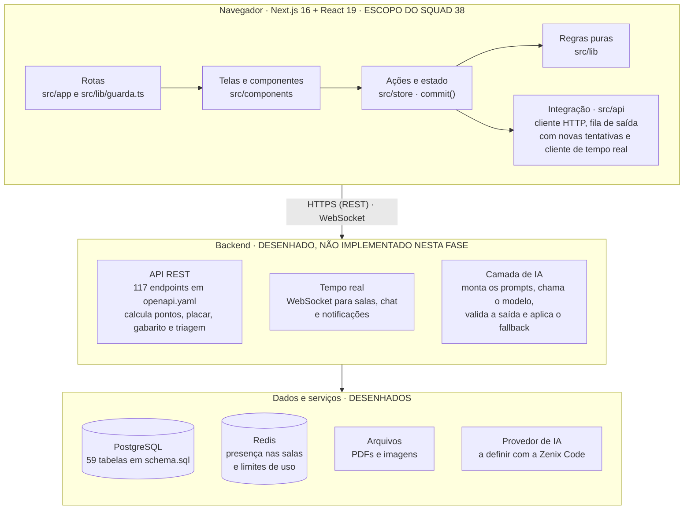
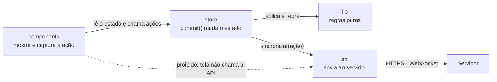
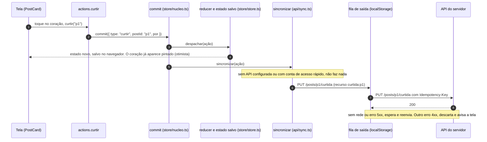
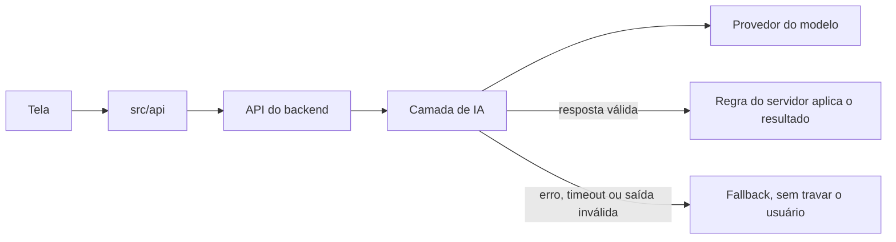
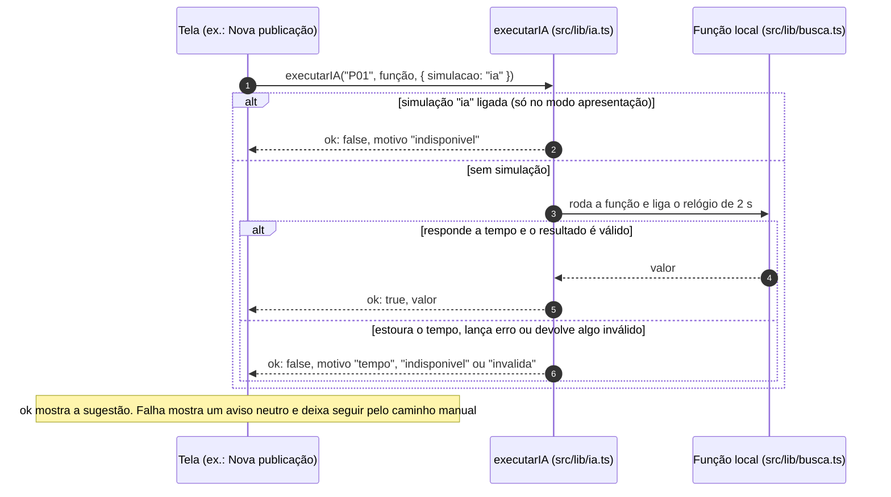
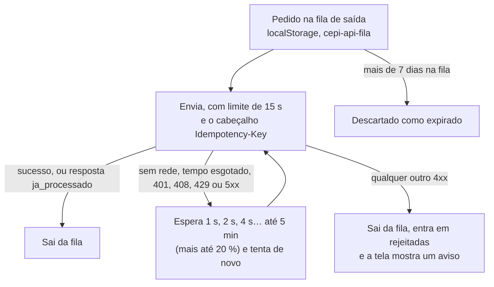

**Bloco 4 · RISEUP 2026.2**

Squad 38 · Portal do Aluno

# Arquitetura da Solução

Camadas, estrutura de pastas, integração com a IA e tratamento de latência, erros, timeout e indisponibilidade. Item 4.2 da entrega.

| Projeto | Empresa parceira | Squad | Programa |
| --- | --- | --- | --- |
| Rede social educacional | Zenix Code | 38 | Porto Digital × UNIT |

> Versão em Markdown de `Arquitetura_da_Solucao_Squad38_1.pdf`, atualizada para o protótipo v8 (09/10/2026).

**Neste documento:** [01 Visão geral](#01--visão-geral) · [02 Estrutura de pastas](#02--estrutura-de-pastas) · [03 O caminho de uma ação](#03--o-caminho-de-uma-ação) · [04 Integração com a IA](#04--integração-com-a-ia) · [05 Latência, erros, timeout e indisponibilidade](#05--latência-erros-timeout-e-indisponibilidade) · [Atualizações em relação ao PDF](#atualizações-em-relação-ao-pdf)

**Documentos relacionados:** [Design System](DESIGN_SYSTEM.md) · [Navegação e Fluxos](NAVEGACAO_E_FLUXOS.md) · [Wireframes](WIREFRAMES.md) · [Guia do backend](../BACKEND.md) · [Contrato da API](../api/openapi.yaml) · [Banco de dados](../api/schema.sql)

---

## 01 · Visão geral

O protótipo é um aplicativo Next.js que roda inteiro no navegador. O backend já está desenhado (contrato da API, banco e guia) e se conecta pela pasta [`src/api`](../../src/api), sem mudar as telas.



**Modo demonstração e modo integrado.** Sem a variável `NEXT_PUBLIC_API_URL`, tudo roda no navegador com os dados de `src/data` e o estado salvo localmente. Com ela, o login chama o servidor, as ações passam pela fila de saída e o tempo real conecta com a sessão. As telas são as mesmas nos dois modos.

| Modo | Quando | O que acontece |
| --- | --- | --- |
| Local (demonstração) | Sem `NEXT_PUBLIC_API_URL` | Dados de `src/data`, estado em `localStorage`, arquivos reais em IndexedDB. [`api/sync.ts`](../../src/api/sync.ts) e [`api/realtime.ts`](../../src/api/realtime.ts) não fazem nada. As janelas do mesmo navegador se sincronizam pelo evento `storage`. |
| Integrado (`http`) | Com `NEXT_PUBLIC_API_URL` | `POST /auth/login` de verdade, `Authorization: Bearer` em todo pedido, ações pela fila de saída e WebSocket conectado (hoje entrega as notificações). As contas de acesso rápido da tela de login (token `"demo"`) não sincronizam. |

O app também roda de dois jeitos idênticos, com as mesmas telas e regras:

| | Next | Demonstração em HTML único |
| --- | --- | --- |
| Como abrir | `npm run dev` ou `npm run build && npm start` | [`demonstração/Portal_do_Aluno.html`](../../demonstra%C3%A7%C3%A3o/Portal_do_Aluno.html): duplo clique, abre por `file://`, sem instalar nada |
| Como gerar | — | `npm run demo` (`next build` e depois [`scripts/demo/build.mjs`](../../scripts/demo/build.mjs)) |
| Rotas | Pastas de `src/app` (`/feed`), 21 páginas | Tabela de rotas de [`scripts/demo/app.tsx`](../../scripts/demo/app.tsx), por hash (`#/feed`), 20 rotas: a `/` só existe no Next |
| Peças do Next | `next/link`, `next/navigation`, `next/image`, `next/dynamic` | Trocadas por adaptadores em `scripts/demo/shims/` |
| Guarda de rotas | [`src/lib/guarda.ts`](../../src/lib/guarda.ts) dentro do `AppShell` | A mesma função, no mesmo `AppShell` |
| Título da aba | `metadata` de [`src/app/layout.tsx`](../../src/app/layout.tsx): "Portal do Aluno · CEPI Expansão" por padrão e "Feed · Portal CEPI Expansão" nas telas com título | Igual. O `<title>` do arquivo é gerado por `build.mjs` a partir de `ESCOLA` ([`src/data/escola.ts`](../../src/data/escola.ts), campo `curto`), a mesma fonte do Next, e o `app.tsx` troca o título a cada tela |

> **O que falta no modo integrado** (detalhado em [`docs/BACKEND.md`](../BACKEND.md), seção 11): a leitura pela API (`/me/bootstrap`, `GET /posts`…) ainda não é chamada, as telas de duelo, desafio e rodada ainda jogam no navegador, o estado otimista ainda não é desfeito quando o servidor recusa um pedido, e o tempo real só cobre notificações.

---

## 02 · Estrutura de pastas

```text
src/
  app/                    Rotas: cada pasta vira um endereço (21 páginas, contando "/" e "/login")
    feed/  estudos/  missoes/  ranking/  campeonatos/  loja/  perfil/
    estatisticas/  pessoas/  login/  professor/
    layout.tsx            Layout raiz: monta o AppShell (cabeçalho, navegação e guarda de rotas)
    template.tsx          Entrada entre telas (só opacidade)
    not-found.tsx         Página 404
    page.tsx              "/" só redireciona para o login
    globals.css           Tokens do Design System e tema escuro

  components/             Telas e peças visuais, sem regra de negócio
    shell/                AppShell, barra lateral, cabeçalho, barra inferior, faixa de conexão,
                          limite de erro (tela "Não foi possível carregar agora"), notificações
    ui/                   Design System: Button, Card, Sheet, Badge, Anel, gráficos,
                          abas.ts (teclado das abas: setas, Home e End)
    feed/  estudos/  salas/  campeonatos/  missoes/  loja/  perfil/  pessoas/  ranking/
    estatisticas/  atividades/  calendario/  login/  professor/

  hooks/                  useAgora, useAtor, useConexao, useFecharFora, useMidia

  store/                  Estado do app
    reducer.ts            Função pura: estado + ação → estado novo
    store.ts              Guarda o estado, grava no navegador e avisa as telas
    nucleo.ts             commit(): único caminho para mudar o estado
    actions.ts            Fluxos de usuário (curtir, publicar, responder, comprar…)
    acoes/                aluno, atividades, campeonatos, estudos, flashcards,
                          notificacoes, professor, salas
    seletores.ts          Perguntas sobre o estado, sem React (ex.: curtiu(post, pessoa))
    types.ts  seed.ts     Tipos do domínio · estado inicial e migração do estado salvo
    ui.ts                 Avisos (toasts) e falhas de progresso, que não são salvos

  lib/                    Regras puras, fáceis de testar
    guarda.ts             Guarda de rotas única (Next e demonstração)
    ia.ts                 Tempo limite e plano B de cada função de IA
    simulacoes.ts         Falhas simuladas, só no modo apresentação
    conexao.ts            Estado da conexão (real ou simulado)
    busca.ts              Busca semântica simulada
    moderacao.ts          Triagem de ofensas simulada
    gamificacao.ts  estudos.ts  campeonatos.ts  turmas.ts
                          Pontos e XP, estudos, campeonatos, visão do professor
    materiais.ts  arquivos.ts  pdf.ts  exportar.ts
                          Anexos, arquivos reais (IndexedDB), PDF e CSV
    auth.ts  tema.ts  apresentacao.ts
                          Sessão, tema claro/escuro, modo apresentação
    format.ts  tempo.ts  cores.ts  cn.ts  aleatorio.ts  tema-script.ts
                          Utilitários

  api/                    Integração com o backend (pronta, ligada pela variável de ambiente)
    client.ts             Cliente HTTP
    endpoints.ts  dto.ts  Catálogo tipado dos 117 endpoints · formatos de dados
    sync.ts               Regras ação → requisição e fila de saída
    realtime.ts           Cliente WebSocket (hoje, notificações)

  data/                   Dados de demonstração

scripts/demo/             Gerador da demonstração em HTML único (app.tsx, build.mjs, shims/)
demonstração/             Portal_do_Aluno.html, gerado por npm run demo
docs/
  BACKEND.md              Guia de integração do backend
  api/openapi.yaml        Contrato da API: 117 endpoints
  api/schema.sql          Banco PostgreSQL: 59 tabelas
  projeto/                Estes documentos em Markdown
```

Não existe `src/proxy.ts`: o controle de acesso por papel mora em [`src/lib/guarda.ts`](../../src/lib/guarda.ts).

### Páginas e quem pode abri-las

| Endereço | Quem acessa | Tela |
| --- | --- | --- |
| `/` | Todos (só no Next) | Redireciona para o login; a guarda leva cada papel à sua tela inicial |
| `/login` | Sem sessão | Entrar |
| `/feed` | Aluna e professor | Início da aluna · "Feed da escola" do professor |
| `/estudos` | Aluna | Sala de estudos |
| `/estudos/salas` e `/estudos/salas/[id]` | Aluna e professor | Salas coletivas |
| `/campeonatos` e `/campeonatos/[id]` | Aluna e professor | Campeonatos |
| `/pessoas/[id]` | Aluna e professor | Perfil de colegas e professores |
| `/missoes` | Aluna | Missões |
| `/ranking` | Aluna | Ranking |
| `/loja` | Aluna | Loja |
| `/perfil` | Aluna | Perfil e configurações |
| `/estatisticas` | Aluna | Estatísticas da aluna |
| `/professor` | Professor | Painel |
| `/professor/alunos` | Professor | Alunos |
| `/professor/atividades` e `/professor/atividades/[id]` | Professor | Atividades |
| `/professor/duvidas` | Professor | Dúvidas (resposta oficial) |
| `/professor/estatisticas` | Professor | Estatísticas da turma |
| `/professor/moderacao` | Professor | Moderação |

São 21 arquivos `page.tsx` no Next (contando `/` e `/login`) e 20 rotas na demonstração. As mensagens diretas foram retiradas por decisão da banca, por isso não existe `app/mensagens/`.

### Guarda de rotas

A guarda é única e roda no cliente, dentro do `AppShell`, no Next e na demonstração. Ela é uma função pura: decide, e quem chama faz o redirecionamento. Enquanto decide, a tela mostra só o esqueleto; a página protegida nunca chega a ser montada. Isso é só organização da navegação: a validação de verdade (JWT) é do backend.

| Situação | Resultado |
| --- | --- |
| Sem sessão em qualquer rota | Vai para `/login?voltar=<rota>` e volta para ela depois de entrar (em `/`, vai só para `/login`) |
| `/login` com sessão | Home do papel (`/feed` para a aluna, `/professor` para o professor), ou a rota de `voltar` se o papel puder abri-la |
| `/feed`, `/estudos/salas`, `/campeonatos`, `/pessoas` | Ficam abertas para os dois papéis |
| Aluna em `/professor/*` | Volta para `/feed` |
| Professor em `/estudos`, `/missoes`, `/ranking`, `/loja`, `/perfil` ou `/estatisticas` | Volta para `/professor` |
| Rota que não existe | Página 404 (`not-found.tsx`), com "Voltar ao Início" (aluna) ou "Voltar ao Painel" (professor). Para a aluna, um endereço inexistente dentro de `/professor/` segue a regra de cima e volta para `/feed` |

### Regra de dependência

Cada camada só conversa com a seguinte. Isso mantém as telas simples e permite trocar a simulação pelo backend sem reescrever componentes.



| Pasta | Pode | Não pode |
| --- | --- | --- |
| `components` | Ler o estado e chamar ações | Ter regra de negócio ou falar com a API |
| `store` | Mudar o estado, sempre pelo `commit()` | Desenhar tela |
| `lib` | Calcular (busca, moderação, pontos, estudos) | Depender de React ou da rede |
| `api` | Enviar ações ao servidor, reenviar e receber eventos em tempo real | Ser chamada direto por uma tela |

O que está confirmado no código: nenhum componente importa `@/api` nem chama `commit()`. As telas só chegam à rede por dois caminhos: as ações de `store/actions.ts` (`commit` e depois `sincronizar`) e o login e a saída de `lib/auth.ts`.

**Exceções reais** à regra de que `lib` não depende de React nem da rede:

- [`lib/auth.ts`](../../src/lib/auth.ts) chama a API no modo integrado (`POST /auth/login`, `POST /auth/sair`) e expõe o hook `useSessao`.
- [`lib/apresentacao.ts`](../../src/lib/apresentacao.ts), [`lib/tema.ts`](../../src/lib/tema.ts) e [`lib/arquivos.ts`](../../src/lib/arquivos.ts) expõem hooks finos do React.
- [`lib/materiais.ts`](../../src/lib/materiais.ts) usa o aviso (toast) da store.
- [`lib/turmas.ts`](../../src/lib/turmas.ts) usa uma função pura que mora em `components/estatisticas/calculos.ts`.

Duas pastas se conhecem de propósito: `api/sync.ts` lê o estado atual (`obterEstado` e os seletores) para montar o pedido certo, e `store/store.ts` liga o cliente de tempo real. A integração acontece em `store/nucleo.ts` e `store/store.ts`, nunca nas telas.

### Números do repositório

| O que | Quantos | Onde conferir |
| --- | --- | --- |
| Páginas no Next | 21 (`/` e `/login` incluídas) | `src/app/**/page.tsx` |
| Rotas na demonstração | 20 | `ROTAS` em `scripts/demo/app.tsx` |
| Endpoints | 117 | [`docs/api/openapi.yaml`](../api/openapi.yaml) e [`src/api/endpoints.ts`](../../src/api/endpoints.ts) |
| Tabelas | 59 | [`docs/api/schema.sql`](../api/schema.sql) |
| Tipos de ação do estado | 68, cada um com uma regra em `api/sync.ts` | `Acao` em `store/reducer.ts` |

---

## 03 · O caminho de uma ação

Exemplo: a aluna curte um post. A tela muda na hora e o servidor é avisado depois. É isso que faz o app parecer instantâneo mesmo com internet lenta.



1. **Toque.** O `PostCard` chama `curtir(post.id)` de [`store/actions.ts`](../../src/store/actions.ts). A tela só chama a ação.
2. **Ação.** `curtir` chama `commit({ type: "curtir", postId, por })`. O campo `por` é quem usa esta aba: a aluna e o professor curtem cada um por si, e o contador de curtidas é um só.
3. **Commit.** [`commit()`](../../src/store/nucleo.ts) confere se outra aba gravou antes e, se sim, relê o estado salvo (aluna e professor podem estar abertos ao mesmo tempo). Depois aplica a ação no `reducer`, grava o estado em `localStorage["cepi-portal-do-aluno"]` e avisa as telas. O coração aparece pintado na hora: é a atualização otimista.
4. **Sincronizar.** Se o estado mudou, o `commit()` chama `sincronizar(ação)`. Sem API configurada, ou com uma conta de acesso rápido, não faz nada.
5. **Fila.** Com API, a regra da ação em [`api/sync.ts`](../../src/api/sync.ts) vira `PUT /posts/p1/curtida` (ou `DELETE`, ao descurtir) e entra na fila de saída, salva em `localStorage["cepi-api-fila"]`. Se já havia na fila um pedido do mesmo recurso, o mais novo substitui o antigo: curtir, descurtir e curtir de novo sem internet vira um só `PUT`.
6. **Envio.** A fila manda um pedido por vez, em ordem, com o cabeçalho `Idempotency-Key`. Se falhar, tenta de novo como descrito na [seção 05](#05--latência-erros-timeout-e-indisponibilidade).

Há uma regra em `api/sync.ts` para cada tipo de ação (68 hoje). Se alguém criar uma ação nova e esquecer a regra, o TypeScript não compila. Cada regra devolve uma requisição ou `null`:

| Família | Exemplos | O que acontece |
| --- | --- | --- |
| Criação com id do cliente | `publicar`, `responder`, `comprar` | `POST` com o `id` gerado no navegador; a chave de idempotência é fixa (`post:<id>`), então a mesma criação nunca sai duas vezes |
| Evento | `missaoProgresso`, `responderCarta`, `entrarSala` | Um fato novo a cada vez; chave aleatória |
| Estado desejado | `curtir`, `salvar`, `equipar`, `definirPrivacidade` | `PUT` ou `DELETE` idempotentes; o pedido mais novo do mesmo recurso substitui o que está na fila |
| Não sobe (`null`) | `premiar`, `notificar`, `desbloquearMedalha`, `virarDia`, `confirmarEnvio` | Pontos, XP, medalhas e notificações são calculados pelo servidor; ou a ação é só visual, só da demonstração, ou chega pelo tempo real |

Eventos que vêm do servidor (tempo real) entram no estado com `despachar`, não com `commit`. Assim não voltam ao servidor pela sincronização.

---

## 04 · Integração com a IA

O navegador **nunca** chama o modelo de IA: a chave ficaria exposta. Toda chamada passa pelo backend, que tira dados pessoais, monta o prompt, chama o modelo com tempo limite, valida a resposta e decide a ação. No protótipo, as mesmas funções são simuladas em `src/lib`, devolvendo dados no mesmo formato da IA real. Os prompts completos estão no documento Prompt Ops.

**Na solução final** (com backend):



**No protótipo** (hoje), [`src/lib/ia.ts`](../../src/lib/ia.ts) dá a cada função o mesmo contrato de um serviço remoto: tempo máximo, plano B e nenhuma exceção para a tela.



| Função de IA | Tempo limite | Fallback | No protótipo |
| --- | --- | --- | --- |
| Sugestão de disciplina e tags (P01) | 2 s | Publicação segue sem sugestão; o aluno escolhe a disciplina | [`lib/busca.ts`](../../src/lib/busca.ts) (`sugerirCategorias`). Plano B implementado e simulável: "Sugestões indisponíveis no momento. Escolha a disciplina abaixo." |
| Busca semântica (P02) | 2,5 s | Busca por palavra-chave, com aviso | [`lib/busca.ts`](../../src/lib/busca.ts) (`buscarSemelhantes`, e `buscarPorPalavras` como plano B). Implementado e simulável na busca do feed |
| Triagem de posts e mensagens (P05) | 1 s | Filtro local por regras sempre ativo; conteúdo reavaliado depois. Nada é publicado sem checagem | [`lib/moderacao.ts`](../../src/lib/moderacao.ts) (`verificarPublicacao`). Sempre local: o texto sinalizado fica retido para revisão humana |
| Triagem de denúncias (P04) | 2 s | Vale o motivo informado; entra na fila com "triagem indisponível" | [`lib/moderacao.ts`](../../src/lib/moderacao.ts) (`triarDenuncia`). Plano B implementado e simulável: a Moderação mostra "Triagem indisponível — vale o motivo informado" |
| Desafio personalizado (P07) | 3 s | Banco de questões revisado pelos professores | Banco fixo (`src/data/desafios.ts`). O tempo limite já está em `lib/ia.ts`, mas nenhuma tela chama P07 |
| Diagnóstico da turma (P06) | 5 s | Só o ranking numérico dos temas com mais dúvidas | Planejado (sem código) |
| Sinalização de IA externa (P08) | 2 s | Em erro, os pontos são creditados e a resposta é reanalisada depois | Planejado (sem código) |

Como ler a tabela no protótipo:

- **Onde cada função é chamada.** P01 e P02 na janela Nova publicação (dúvida) e P02 na busca do feed; P04 na janela Denúncia. P05 não passa por `executarIA`: a triagem local roda antes de publicar um post, um aviso ou uma mensagem de sala. Aqui "mensagens" são as do chat das salas coletivas; as mensagens diretas foram retiradas.
- **Por que o plano B só aparece simulado.** As funções locais respondem em milissegundos, então o tempo limite quase nunca estoura. Na prática o plano B aparece quando as simulações "IA indisponível" ou "Busca por significado indisponível" estão ligadas (modo apresentação, veja a [seção 05](#simular-as-falhas-na-apresentação)). Com um serviço remoto, o mesmo código passa a valer sem mudar as telas.
- **Dois planos B diferentes para P02.** Na busca do feed cai para palavra-chave, com aviso. Na janela Nova publicação, se P01 ou P02 falhar, o aviso é "Sugestões indisponíveis" e a pessoa escolhe a disciplina; a publicação segue (a dúvida é salva sem sugestões).
- **O que é só do servidor.** "Conteúdo reavaliado depois" (P05) e a conferência do formato da resposta da IA acontecem no backend e não existem no protótipo.

---

## 05 · Latência, erros, timeout e indisponibilidade

Princípio: nenhuma falha apaga o que o usuário fez, nenhuma falha vira punição e todo erro diz o que aconteceu e o que fazer. As telas de cada situação estão em [Wireframes (3.1.3)](WIREFRAMES.md).

| Situação | Estratégia | O que o usuário vê | Estado hoje |
| --- | --- | --- | --- |
| Latência | Interface otimista: a tela muda na hora e o servidor confirma depois. Janelas pesadas (calendário, notificações, checkout, duelo) ficam em arquivos separados, fora do pacote principal (`next/dynamic`). | Esqueleto no carregamento ([`Esqueleto.tsx`](../../src/components/shell/Esqueleto.tsx)); resposta imediata ao toque | **No protótipo** |
| Sem conexão | A conexão é lida do navegador (`navigator.onLine`, em [`lib/conexao.ts`](../../src/lib/conexao.ts)). A publicação feita sem conexão fica salva neste aparelho. A fila de saída guarda as ações no navegador e envia quando a conexão volta, uma por vez e em ordem. | Faixa "Sem conexão. Tentando retransmitir…" abaixo do cabeçalho (com "N publicações aguardando envio", se houver) e selo "Aguardando envio · salvo neste aparelho" na publicação. Ao voltar, aviso "Publicação enviada" | **No protótipo** (faixa e selo). **Pronto no código** (envio real pela fila, no modo integrado) |
| Servidor fora do ar | Novas tentativas com espera crescente: 1 s, 2 s, 4 s… até 5 minutos, mais até 20 % de variação para os aparelhos não voltarem todos juntos. Erro 5xx **nunca descarta** o pedido: só a validade de 7 dias o remove. | Nada: a tela já mostrou o resultado e o pedido espera na fila | **Pronto no código** |
| Pedido duplicado | Cada ação leva uma chave de idempotência (`Idempotency-Key`); se chegar duas vezes, o servidor não cria post nem credita pontos em dobro. O cliente também não enfileira duas vezes a mesma chave. | Nada; o problema é evitado | **Pronto no código** |
| Timeout de leitura | Qualquer tela que falhe ao carregar cai no limite de erro. O rascunho do usuário é preservado: ele fica em memória, fora das telas ([`ui/rascunhos.ts`](../../src/components/ui/rascunhos.ts)), e sobrevive a fechar o modal sem querer e à tela de erro, mas não a recarregar a página. Hoje só a fila de saída tem tempo limite por chamada (15 s por pedido, 60 s para enviar arquivo); a leitura pela API ainda não existe. | "Não foi possível carregar agora", com "Tentar novamente" e "Voltar ao Início" | **No protótipo** (tela). Leitura pela API: **Especificado** |
| Falha ou timeout da IA | Fallback por função (seção 04). A IA nunca bloqueia a publicação e nunca pune. | Aviso neutro e caminho manual: "Sugestões indisponíveis no momento. Escolha a disciplina abaixo."; busca por palavra-chave com aviso; denúncia segue com o motivo informado | **No protótipo** (P01, P02, P04) |
| Saída da IA inválida | O servidor confere o formato da resposta antes de usar; se falhar, descarta e aplica o fallback. No cliente, `executarIA` também aceita uma função de validação e devolve o motivo `invalida`. | Igual à falha da IA | **Pronto no código** (cliente). **Especificado** (servidor) |
| Ação recusada pelo servidor | O servidor tem a palavra final sobre pontos, saldo e placar. Quando recusa um pedido, a fila o descarta, guarda o motivo (sem o conteúdo da mensagem) e a tela avisa. Desfazer o estado otimista ainda não existe. | No modo integrado: "Não foi possível concluir uma ação", com a mensagem do servidor. No protótipo: "Saldo insuficiente: você possui X pontos e este item requer Y pontos." e "Não conseguimos salvar seu progresso" | **No protótipo** (saldo e progresso, checados no próprio app). **Pronto no código** (aviso de recusa). **Especificado** (desfazer) |
| Tempo real interrompido | O cliente WebSocket reconecta sozinho, com espera crescente (1 s, 2 s, 4 s… até 30 s, com variação), manda um sinal a cada 20 s e reinicia a conexão que ficar 45 s em silêncio. Eventos repetidos depois de reconectar são ignorados. O timer das salas é calculado pelo horário de início do ciclo, então não perde sincronia. | Presença e chat voltam sozinhos | **Pronto no código**. Hoje só as notificações assinam o tempo real |

**No protótipo** = funcionando hoje, no Next e na demonstração · **Pronto no código** = escrito em `src/api`, ativo quando a API for conectada · **Especificado** = definido para a implementação, ainda sem código.

### A fila de saída por dentro

Código em [`src/api/sync.ts`](../../src/api/sync.ts). Os tempos abaixo são os do código.



| Regra | Valor |
| --- | --- |
| Ordem | Um pedido por vez, em ordem. Se o primeiro está esperando para tentar de novo, os seguintes esperam também. |
| Espera entre tentativas | `1 s × 2^tentativa`, com teto de 5 min, mais até 20 % de variação (no máximo 6 min). |
| Também tenta na hora | Quando o navegador volta a ficar online, quando a aba volta a ficar visível e quando a pessoa entra na conta. |
| Tempo limite | 15 s por pedido; 60 s para enviar um arquivo. |
| Idempotência | Criações usam chave fixa (`post:<id>`, `resposta:<id>`…); o resto usa chave aleatória. Resposta `ja_processado` conta como sucesso. |
| Arquivos reais | Anexos escolhidos ficam no IndexedDB. Antes do pedido, a fila faz `POST /anexos`, guarda o `anexoId` na própria fila (um reenvio não sobe o arquivo de novo) e só então envia o pedido. |
| Tamanho | Até 500 pedidos na fila; ao passar disso, os mais antigos são descartados como `fila_cheia`. As últimas 50 recusas ficam em `cepi-api-rejeitadas`, sem o corpo do pedido (LGPD). |
| Várias abas | Só uma aba envia por vez (Web Locks); as outras veem a fila pelo evento `storage`. |
| Várias contas | Cada pedido guarda o dono. Ao sair da conta, só a fila daquele usuário é apagada, nunca a da conta aberta em outra aba. |
| Avisos na tela | `cepi:sync-rejeitada` vira "Não foi possível concluir uma ação"; `cepi:sessao-expirada` vira "Sua sessão expirou. Entre de novo." (um aviso a cada 15 s, no máximo). |

### Simular as falhas na apresentação

As falhas abaixo podem ser mostradas sem derrubar nada de verdade. Elas só existem com o **modo apresentação** ligado (**Alt+Shift+D**, ou Perfil › Configurações › Modo apresentação) e se ativam em **Roteiro de apresentação › Simular falhas**. Com o modo desligado, [`simulacaoAtiva()`](../../src/lib/simulacoes.ts) devolve sempre `false`, mesmo que algum valor tenha ficado guardado, e nada gera erro no console.

| Simulação | Onde aparece | O que a pessoa vê |
| --- | --- | --- |
| Sem conexão | Topo de todas as telas e nas publicações | Faixa "Sem conexão. Tentando retransmitir…" e selo "Aguardando envio · salvo neste aparelho". A faixa também aparece com a conexão realmente caída |
| IA indisponível | Nova publicação (dúvida) e Denúncia | "Sugestões indisponíveis no momento. Escolha a disciplina abaixo."; a denúncia segue com o motivo informado e a Moderação mostra "Triagem indisponível — vale o motivo informado" |
| Busca por significado indisponível | Lupa do feed | "Resultados por palavra-chave. A busca por significado está indisponível agora." |
| Falha ao salvar progresso | Missões | "Não conseguimos salvar seu progresso" e, na linha da missão, "Progresso não salvo" com "Tentar novamente" |
| Falha ao carregar tela | Próxima tela que a pessoa abrir | "Não foi possível carregar agora", com "Tentar novamente" e "Voltar ao Início" |

### Onde cada estado de erro está hoje

Mapa dos estados de erro de [Wireframes (3.1.3)](WIREFRAMES.md) para o protótipo v8.

| Tela | Estado | Hoje |
| --- | --- | --- |
| 68 | Carregando | Implementada (esqueleto) |
| 69 e 70 | Publicação retida pela triagem | Implementada |
| 71 | Sem conexão | Implementada (faixa e selo); simulável |
| 72 | Timeout | Implementada como limite de erro, vale para qualquer tela; simulável |
| 73 | Falha da IA | Implementada; simulável |
| 74 | Falha da busca | Implementada (palavra-chave e aviso); simulável |
| 75 | Contestação | Implementada ("Isso foi um engano? Conteste aqui"; a Moderação mostra a contestação) |
| 76 | Erro ao registrar missão | Implementada; simulável |
| 77 | Pontos em verificação | Continua só no mockup (evolução futura, US10) |
| 78 | Saldo insuficiente | Implementada, com a frase completa |
| 79 | Estado vazio | Implementada em todas as listas (ícone, frase e ação) |

---

## Atualizações em relação ao PDF

O que mudou entre `Arquitetura_da_Solucao_Squad38_1.pdf` e o protótipo v8, para a equipe atualizar o PDF.

**Gerais**

1. As mensagens diretas foram retiradas por decisão da banca. A pasta `app/mensagens/` não existe mais e a tela de estado vazio não usa mais Mensagens como exemplo. No P05, "mensagens" significa o chat das salas coletivas.
2. O app roda de dois jeitos idênticos: Next (`npm start`) e demonstração em HTML único (`demonstração/Portal_do_Aluno.html`, gerada por `npm run demo` a partir de `scripts/demo/`). O PDF não cita a demonstração. O título e a descrição do arquivo da demonstração saem de `src/data/escola.ts`, então o `<title>` estático ("Portal do Aluno · CEPI Expansão") é igual ao do Next.
3. Novo, fora do PDF: o professor também usa `/feed` ("Feed da escola"), uma rota compartilhada. Ela entra nas rotas compartilhadas da guarda e na tabela de páginas.

**01 · Visão geral**

4. "Rotas: `src/app` e `proxy.ts`" passa a ser "`src/app` e `src/lib/guarda.ts`". O `src/proxy.ts` e o cookie `cepi_papel` não existem mais; a guarda é única, no cliente, para o Next e para a demonstração.
5. "109 endpoints" passa a **117** (a v8 acrescenta `POST /posts/{id}/contestacao` e `POST /professor/respostas/{respostaId}/util`). As **59 tabelas** continuam (colunas novas, nenhuma tabela nova).
6. O texto sobre o modo integrado agora diz que o tempo real conecta com a sessão (v8) e que as contas de acesso rápido (token `"demo"`) não sincronizam. Entram duas tabelas novas (modo local × integrado; Next × demonstração) e o aviso do que falta no modo integrado.
7. O diagrama de camadas foi refeito em Mermaid, com o fluxo navegador → `src/api` → backend → dados e IA.

**02 · Estrutura de pastas**

8. "19 páginas" passa a **21** `page.tsx` (contando `/` e `/login`); a demonstração tem 20 rotas. Entram `estatisticas/` e `pessoas/`; sai `mensagens/`.
9. Sai `proxy.ts`; entra `lib/guarda.ts`.
10. A árvore passa a mostrar o que faltava: `store/acoes/*` (aluno, atividades, campeonatos, estudos, flashcards, notificacoes, professor, salas), `store/actions.ts`, `store/seletores.ts` (v8), `store/types.ts`, `store/seed.ts`, `store/ui.ts`; `hooks/` (`useAgora`, `useFecharFora`, `useMidia`, `useAtor` e `useConexao`, os dois últimos novos na v8); em `lib/`, `guarda`, `materiais`, `arquivos`, `exportar`, `pdf`, `turmas`, `simulacoes`, `conexao` e `ia` (os três últimos novos na v8); `scripts/demo/` e `demonstração/`.
11. Novas subseções: tabela de páginas e quem pode abri-las, tabela da guarda de rotas e números do repositório.
12. Regra de dependência: o texto "lib não pode depender de React ou da rede" ganha as **exceções reais** (`lib/auth`, `lib/apresentacao`, `lib/tema`, `lib/arquivos`, `lib/materiais` e o uso de uma função de `components/estatisticas/calculos.ts` por `lib/turmas`) e a observação de que `api/sync.ts` e `store/store.ts` se conhecem de propósito.

**03 · O caminho de uma ação**

13. O diagrama em texto virou diagrama de sequência. Detalhes novos: a ação leva `por` (quem usa a aba), o `commit()` relê o estado se outra aba gravou, e "sem API configurada: não faz nada" vale também para contas de acesso rápido. A fila passa a ser mostrada como etapa própria, com a regra "o pedido mais novo do mesmo recurso substitui o da fila".
14. Nova tabela com as quatro famílias de ação (criação, evento, estado desejado, não sobe).

**04 · Integração com a IA**

15. A v8 tem `src/lib/ia.ts`, com tempo limite e plano B por função: P01 2 s, P02 2,5 s, P04 2 s, P05 1 s, P07 3 s (os tempos do PDF se confirmam). A coluna "No protótipo" passou a dizer o arquivo e o estado de cada plano B.
16. Plano B de P01, P02 (na busca) e P04 **implementado** e simulável. P05 continua sempre local e não passa por `executarIA`. P07 é banco fixo (o tempo limite existe, mas nenhuma tela chama). P06 e P08 seguem planejados, sem código.
17. P02 tem dois planos B no protótipo: palavra-chave com aviso na busca do feed e "Sugestões indisponíveis" na janela Nova publicação.
18. Entra um diagrama do protótipo (`executarIA`), além do diagrama da solução final.

**05 · Latência, erros, timeout e indisponibilidade**

19. Latência: as janelas pesadas ficam em arquivos separados (`next/dynamic`). O PDF diz que "só carregam quando abertas"; no código isso vale para nova publicação, denúncia, remoção, contestação, material, checkout e duelo, mas calendário, carteira e notificações (do cabeçalho) são baixados logo depois da primeira tela.
20. Sem conexão: passa a **No protótipo** (faixa e selo implementados, também com a conexão realmente caída). Antes era "Pronto no código" mais "aviso visual em mockup".
21. Servidor fora do ar: acrescentados a variação de até 20 % na espera, o tempo limite de 15 s por pedido e a regra de que erro 5xx **nunca descarta** o pedido (só os 7 dias de validade). Também ficam documentados 401, 408 e 429 (tentam de novo) e os outros 4xx (descartados e avisados).
22. Timeout de leitura: a tela é **No protótipo** (limite de erro, "Não foi possível carregar agora"); o "mockup" do PDF não vale mais. A leitura pela API ainda não existe (modo local).
23. Falha ou timeout da IA: **No protótipo** (telas implementadas e simuláveis). Saída da IA inválida: o cliente já trata (motivo `invalida`); a conferência no servidor continua especificada.
24. Ação recusada pelo servidor: aviso na tela implementado; "Saldo insuficiente…" (frase completa) e "Não conseguimos salvar seu progresso" estão no protótipo; **desfazer o estado otimista ainda não existe**.
25. Tempo real interrompido: `realtime.ts` agora é ligado no modo integrado (v8), mas só as notificações assinam; salas, campeonatos e entregas ainda não. O PDF dizia "presença e chat voltam sozinhos". Entram os tempos reais da reconexão (1 s até 30 s, sinal a cada 20 s, silêncio de 45 s).
26. Ao sair da conta, só a fila daquele usuário é apagada (v8).
27. A legenda e a coluna de estado ganham o "Estado hoje" por parte (por exemplo, "No protótipo" e "Pronto no código" na mesma linha). A coluna repetida "Situação" do PDF virou "Estado hoje".
28. Novas subseções: "A fila de saída por dentro", "Simular as falhas na apresentação" (Alt+Shift+D › Roteiro de apresentação › Simular falhas) e "Onde cada estado de erro está hoje" (telas 68 a 79).
