**Bloco 3 · RISEUP 2026.2**

Squad 38 · Portal do Aluno

# Design System

Cores, tipografia, componentes, acessibilidade, responsividade e padrões de feedback do módulo social integrado ao portal Zenix Education.

| Projeto | Empresa parceira | Squad | Programa |
|---|---|---|---|
| Rede social educacional | Zenix Code | 38 | Porto Digital × UNIT |

> Versão em Markdown de `Design_System_Squad38_1.pdf`, atualizada para o protótipo v8 (09/10/2026). O que mudou em relação ao PDF está na última seção, [Atualizações em relação ao PDF](#atualizações-em-relação-ao-pdf).

Documentos do projeto: [Arquitetura da Solução](./ARQUITETURA_DA_SOLUCAO.md) · [Navegação e Fluxos](./NAVEGACAO_E_FLUXOS.md) · [Wireframes](./WIREFRAMES.md) · [Índice](./README.md)

## Índice

| Nº | Seção | Nº | Seção |
|---|---|---|---|
| 01 | [Identidade visual](#01-identidade-visual) | 10 | [Navegação inferior](#10-navegação-inferior) |
| 02 | [Paleta de cores](#02-paleta-de-cores) | 11 | [Ícones](#11-ícones) |
| 03 | [Tipografia](#03-tipografia) | 12 | [Loja](#12-loja) |
| 04 | [Formas e bordas](#04-formas-e-bordas) | 13 | [Modal de confirmação](#13-modal-de-confirmação) |
| 05 | [Botões](#05-botões) | 14 | [Espaçamento](#14-espaçamento) |
| 06 | [Cards](#06-cards) | 15 | [Tema escuro](#15-tema-escuro) |
| 07 | [Avatares](#07-avatares) | 16 | [Acessibilidade](#16-acessibilidade) |
| 08 | [Badges e etiquetas](#08-badges-e-etiquetas) | 17 | [Responsividade](#17-responsividade) |
| 09 | [Barras de progresso](#09-barras-de-progresso) | 18 | [Feedback e validação](#18-feedback-e-validação) |

## Como ler este documento

Este documento descreve o visual do **protótipo v8** e diz onde cada peça está no código. Os valores vêm de [`src/app/globals.css`](../../src/app/globals.css) e dos componentes em [`src/components/ui/`](../../src/components/ui). Quando o PDF e o código divergem, vale o código.

Nas tabelas de acessibilidade e responsividade, a coluna **Situação** usa estas palavras:

| Situação | Significado |
|---|---|
| No protótipo | Existe no código e foi conferido. |
| No protótipo, com ressalvas | Existe, mas há exceções conhecidas (listadas). |
| Mockup | Aparece só nos wireframes, sem tela no protótipo. |

As medições citadas foram feitas em 09/10/2026 na demonstração em HTML único (`demonstração/Portal_do_Aluno.html`, gerada por `npm run demo`), com o Chromium controlado por Playwright. O app roda igual no Next (`npm start`) e na demonstração.

Onde cada coisa mora:

```
src/
├─ app/globals.css          tokens (cores, raio, sombras), tema escuro, utilitários
├─ components/
│  ├─ ui/                   Button, Card, Badge, Avatar, ProgressBar, Anel, Sheet, Campo,
│  │                        Switch, Segmentado, ChipGroup, Toaster, Blocos, graficos ...
│  └─ shell/                AppShell, Header, Sidebar, BottomNav, FaixaConexao, Esqueleto,
│                           LimiteDeErro, PularParaConteudo
├─ lib/                     cores.ts, tema.ts, tema-script.ts, ia.ts, simulacoes.ts
└─ hooks/                   useMidia.ts, useConexao.ts, useFecharFora.ts
```

Componentes do kit e a seção deste documento que fala de cada um:

| Componente | Arquivo | Seção |
|---|---|---|
| `Button`, `classesDoBotao` | [`ui/Button.tsx`](../../src/components/ui/Button.tsx) | 05 |
| `Card` | [`ui/Card.tsx`](../../src/components/ui/Card.tsx) | 06 |
| `Avatar`, `LinkPessoa`, `DisciplinaIcon` | [`ui/Avatar.tsx`](../../src/components/ui/Avatar.tsx), [`ui/LinkPessoa.tsx`](../../src/components/ui/LinkPessoa.tsx), [`ui/DisciplinaIcon.tsx`](../../src/components/ui/DisciplinaIcon.tsx) | 07 |
| `Badge` | [`ui/Badge.tsx`](../../src/components/ui/Badge.tsx) | 08 |
| `ProgressBar`, `Anel` | [`ui/ProgressBar.tsx`](../../src/components/ui/ProgressBar.tsx), [`ui/Anel.tsx`](../../src/components/ui/Anel.tsx) | 09 |
| Gráficos (`Barras`, `BarrasHorizontais`, `MapaDeCalor`, `Sparkline`, `Rosca`) | [`ui/graficos.tsx`](../../src/components/ui/graficos.tsx) | 09 e 16 |
| `Segmentado`, `ChipGroup`, `Abas` | [`ui/Segmentado.tsx`](../../src/components/ui/Segmentado.tsx), [`ui/ChipGroup.tsx`](../../src/components/ui/ChipGroup.tsx), [`feed/Abas.tsx`](../../src/components/feed/Abas.tsx) | 16 |
| `Sheet`, `RodapeSheet` | [`ui/Sheet.tsx`](../../src/components/ui/Sheet.tsx), [`ui/RodapeSheet.tsx`](../../src/components/ui/RodapeSheet.tsx) | 13 |
| `Campo`, `Entrada`, `AreaTexto`, `Seletor`, `Switch` | [`ui/Campo.tsx`](../../src/components/ui/Campo.tsx), [`ui/Switch.tsx`](../../src/components/ui/Switch.tsx) | 04 e 18 |
| `Toaster`, `Celebracao` | [`ui/Toaster.tsx`](../../src/components/ui/Toaster.tsx), [`ui/Celebracao.tsx`](../../src/components/ui/Celebracao.tsx) | 18 |
| `TituloPagina`, `TituloSecao`, `Nota`, `Vazio` | [`ui/Blocos.tsx`](../../src/components/ui/Blocos.tsx) | 03 e 18 |
| `AnimatedNumber` | [`ui/AnimatedNumber.tsx`](../../src/components/ui/AnimatedNumber.tsx) | 03 |

Do token à tela:

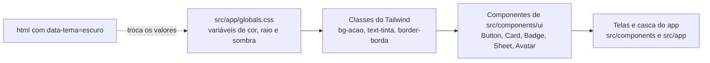

## 01 Identidade visual

Uma identidade baseada em tons de verde, associados a educação, crescimento, colaboração e tecnologia, com um estilo limpo, leve e minimalista.

A interface usa bastante espaço em branco, componentes com bordas arredondadas e elementos em verde para destacar ações e informações importantes.

Na versão atual, o visual foi alinhado ao portal Zenix Education, onde o módulo será integrado: tons neutros de cinza-azulado (slate) para textos e bordas, a fonte Geist e o verde reservado para ações e estados ativos. Assim, o módulo social parece parte do portal, e não um aplicativo à parte. O sistema também tem tema escuro (seção [15](#15-tema-escuro)).

Quatro regras valem para todas as telas:

1. **Verde só para ação e estado ativo.** O resto é cinza-azulado.
2. **Cor nunca é o único sinal.** Todo estado tem texto, ícone ou forma (seção [16](#16-acessibilidade)).
3. **Cards têm borda fina e nenhuma sombra.** Sombra só em elementos que flutuam (menus, modais, notificações).
4. **Toda cor é uma variável.** O tema escuro só troca os valores.

## 02 Paleta de cores

Tema claro. Os valores abaixo são os reais de [`src/app/globals.css`](../../src/app/globals.css) (no PDF eles eram aproximados). O contraste de cada combinação usada em texto está medido na seção [16](#16-acessibilidade).

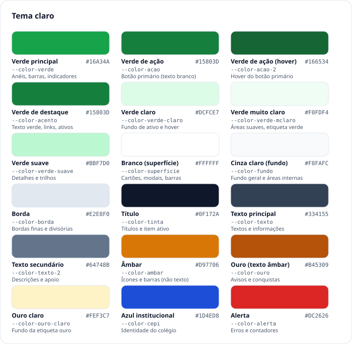

| Nome no PDF | Variável CSS | Claro | Escuro | Para que serve |
|---|---|---|---|---|
| Verde principal | `--color-verde` | `#16A34A` | `#16A34A` | Anel de foco, barras e anéis de progresso, interruptor ligado, pontos de status. Nunca é fundo de texto branco (3,30 : 1). |
| Verde de ação | `--color-acao` | `#15803D` | `#15803D` | Fundo do botão primário e da etiqueta verde cheia, sempre com texto branco (5,02 : 1). Novo na v8. |
| Verde de ação, hover | `--color-acao-2` | `#166534` | `#166534` | Hover do botão primário (7,13 : 1). Novo na v8. |
| Verde escuro | `--color-verde-2` | `#15803D` | `#22C55E` | Ênfase em poucos pontos (3 usos no código). |
| Verde de destaque | `--color-acento` | `#15803D` | `#4ADE80` | Texto verde: links, "Trocar", "Resolvida", hashtags, ícones ativos. |
| Verde claro | `--color-verde-claro` | `#DCFCE7` | `#12291C` | Fundo de estado ativo e hover. |
| Verde muito claro | `--color-verde-mclaro` | `#F0FDF4` | `#0D1F16` | Áreas suaves de destaque e fundo da etiqueta verde clara. |
| Verde suave | `--color-verde-suave` | `#BBF7D0` | `#1C4A31` | Detalhes e trilhos (1 uso). |
| Branco | `--color-superficie` | `#FFFFFF` | `#0F1623` | Fundo dos cartões, modais e barras de navegação. |
| Cinza claro | `--color-fundo` | `#F8FAFC` | `#0A0F18` | Fundo geral da página. |
| Cinza claro (interno) | `--color-superficie-2` | `#F8FAFC` | `#141D2C` | Hover e áreas internas dentro de cartões. |
| Borda | `--color-borda` | `#E2E8F0` | `#1E293B` | Bordas finas dos cartões e divisórias. |
| Título | `--color-tinta` | `#0F172A` | `#F1F5F9` | Títulos, números de destaque e item ativo da navegação. |
| Texto principal | `--color-texto` | `#334155` | `#CBD5E1` | Textos e informações principais. |
| Texto secundário | `--color-texto-2` | `#64748B` | `#94A3B8` | Descrições e informações auxiliares. |
| Âmbar | `--color-ambar` | `#D97706` | `#FBBF24` | Sequência de dias. Só em ícones, barras e pontos, nunca em texto. |
| Ouro | `--color-ouro` | `#B45309` | `#FBBF24` | **Texto** âmbar: avisos, conquistas, pódio, itens raros (5,02 : 1 no claro). |
| Ouro claro | `--color-ouro-claro` | `#FEF3C7` | `#2A2210` | Fundo da etiqueta ouro. |
| Azul institucional | `--color-cepi` | `#1D4ED8` | `#93B4FB` | Identidade do colégio. |
| Alerta | `--color-alerta` | `#DC2626` | `#F87171` | Erros, contadores de não lidas e zona de rebaixamento. |
| Superfície escura | `--color-sombra` | `#0F172A` | `#020617` | Uso raro (1 uso no código). |

Regras de uso:

- **Botão com texto branco:** fundo `--color-acao` e hover `--color-acao-2`, em `bg-acao text-white hover:bg-acao-2`. O verde `#16A34A` não serve de fundo para texto pequeno.
- **Texto âmbar:** sempre `--color-ouro`. O `--color-ambar` fica para ícones e barras.
- **Texto verde:** sempre `--color-acento`.
- **Cinza `#94A3B8` no tema claro:** só em elementos decorativos, nunca em texto (2,56 : 1).
- **Tons de apoio do Tailwind** (amber-50, red-50, blue-50, sky, emerald, rose e violet) aparecem em avisos, etiquetas e avatares. No tema escuro, parte deles é remapeada (seção [15](#15-tema-escuro)).

### Cores por disciplina

Nos gráficos (tempo por disciplina, domínio), cada disciplina tem uma cor fixa, escolhida para continuar distinguível por pessoas com daltonismo nos dois temas. A cor sempre vem acompanhada do nome da disciplina.

A cor segue a disciplina, nunca a posição na lista: as variáveis `--disc-1` a `--disc-8` seguem a ordem de `DISCIPLINAS` em [`src/data/escola.ts`](../../src/data/escola.ts), e [`src/lib/cores.ts`](../../src/lib/cores.ts) liga cada nome à sua variável.

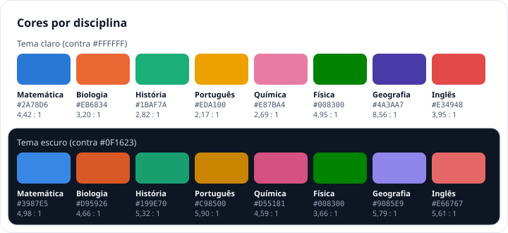

| Disciplina | Variável | Claro | Contraste sobre branco | Escuro | Contraste sobre o cartão escuro |
|---|---|---|---|---|---|
| Matemática | `--disc-1` | `#2A78D6` | 4,42 : 1 | `#3987E5` | 4,98 : 1 |
| Biologia | `--disc-2` | `#EB6834` | 3,20 : 1 | `#D95926` | 4,66 : 1 |
| História | `--disc-3` | `#1AA775` | 3,08 : 1 | `#199E70` | 5,32 : 1 |
| Português | `--disc-4` | `#C68700` | 3,06 : 1 | `#C98500` | 5,90 : 1 |
| Química | `--disc-5` | `#E56A99` | 3,06 : 1 | `#D55181` | 4,59 : 1 |
| Física | `--disc-6` | `#008300` | 4,95 : 1 | `#008300` | 3,66 : 1 |
| Geografia | `--disc-7` | `#4A3AA7` | 8,56 : 1 | `#9085E9` | 5,79 : 1 |
| Inglês | `--disc-8` | `#E34948` | 3,95 : 1 | `#E66767` | 5,61 : 1 |

Como objeto gráfico (barras, fatias da rosca), a meta é 3 : 1 contra o fundo do cartão (WCAG 1.4.11). **As oito cores passam nos dois temas.** No tema claro, três ficavam abaixo e foram escurecidas só até passar, mantendo o matiz (o tom em HSL):

| Disciplina | Antes (claro) | Contraste antes | Agora (claro) | Contraste agora |
|---|---|---|---|---|
| História | `#1BAF7A` | 2,82 : 1 | `#1AA775` | 3,08 : 1 |
| Português | `#EDA100` | 2,17 : 1 | `#C68700` | 3,06 : 1 |
| Química | `#E87BA4` | 2,69 : 1 | `#E56A99` | 3,06 : 1 |

As outras cinco cores do tema claro e todo o tema escuro não mudaram. As oito continuam distinguíveis entre si, inclusive para daltonismo. Medida: menor distância de cor (ΔE, CIE76) entre qualquer par, sem simulação e com simulação de protanopia, deuteranopia e tritanopia.

| Tema | Sem simulação | Com simulação de daltonismo |
|---|---|---|
| Claro | 22,0 | 9,5 a 11,3 |
| Escuro | 20,7 | 2,5 a 7,9 (o par mais próximo é Matemática × Geografia, em protanopia) |

O nome da disciplina continua acompanhando a cor (legenda, rótulo ou dica): a cor nunca é o único sinal, e é por isso que o par mais próximo do tema escuro é aceitável. A cor de disciplina só aparece nos gráficos de Estatísticas (rosca e barras horizontais de "Por disciplina", do aluno e do professor). Os tokens ficam em `globals.css`; [`lib/cores.ts`](../../src/lib/cores.ts) só aponta para as variáveis.

O mapa de calor de estudo usa uma rampa de um só tom (verde), do claro ao escuro: `--calor-0` a `--calor-4` (claro: `#F1F5F9`, `#BBF7D0`, `#4ADE80`, `#16A34A`, `#166534`; escuro: `#141D2C`, `#14532D`, `#15803D`, `#22C55E`, `#86EFAC`). O valor de cada dia também está na dica e no rótulo para leitor de tela.

## 03 Tipografia

Hierarquia simples e legível, com a fonte **Geist**, a mesma do portal da escola. Ela é carregada em [`src/app/layout.tsx`](../../src/app/layout.tsx) e vai embutida na demonstração. A Geist Mono aparece só em relógios de timer e códigos (por exemplo, o código de retirada de uma troca). A Caveat só aparece no item da Loja "Fonte manuscrita no nome".

| Nível | Exemplo | Característica no código |
|---|---|---|
| Título principal | **Feed da escola** | 22 px, semibold, cor `--color-tinta` (`TituloPagina`) |
| Subtítulo | **Missões de hoje** · Renovam a cada 24 horas | 15 px, semibold, sem caixa alta; texto auxiliar em cinza à direita, 12 px (`TituloSecao`) |
| Texto principal | Postei a lista 7 de funções afins com gabarito comentado. | 14 a 15 px, regular, entrelinha de 1,55 nas publicações, cor `--color-texto` |
| Texto secundário | há 15 min · Matemática · 9º Ano A | 12 a 13 px, regular, cor `--color-texto-2` |
| Números | 2.570 pontos · 25:00 · 3 × 1 | algarismos de largura fixa (`tabular-nums`), formato brasileiro (ponto nos milhares) |

| Nível | Onde aparece |
|---|---|
| Títulos principais | Nomes das páginas: Feed da escola, Sala de estudos, Missões, Ranking, Campeonatos, Loja, Estatísticas, Painel do professor ("Bom dia, Prof. Ricardo") |
| Subtítulos | Separação de seções: Sequência, Missões de hoje, Atividades do professor, Histórico de trocas, Domínio por disciplina |
| Texto principal | Publicações, descrições e informações |
| Texto secundário | Datas, horários, descrições, informações auxiliares, categorias |

Números que mudam (pontos, tempo, placar) usam algarismos de largura fixa, para não "pularem" ao atualizar. O número que sobe ao ganhar pontos é o componente [`AnimatedNumber`](../../src/components/ui/AnimatedNumber.tsx); com "reduzir movimento" ligado, ele troca de valor na hora.

## 04 Formas e bordas

Cantos arredondados são um dos padrões mais evidentes nas telas.

| Elemento | Raio | Borda e sombra |
|---|---|---|
| Cards | 16 px (`rounded-2xl`, variável `--radius-card`) | borda de 1 px em `--color-borda`, **sem sombra** |
| Botões pequeno e médio | 8 px (`rounded-lg`) | sem sombra |
| Botão grande | 12 px (`rounded-xl`) | sem sombra |
| Campos de texto | 8 px, altura de 40 px | borda `--color-borda`; no foco, borda verde e halo suave |
| Etiquetas (badges) | totalmente arredondado | fundo claro ou contorno |
| Avatares | círculo | anel opcional |
| Modal | 16 px (cantos de cima no celular) | borda e sombra flutuante |
| Menus e notificações | 12 px (`rounded-xl`) | borda e sombra flutuante |

A única sombra do sistema é `--sombra-flutuante`, usada em menus, modais e notificações. A sombra dos cards (`--sombra-card`) é vazia de propósito.

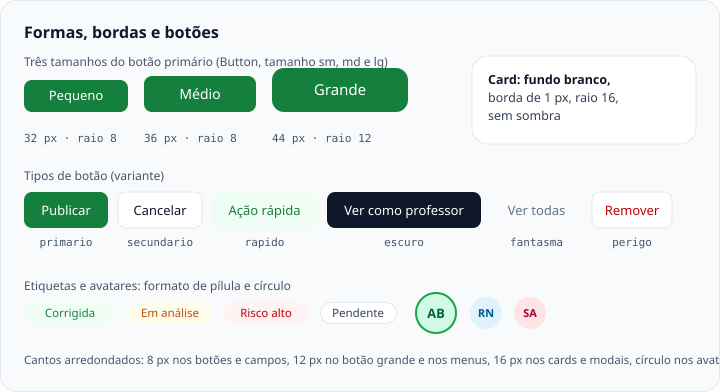

## 05 Botões

Componente: [`src/components/ui/Button.tsx`](../../src/components/ui/Button.tsx). Para um link com cara de botão, use `classesDoBotao()` do mesmo arquivo.

| Tipo | `variante` | Aparência | Uso | Exemplos reais |
|---|---|---|---|---|
| Primário | `primario` | Fundo `--color-acao`, texto branco, hover `--color-acao-2` | Ações importantes | Publicar · Iniciar foco · Registrar estudo de hoje · Entregar · Trocar pontos |
| Secundário | `secundario` | Fundo branco, borda fina, texto `--color-tinta` | Ações alternativas, com menor destaque | Cancelar · Abrir material · Simular ausência (só no modo apresentação) · Usar Matemática (sugestão da IA) |
| Ação rápida | `rapido` | Fundo verde muito claro, texto verde de destaque | Prevista para ações pequenas dentro de cards. **Nenhuma tela usa hoje.** | Os cards usam botões redondos só com ícone (curtir, responder, salvar, compartilhar), com rótulo de acessibilidade |
| Escuro | `escuro` | Fundo `--color-tinta`, texto `--color-superficie` | Ação neutra de alto contraste | Ver como professor (no Roteiro de apresentação) |
| Fantasma | `fantasma` | Só texto cinza, fundo no hover | Ações discretas, links de apoio | Modo imersivo (timer de foco) · Baixar anexo em Atividades |
| Perigo | `perigo` | Fundo branco, borda fina, texto vermelho | Ações destrutivas | Remover publicação · Excluir atividade · Sim, apagar tudo |

Tamanhos:

| Tamanho | `tamanho` | Altura | Texto | Raio |
|---|---|---|---|---|
| Pequeno | `sm` | 32 px | 13 px | 8 px |
| Médio (padrão) | `md` | 36 px | 14 px | 8 px |
| Grande | `lg` | 44 px | 15 px | 12 px |

Como o botão se comporta:

- **Carregando:** `carregando` mostra um indicador e desabilita o botão (`aria-busy`).
- **Desabilitado:** opacidade reduzida e cursor "não permitido".
- **Toque:** no celular (menos de 640 px) ou com ponteiro "grosso", os tamanhos pequeno e médio ganham uma área de toque invisível de pelo menos 44 × 44 px, sem mudar o visual (utilitário `alvo-toque` de `globals.css`). O grande já tem 44 px de altura.
- **Confirmações em modal** usam uma trava interna para que um duplo clique execute a ação uma só vez.
- **Rótulo inteiro:** nos rodapés de modal, o botão nunca é espremido a ponto de quebrar o rótulo; quando dois botões não cabem lado a lado, eles empilham (seção [13](#13-modal-de-confirmação)).

Botão primário e hover, medidos: branco sobre `#15803D` = 5,02 : 1; branco sobre `#166534` = 7,13 : 1, nos dois temas.

## 06 Cards

Componente: [`src/components/ui/Card.tsx`](../../src/components/ui/Card.tsx).

**Card.** Fundo branco e borda fina cinza, cantos arredondados de 16 px, sem sombra, espaçamento interno e divisórias finas entre conteúdos.

Os cards aparecem em praticamente todas as áreas: Início, Estudos, Missões, Ranking e Campeonatos, Loja, Perfil e Painel do professor.

| `tom` | Fundo e borda | Uso |
|---|---|---|
| `branco` (padrão) | `--color-superficie` e `--color-borda` | Conteúdo comum |
| `suave` | `--color-superficie-2` | Áreas internas |
| `destaque` | `--color-verde-mclaro` e `--color-verde-claro` | Destaque verde |
| `escuro` | `--color-tinta` | Contraste alto, uso raro |

Com `onClick`, o card ganha cursor e um leve efeito ao pressionar (nenhuma tela usa isso hoje; os cards clicáveis das telas são botões ou links). `semPadding` tira o espaçamento interno, para listas com divisórias.

**Card de publicação no Início** ([`feed/PostCard.tsx`](../../src/components/feed/PostCard.tsx)):

- Avatar, nome com selo de verificado (professor e escola), papel e há quanto tempo.
- Segunda linha: ícone do tipo (Dúvida, Material, Aviso, Publicação), disciplina e, quando houver resposta oficial, "Resolvida".
- Texto em 15 px, hashtags em verde de destaque e, se houver, o anexo (nome, tipo e tamanho, botão "Baixar").
- Ações só com ícone e contador: curtir, responder ou comentar, salvar e compartilhar.
- Menu "Mais opções": copiar link e, conforme o papel, "Denunciar publicação" (aluno) ou "Remover publicação" (professor).

No feed, as publicações ficam dentro de um único cartão, separadas por divisórias finas. No celular, esse cartão vai de ponta a ponta da tela.

Hierarquia clara das informações: quem publicou, o que é, o conteúdo e, por último, as ações.

## 07 Avatares

Componente: [`src/components/ui/Avatar.tsx`](../../src/components/ui/Avatar.tsx). Aparecem principalmente no Início, no Ranking e no Perfil: círculos com as iniciais do usuário.

- Formato circular, com fundo em tom suave (verde, azul, âmbar, rosa, violeta ou cinza) definido pelo nome, de modo que cada pessoa tem sempre a mesma cor.
- Iniciais em tom escuro da mesma cor. São as letras dos dois primeiros nomes, sem "Prof." ou "Profª.".
- Se a pessoa escolheu uma foto em "Editar perfil", a foto substitui as iniciais e aparece em todo lugar onde o nome aparece. O anel e os selos continuam.
- **Anel verde** para a moldura da Loja equipada e para quem está ao vivo ou em destaque (`ativo`). **Anel dourado** para o item "Anel dourado no avatar".
- Os outros itens de avatar da Loja: fundo verde cheio, selo de livro no canto e estrela dourada.
- O tamanho varia conforme o contexto: `xs` 24 px, `sm` 32 px, `md` 40 px (padrão), `lg` 56 px e `xl` 80 px. No perfil, o avatar recebe maior destaque.
- Para leitor de tela, o avatar é lido com o **nome completo** (as iniciais são ocultadas).

## 08 Badges e etiquetas

Componente: [`src/components/ui/Badge.tsx`](../../src/components/ui/Badge.tsx). Pequenas etiquetas classificam informações: tamanho reduzido (11 px), formato arredondado, fundo em tons claros ou apenas contorno, texto pequeno e cor associada ao tipo: verde para estados positivos, âmbar para atenção, vermelho para alerta. O texto da etiqueta sempre diz o estado; a cor só reforça.

| `tom` | Aparência | Exemplos reais |
|---|---|---|
| `claro` | Verde de destaque sobre verde muito claro | Corrigida · Validado · Respondida · Tudo corrigido · Você está aqui |
| `verde` | Branco sobre verde de ação | (disponível; sem uso em tela hoje) |
| `ambar` | Texto ouro sobre âmbar 50 | Em análise · Pendente (dúvida sem resposta) · Atenção · Contestada |
| `alerta` | Vermelho sobre vermelho 50 | Risco alto · Atrasada · prioridade alta |
| `neutro` | Texto secundário, fundo cinza, anel fino | Nível 3 · Estudante · Entregue · Oficial · Amistoso |
| `contorno` | Fundo branco, anel fino | Pendente (atividade) · disciplina · categoria |
| `azul` | Azul institucional sobre azul 50 | Placa de turma no perfil |
| `ouro` | Ouro sobre ouro claro | (disponível; sem uso em tela hoje) |
| `escuro` | Fundo `--color-tinta` | (disponível; sem uso em tela hoje) |

**Raridade da Loja não é uma etiqueta.** Comum, Incomum, Raro, Especial e Exclusivo aparecem como texto pequeno acima do nome do item ("Raro · Moldura"). Só o Exclusivo ganha cor (ouro). Veja a seção [12](#12-loja).

## 09 Barras de progresso

Componentes: [`ProgressBar`](../../src/components/ui/ProgressBar.tsx) (linear) e [`Anel`](../../src/components/ui/Anel.tsx) (circular).

Aparecem em Missões, Perfil (nível e domínio por disciplina), Ranking (distância até a zona de promoção), missão coletiva, correções do professor e na Carteira. Trilho em cinza muito claro, preenchimento em verde, formato arredondado e a porcentagem ou contagem sempre escrita ao lado.

- `ProgressBar`: altura de 10 px (6 px na versão `fina`), trilho `--color-borda` com transparência, preenchimento `--color-verde` (ou verde suave, ou âmbar). Tem `role="progressbar"` com valor, mínimo, máximo e rótulo.
- `Anel`: anel em SVG (120 px por padrão), usado na meta do dia e no timer de foco. Também é um `progressbar`. Nos timers que atualizam a cada segundo a animação é desligada.
- Exemplos do PDF: "Responder 2 dúvidas de colegas" (1/2), "Maratona da Turma · 200 flashcards" (82%), "Domínio em História" (45%), anel "60% da meta".

### Gráficos

Os gráficos de Estatísticas são componentes leves em HTML e SVG, sem biblioteca, em [`ui/graficos.tsx`](../../src/components/ui/graficos.tsx): `Barras`, `BarrasHorizontais`, `MapaDeCalor`, `Sparkline` e `Rosca` (com legenda). Traços finos, pontas de 4 px arredondadas, 2 px de respiro entre as barras, grade discreta, dica ao passar o mouse ou tocar, e textos sempre nas cores de texto. Cada disciplina usa a sua cor fixa (seção [02](#02-paleta-de-cores)). Todo gráfico tem resumo em texto e navegação por setas (seção [16](#16-acessibilidade)). Nas barras verticais, cada barra é um botão que ocupa todo o "vão" (a barra mais metade do respiro de cada lado) e a altura inteira do gráfico, e no celular o dedo que toca ou arrasta escolhe o vão sob ele (seção [16](#alvo-de-toque-e-zoom)).

## 10 Navegação inferior

Componente: [`shell/BottomNav.tsx`](../../src/components/shell/BottomNav.tsx), com os destinos em [`shell/abas.ts`](../../src/components/shell/abas.ts). Barra fixa no rodapé em todas as telas principais do celular e do tablet (até 1023 px), com 56 px de altura. No computador (a partir de 1024 px), dá lugar a uma barra lateral com todas as áreas agrupadas (seção [17](#17-responsividade)).

São cinco destinos por perfil:

| Perfil | Destinos da barra inferior |
|---|---|
| Aluno | Início · Estudos · Missões · Ranking · Perfil |
| Professor | Painel · Feed · Alunos · Atividades · Estatísticas |

No aluno, "Ranking" também fica ativo em Campeonatos, e "Perfil" fica ativo em Loja e Estatísticas. No professor, Salas de estudo, Campeonatos, Dúvidas e Moderação ficam a um toque de distância, no bloco "Comunidade e engajamento" do Painel.

Barra lateral (computador), com o título de cada grupo visível:

| Perfil | Grupos |
|---|---|
| Aluno | **Aprender**: Início, Sala de estudos, Salas coletivas, Missões · **Competir**: Ranking, Campeonatos · **Você**: Loja, Estatísticas, Perfil |
| Professor | **Turmas**: Painel, Alunos, Atividades, Estatísticas · **Engajamento**: Salas de estudo, Campeonatos · **Comunidade**: Feed da escola, Dúvidas, Moderação |

No rodapé da barra lateral fica a conta (avatar, nome e turma ou papel), com um menu: aparência (claro, escuro ou sistema), "Meu perfil" e "Sair". Com o modo apresentação ligado, o menu ganha "Roteiro guiado" e "Ver como professor" (ou "Ver como aluna").

**Estado ativo e inativo.** O item ativo é marcado por três sinais ao mesmo tempo (peso do traço, negrito e cor), e não só pela cor.

| Estado ativo | Estado inativo |
|---|---|
| Ícone com traço mais grosso (2,25) | Ícone cinza com traço normal (1,75) |
| Texto em negrito | Texto cinza |
| Cor escura (título), em contraste com os demais | Sem destaque de fundo |
| Na barra lateral, fundo cinza claro atrás do item | |

O item ativo recebe `aria-current="page"`.

## 11 Ícones

Estilo simples e minimalista, da biblioteca **Lucide** (`lucide-react`), com traços simples que acompanham a cor do elemento em que estão inseridos. Ícones decorativos são ignorados por leitores de tela; botões que só têm ícone recebem um rótulo de acessibilidade com o nome da ação.

| Uso | Ícone (Lucide) | Onde |
|---|---|---|
| Início | `House` | Barra inferior e lateral |
| Estudos | `Hourglass` | Barra inferior e lateral |
| Missões | `Target` | Barra inferior e lateral |
| Ranking | `Trophy` | Barra inferior e lateral |
| Campeonatos | `Swords` | Barra lateral |
| Loja | `ShoppingBag` | Barra lateral |
| Perfil | `User` | Barra inferior e lateral |
| Estatísticas | `ChartColumn` | Barra lateral (aluno) e barra inferior (professor) |
| Feed (professor) | `Newspaper` | Barra inferior e lateral |
| Pontos | `Coins` | Cabeçalho, Loja, Carteira |
| XP | `Sparkles` | Cabeçalho, Carteira |
| Sequência | `Flame` | Missões, Estudos |
| Medalhas | ícone próprio de cada medalha (`Users`, `FlaskConical`, `Flame`, `ShieldCheck`, `Lightbulb`, `Brain`, `Megaphone`, `Crown`); `Award` nas notificações | Perfil, notificações |
| Calendário | `CalendarDays` | Cabeçalho |
| Notificações | `Bell` | Cabeçalho |
| Respostas | `MessageCircle` | Cards de publicação |
| Curtidas | `Heart` | Cards de publicação |
| Salvar | `Bookmark` | Cards de publicação |
| Compartilhar | `Share` | Cards de publicação |
| Progresso | `TrendingUp` | Lista de alunos do professor e aviso de novo nível |

O ícone de Mensagens saiu do sistema: as mensagens diretas foram retiradas por decisão da banca (v4).

## 12 Loja

A Loja tem componentes próprios ([`src/components/loja/`](../../src/components/loja)) e diferencia os produtos por raridade: Comum, Incomum, Raro, Especial e Exclusivo. A raridade aparece junto do tipo do item, acima do nome (ex.: "Raro · Moldura"), como texto pequeno: cinza para Comum e Incomum, cor de texto normal para Raro e Especial, e ouro para Exclusivo. Nos itens de avatar, o card mostra uma prévia do próprio avatar do aluno com o item aplicado; o preço aparece ao lado do ícone de pontos, com a ação "Trocar" ou o estado "Equipado".

Exemplos (dados de [`src/data/loja.ts`](../../src/data/loja.ts)):

| Item | Raridade · tipo | Preço | Estado no card |
|---|---|---|---|
| Anel verde no avatar | Comum · Moldura | 150 | "Equipado" (com a marca de verificação) ou "Adquirido" |
| Fundo verde no avatar | Comum · Fundo | 220 | "Trocar" |
| Anel dourado no avatar | Raro · Moldura | 750 | "Trocar" |

O que o card mostra, de cima para baixo: a prévia (quadro cinza), "Raridade · tipo", o nome em até duas linhas, e na base o preço com o ícone de pontos e o estado. Sem saldo suficiente, em vez de "Trocar" o card diz "faltam N". A Loja tem três abas (Avatar, Perfil e Recompensas da escola) e o Histórico de trocas ao final da página. Itens do perfil são únicos; os vouchers da escola podem ser trocados de novo, e cada troca gera um código novo.

## 13 Modal de confirmação

Componente: [`src/components/ui/Sheet.tsx`](../../src/components/ui/Sheet.tsx). Padrão de modal inferior para confirmar compras; no computador, o mesmo modal aparece centralizado na tela.

| Largura da tela | Como o modal aparece |
|---|---|
| Até 1023 px (celular e tablet) | Modal inferior: sobe de baixo, até 92% da altura, largura máxima de 640 px, com alça. Fecha também arrastando para baixo. |
| 1024 px ou mais | Diálogo centralizado, largura máxima de 560 px (760 px nos formulários grandes, como Calendário e Nova atividade). |

O modal "Confirmar troca" (título "Seu item" quando o item já é seu):

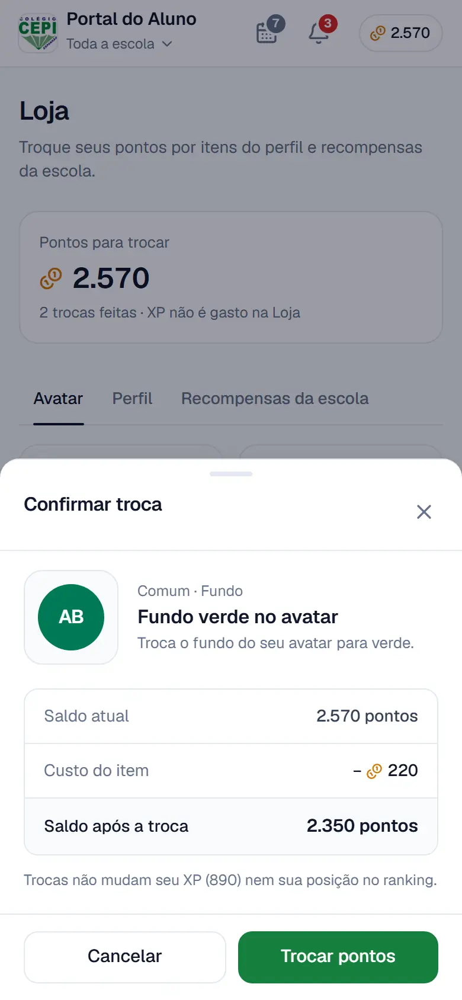

- Aparece sobre a tela, escurecendo o fundo.
- Fundo branco e cantos arredondados (os de cima, no celular).
- Mostra a prévia, "Raridade · tipo", o nome e a descrição do item.
- Apresenta as informações da operação: **saldo atual**, **custo do item** e **saldo após a troca**.
- Botão de cancelamento ("Cancelar") e botão principal de confirmação ("Trocar pontos").
- Se o saldo não basta, mostra "Saldo insuficiente: você possui X pontos e este item requer Y pontos." e desabilita o botão principal.
- Lembra que trocas não mudam o XP nem a posição no ranking.

O mesmo padrão é usado em nova publicação, denúncia, relato à escola, detalhe de medalha, calendário, notificações e correção de atividades. No total, cerca de trinta telas usam o `Sheet`.

Como o modal se comporta (veja também a seção [16](#16-acessibilidade)):

- Fecha no X, tocando no fundo e com **Esc**. Com dois modais empilhados, o Esc fecha só o de cima.
- Prende o Tab dentro dele, deixa o fundo inerte e trava a rolagem da página.
- Ao fechar, o foco volta para o botão que o abriu.

**Rodapé com botões.** Os modais de formulário e de confirmação (Nova publicação, Remover publicação, Detalhe da medalha, Confirmar troca e outros; 26 rodapés em 22 arquivos) terminam com um rodapé fixo, o `RodapeSheet` ([`ui/RodapeSheet.tsx`](../../src/components/ui/RodapeSheet.tsx)): Cancelar (ou Fechar) e a ação principal. Cada botão tem largura mínima igual à do próprio rótulo (`min-w-fit`). Se os dois cabem lado a lado, ficam lado a lado; se não cabem (celular estreito, rótulo longo), **empilham**, cada um com a largura inteira, em vez de quebrar o texto em duas ou três linhas. Medido na demonstração (altura de 44 px nos dois casos):

| Modal | 390 px | 320 px |
|---|---|---|
| Detalhe da medalha: "Baixar certificado (PDF)" e "Fechar" (tela 49) | lado a lado; o botão do certificado tem 228,6 px de largura e uma linha só | empilhados, 280 px cada |
| Remover publicação: "Cancelar" e "Remover publicação" (tela 86) | lado a lado; o botão da ação tem 184,9 px de largura e uma linha só | empilhados, 280 px cada |

Nenhum modal com rodapé rola na horizontal em 320, 390 ou 1280 px.

Telas de referência: [Wireframes](./WIREFRAMES.md), tela 45 (Confirmar troca), tela 78 (Saldo insuficiente), tela 49 (Detalhe da medalha) e tela 86 (Remover publicação).

## 14 Espaçamento

Escala consistente baseada em múltiplos de 4 px, que mantém todas as telas visualmente alinhadas. É a escala padrão do Tailwind (`p-1` = 4 px, `p-2` = 8 px, e assim por diante).

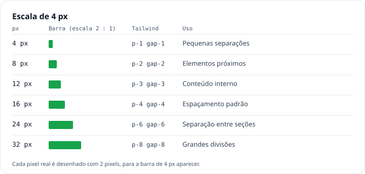

| Valor | Tailwind | Uso |
|---|---|---|
| 4 px | `1` | Pequenas separações |
| 8 px | `2` | Elementos próximos |
| 12 px | `3` | Conteúdo interno |
| 16 px | `4` | Espaçamento padrão (padding de card, margem lateral da página no celular) |
| 24 px | `6` | Separação entre seções; margem lateral no tablet |
| 32 px | `8` | Grandes divisões; margem lateral no computador |

Medidas de layout que vêm de variáveis em `globals.css`: cabeçalho de 56 px, barra inferior de 56 px (mais a área segura do aparelho), barra lateral de 248 px (`--sidebar`) e coluna de conteúdo de `100%` no celular, 640 px no tablet e até 1080 px no computador (`--coluna`).

## 15 Tema escuro

O aluno escolhe a aparência em Perfil → Configurações → Aparência: **Claro**, **Escuro** ou **Sistema** (igual ao sistema). O mesmo seletor aparece no menu da conta (barra lateral e cabeçalho do professor) e, como botão, na tela de entrada. A escolha fica salva no navegador.

Todas as cores são variáveis do Design System; no tema escuro os componentes continuam os mesmos e só os valores mudam. O `<html>` ganha `data-tema="escuro"`, e as variáveis são redefinidas em `[data-tema="escuro"]`. O tema é aplicado antes de a página aparecer, por um script curto no `<head>` ([`lib/tema-script.ts`](../../src/lib/tema-script.ts)), então a tela não "pisca" em branco ao abrir no modo escuro. O mesmo script acerta a cor da barra do navegador (`theme-color`). Isso vale para o Next e para a demonstração.

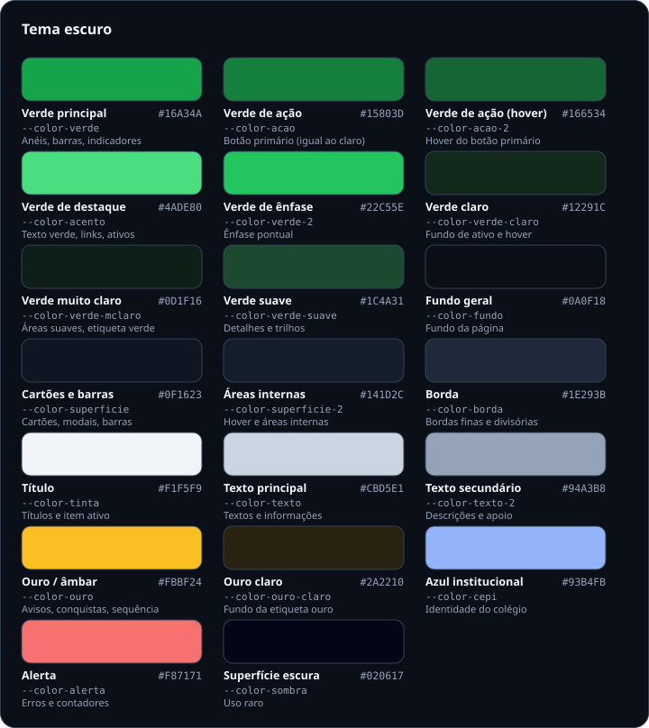

| Variável | Tema claro | Tema escuro |
|---|---|---|
| Fundo geral (`--color-fundo`) | `#F8FAFC` | `#0A0F18` |
| Cartões e barras (`--color-superficie`) | `#FFFFFF` | `#0F1623` |
| Áreas internas (`--color-superficie-2`) | `#F8FAFC` | `#141D2C` |
| Borda (`--color-borda`) | `#E2E8F0` | `#1E293B` |
| Título (`--color-tinta`) | `#0F172A` | `#F1F5F9` |
| Texto principal (`--color-texto`) | `#334155` | `#CBD5E1` |
| Texto secundário (`--color-texto-2`) | `#64748B` | `#94A3B8` |
| Verde principal (`--color-verde`) | `#16A34A` | `#16A34A` |
| Verde de ação, botão primário (`--color-acao`) | `#15803D` | `#15803D` |
| Verde de ação, hover (`--color-acao-2`) | `#166534` | `#166534` |
| Texto de destaque verde (`--color-acento`) | `#15803D` | `#4ADE80` |
| Verde escuro, ênfase (`--color-verde-2`) | `#15803D` | `#22C55E` |
| Verde claro / muito claro / suave | `#DCFCE7` / `#F0FDF4` / `#BBF7D0` | `#12291C` / `#0D1F16` / `#1C4A31` |
| Ouro, texto âmbar (`--color-ouro`) | `#B45309` | `#FBBF24` |
| Ouro claro (`--color-ouro-claro`) | `#FEF3C7` | `#2A2210` |
| Âmbar, ícones (`--color-ambar`) | `#D97706` | `#FBBF24` |
| Azul institucional (`--color-cepi`) | `#1D4ED8` | `#93B4FB` |
| Alerta (`--color-alerta`) | `#DC2626` | `#F87171` |

**O botão primário não muda de cor.** Ele usa `#15803D` com texto branco nos dois temas (5,02 : 1), por isso a tabela mostra o mesmo valor nas duas colunas.

**Cores por disciplina no tema escuro:** `#3987E5` (Matemática), `#D95926` (Biologia), `#199E70` (História), `#C98500` (Português), `#D55181` (Química), `#008300` (Física), `#9085E9` (Geografia) e `#E66767` (Inglês). A rampa do mapa de calor também muda (seção [02](#02-paleta-de-cores)).

**Tons de apoio remapeados no escuro** (usados em avisos e estados):

| Tom | Claro (Tailwind) | Escuro |
|---|---|---|
| `amber-50` (fundo de aviso) | `#FFFBEB` | `#231C0C` |
| `amber-200` | `#FEE685` | `#4D3A14` |
| `amber-300` | `#FFD230` | `#6D5219` |
| `amber-900` (texto de aviso) | `#7B3306` | `#F3D59A` |
| `amber-950` | `#461901` | `#F8E6BF` |
| `red-50` / `red-100` / `red-200` | `#FEF2F2` / `#FFE2E2` / `#FFC9C9` | `#2A1212` / `#3A1616` / `#4E1C1C` |
| `sky-100` / `sky-200` / `sky-600` | `#DFF2FE` / `#B8E6FE` / `#0084D1` | `#0E2434` / `#16354D` / `#7CC4F0` |
| `blue-50` / `blue-100` | `#EFF6FF` / `#DBEAFE` | `#0F1B31` / `#172A4A` |

A classe `dark:` do Tailwind segue o atributo `data-tema` (e não só a preferência do sistema), por causa de `@custom-variant dark` em `globals.css`.

## 16 Acessibilidade

Cinco requisitos orientam todas as telas: navegação por teclado, foco visível, texto alternativo, contraste e nunca depender só da cor. Dois outros cuidados completam a lista: movimento reduzido e alvo de toque.

A coluna "Situação" separa o que já está no protótipo do que ainda tem ressalvas.

| Requisito | Situação na v8 |
|---|---|
| [Navegação por teclado](#navegação-por-teclado) | No protótipo |
| [Foco visível](#foco-visível) | No protótipo |
| [Texto alternativo](#texto-alternativo) | No protótipo |
| [Contraste](#contraste-medido) | No protótipo (as 4 exceções foram corrigidas em 09/10/2026; resta só uma nuance no hover dos links de pessoa) |
| [Não depender só de cor](#não-depender-só-de-cor) | No protótipo (o estado "Pontos em verificação" é só mockup) |
| [Movimento](#movimento) | No protótipo |
| [Alvo de toque e zoom](#alvo-de-toque-e-zoom) | No protótipo, com ressalva (nas séries de 30 e 60 dias dos gráficos cada barra é um vão estreito, de 5 a 11 px; o arrasto do dedo compensa) |

### Navegação por teclado

Todos os controles são alcançados com **Tab**, na mesma ordem em que aparecem na tela, e acionados com **Enter** ou **Espaço**. **Esc** fecha modais e painéis. Com um modal aberto, o foco fica preso dentro dele e, ao fechar, volta para o botão que o abriu. Um link "Pular para o conteúdo" é o primeiro item da página.

**Situação: no protótipo.** O que foi conferido:

- O primeiro Tab, em qualquer tela (inclusive a de entrada), cai em "Pular para o conteúdo" ([`PularParaConteudo.tsx`](../../src/components/shell/PularParaConteudo.tsx)). O link fica fora da tela até receber foco e leva o foco para o `<main>`. Ele não usa `#conteudo` como endereço, porque na demonstração a rota vive no hash.
- Na demonstração, com o modal "Nova publicação" aberto, 25 Tabs seguidos ficaram sempre dentro do modal; Esc fechou; o foco voltou para o botão "Compartilhe uma dúvida ou material…" que o abriu.
- Esc fecha só o modal do topo ([`Sheet.tsx`](../../src/components/ui/Sheet.tsx)). Menus suspensos fecham com Esc e devolvem o foco ao gatilho ([`useFecharFora.ts`](../../src/hooks/useFecharFora.ts)).
- Os gráficos de barras são uma parada de Tab só; as setas, Home e End percorrem as barras.
- **Abas, chips e controles segmentados** (`role="tab"`) seguem o padrão ARIA de abas, com "ativação automática":
  - Só a aba ativa entra na ordem do **Tab** (as outras ficam com `tabindex="-1"`). Se nenhuma está ativa, como num filtro ainda sem escolha (o motivo na janela "Remover publicação"), a primeira é a parada de Tab. Assim a lista inteira é uma parada só, e **Tab** sai dela.
  - **←** e **→** movem o foco para a aba vizinha e já a selecionam; do último volta ao primeiro e vice-versa. **Home** vai à primeira e **End** à última.
  - O visual não mudou. O código é compartilhado em [`ui/abas.ts`](../../src/components/ui/abas.ts): `aoTeclarNasAbas` vai no `onKeyDown` da lista e `abaNoTab` decide o `tabindex` (o Perfil e o painel do professor, que têm sempre uma aba ativa, usam `tabIndex={ativa ? 0 : -1}`). Usam o código [`ChipGroup`](../../src/components/ui/ChipGroup.tsx), [`Segmentado`](../../src/components/ui/Segmentado.tsx), `Abas` do feed ([`feed/Abas.tsx`](../../src/components/feed/Abas.tsx)), as abas do Perfil e as do painel do professor ([`professor/comum.tsx`](../../src/components/professor/comum.tsx)).
  - Conferido com teclado de verdade, em 390 px e em 1280 px, em 23 listas de abas da demonstração (Feed, Estudos, Perfil, Campeonatos, Salas, Ranking, Loja, Estatísticas e as listas do professor, entre abas, filtros em pílula e controles segmentados): uma parada de Tab, →, End, volta ao início, ← no primeiro, Home e Tab saindo do grupo. A única que não responde no teste é a do feed atrás da janela "Remover publicação", que fica inerte (o foco não entra no fundo); a lista da própria janela responde.

### Foco visível

Todo elemento interativo mostra um anel de foco ao ser alcançado pelo teclado. O anel nunca é removido para "limpar" o visual.

**Situação: no protótipo.** A regra global em `globals.css` é `:focus-visible { outline: 2px solid var(--color-verde); outline-offset: 2px }`. Medido na demonstração: 2 px, `#16A34A`, em links, botões e itens da barra lateral. O contraste do anel é 3,30 : 1 sobre o branco e 5,50 : 1 sobre o cartão escuro (mínimo de 3 : 1 para componentes de interface). Campos de texto trocam o anel por borda verde mais um halo; os cartões de sala têm um anel próprio sobre o cartão inteiro.

### Texto alternativo

Botões só com ícone (curtir, salvar, compartilhar, notificações) têm rótulo com o nome da ação. Avatares de iniciais são lidos com o nome completo. Imagens enviadas em publicações pedem uma descrição opcional ao autor e, sem ela, são lidas como "Imagem enviada por [nome]". Gráficos trazem um resumo em texto. Ícones decorativos são ignorados.

**Situação: no protótipo.**

- Rótulos: `aria-label` nos botões de ícone ("Curtir · 14", "Salvar", "Compartilhar (copiar link)", "Notificações: 3 não lidas", "Calendário: 2 compromissos nos próximos 7 dias").
- Avatar: as iniciais ficam `aria-hidden` e o nome completo vai em texto só para leitor de tela.
- Imagem enviada: o campo "Descrição da imagem (opcional)" aparece quando a pessoa escolhe uma imagem (até 200 caracteres). Sem descrição, o texto alternativo é "Imagem enviada por [nome]" ([`PostCard.tsx`](../../src/components/feed/PostCard.tsx) e [`MaterialSheet.tsx`](../../src/components/feed/MaterialSheet.tsx)).
- Gráficos ([`graficos.tsx`](../../src/components/ui/graficos.tsx)): todo gráfico tem uma legenda só para leitor de tela (`<figcaption class="sr-only">`), escrita à mão (`resumo`) ou gerada, neste formato (valores de exemplo): "Tempo de estudo: 7 valores. Total 1 h 20, média 11 min. Maior valor: 25 min em 12 set. 27% a mais que no período anterior."
- Onde o ícone só enfeita, ele leva `aria-hidden`.

### Contraste

Combinações medidas pela fórmula da WCAG 2.1 (tabela abaixo). Meta: 4,5 : 1 para texto comum e 3 : 1 para texto grande e ícones.

**Situação: ajustes aplicados.** Os dois ajustes recomendados no PDF já estão no código: o botão primário usa `#15803D` (e não `#16A34A`) e o cinza `#94A3B8` não é usado em texto no tema claro. As quatro exceções que restavam foram corrigidas em 09/10/2026 (tabela depois da tabela de combinações).

### Não depender só de cor

Todo estado tem texto e, quando cabe, ícone: "Em revisão pela coordenação", "Sem conexão", "Saldo insuficiente", "Concluída". Erros de formulário mostram a mensagem escrita ao lado do campo. Gráficos por disciplina têm legenda com o nome. A aba ativa usa negrito e traço mais grosso, além da cor. Contadores mostram o número, não só um ponto colorido.

**Situação: no protótipo.**

- Erro de formulário: texto, ícone de alerta e `role="alert"` ([`ErroCampo.tsx`](../../src/components/feed/ErroCampo.tsx), [`Campo.tsx`](../../src/components/ui/Campo.tsx)).
- Contadores do cabeçalho mostram o número (e "99+" acima de 99).
- Estado ativo: na navegação, peso do traço, negrito e cor. Nas abas do feed e da Loja, sublinhado de 2 px. Nos filtros em pílula, fundo escuro cheio. Nos controles segmentados, pílula elevada com anel. Em todos, `aria-selected` ou `aria-current`.
- O estado "Pontos em verificação" (tela 77) continua só como mockup no [Wireframes](./WIREFRAMES.md).

### Movimento

Animações curtas, só para dar continuidade (abrir modal, trocar aba, número que sobe). Com a opção "reduzir movimento" do sistema ativada, as animações são desligadas.

**Situação: no protótipo.** Três camadas: `MotionConfig reducedMotion="user"` (animações da biblioteca de movimento), `@media (prefers-reduced-motion: reduce)` em `globals.css` (CSS: animações e transições passam a 0,01 ms, e o brilho do esqueleto para) e checagem explícita em `AnimatedNumber` (o número troca na hora) e em `Celebracao` (sem confete).

### Alvo de toque e zoom

Áreas de toque de pelo menos 44 × 44 px no celular. A página continua utilizável com zoom de 200%, sem rolagem horizontal.

**Situação: no protótipo, com uma ressalva.**

- A área de toque é ampliada sem mudar o visual. Controles pequenos usam o utilitário `alvo-toque` de `globals.css`: um `::after` invisível de no mínimo 44 × 44 px, centrado no controle. Onde o texto corta com reticências (e o `::after` seria recortado), o link ganha a mesma altura por preenchimento. Os campos de formulário e menus de seleção passam de 40 para 44 px (`toque:h-11`). Tudo isso vale com menos de 640 px de largura ou com ponteiro "grosso".
- Medido na demonstração em 390 px, nas 16 telas abaixo: todos os botões, links (inclusive nomes e avatares em cards e listas), abas, campos e itens das barras têm pelo menos 44 × 44 px de área de toque.
- **Ressalva:** as barras dos gráficos de Estatísticas (aluno e professor). Cada barra é um botão, e nas séries longas 30 ou 60 alvos de 24 ou 44 px não cabem na tela. O que se fez:
  - O botão é o "vão" inteiro da barra, em toda a altura do gráfico e **sem faixa morta** entre barras. Antes, cada botão tinha 2 px de folga entre ele e o vizinho (8,6 px de largura em 390 px, 6,3 px em 320 px); agora são 10,6 px e 8,3 px, e a barra visível continua com 8,6 px, na mesma posição.
  - No celular, tocar ou arrastar na área do gráfico escolhe o vão sob o dedo (`touch-pan-y`: arrastar na vertical ainda rola a página). A dica fica na tela depois de soltar e fecha com um toque fora.
  - As setas, Home e End e o resumo em texto continuam como alternativa equivalente.
  - O limite que fica está na tabela abaixo: só as séries de 30 e 60 dias do celular ficam bem abaixo de 24 px. É o limite do dado (uma barra por dia).
- **320 px sem rolagem horizontal:** conferido em 16 telas (9 do aluno e 7 do professor), em 320 e 390 px. Nenhuma rolou na horizontal, inclusive o Painel do professor.
- **Zoom de 200%:** em uma tela de 1280 px, equivale a 640 px de largura. Nessa largura e em 639 px, nenhuma das 16 telas rolou na horizontal.

Largura do vão de cada barra, medida na demonstração (altura do gráfico inteira, de 72 a 150 px):

| Gráfico | 390 px | 320 px |
|---|---|---|
| Séries de 7 dias, do aluno ou do professor (Tempo por dia, XP, Pontos, Alunos ativos) | 45 a 47 px | 35 a 37 px |
| Séries de 30 dias (aluno e professor) | **10,6 a 10,9 px** | **8,3 a 8,5 px** |
| Bimestre do aluno: 60 dias, uma barra por dia | **5,3 px** | **4,1 px** |
| Bimestre do professor e "Concluídas por semana" do aluno (8 semanas) | 40 a 41 px | 31 a 32 px |
| Horário de pico do aluno (24 horas) | 13,3 px | 10,3 px |

### Contraste medido

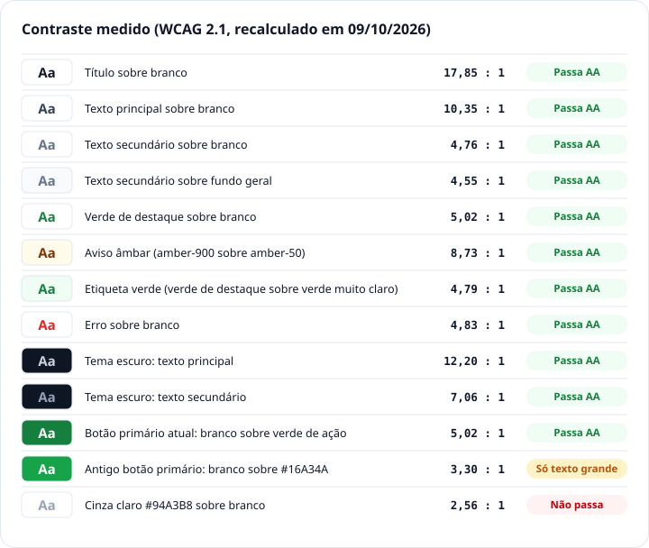

Razões recalculadas em 09/10/2026 pela fórmula da WCAG 2.1, com os valores reais de `globals.css` (e os do Tailwind 4.3 para os tons de apoio).

| Combinação | Texto sobre fundo | Razão no PDF | Razão recalculada | Resultado |
|---|---|---|---|---|
| Título sobre branco | `#0F172A` sobre `#FFFFFF` | 17,85 : 1 | 17,85 : 1 | Passa AA |
| Texto principal sobre branco | `#334155` sobre `#FFFFFF` | 10,35 : 1 | 10,35 : 1 | Passa AA |
| Texto secundário sobre branco | `#64748B` sobre `#FFFFFF` | 4,76 : 1 | 4,76 : 1 | Passa AA |
| Texto secundário sobre fundo geral | `#64748B` sobre `#F8FAFC` | 4,55 : 1 | 4,55 : 1 | Passa AA |
| Verde escuro sobre branco (links, "Trocar") | `#15803D` sobre `#FFFFFF` | 5,02 : 1 | 5,02 : 1 | Passa AA |
| Aviso âmbar (em revisão) | `#7B3306` (amber-900) sobre `#FFFBEB` (amber-50) | 6,84 : 1 | **8,73 : 1** | Passa AA |
| Etiqueta verde | `#15803D` sobre `#F0FDF4` (etiqueta `claro` atual) | 6,49 : 1 | **4,79 : 1** | Passa AA |
| Erro sobre branco | `#DC2626` sobre `#FFFFFF` | 4,83 : 1 | 4,83 : 1 | Passa AA |
| Tema escuro: texto principal | `#CBD5E1` sobre `#0F1623` | 12,20 : 1 | 12,20 : 1 | Passa AA |
| Tema escuro: texto secundário | `#94A3B8` sobre `#0F1623` | 7,06 : 1 | 7,06 : 1 | Passa AA |
| Branco sobre verde principal (botão primário antigo) | `#FFFFFF` sobre `#16A34A` | 3,30 : 1 | 3,30 : 1 | Só texto grande. **O botão não usa mais esta combinação.** |
| Branco sobre verde de ação (botão primário atual) | `#FFFFFF` sobre `#15803D` | n/d | **5,02 : 1** | Passa AA |
| Cinza claro sobre branco | `#94A3B8` sobre `#FFFFFF` | 2,56 : 1 | 2,56 : 1 | Não passa (só decorativo) |

> **Ajustes recomendados (aplicados na v8).** (1) O texto branco sobre o verde principal (`#16A34A`) fica em 3,30 : 1 e só passa em texto grande. Nos botões com texto de tamanho comum, usar o verde escuro `#15803D`, que chega a 5,02 : 1 sem mudar a identidade; os botões do protótipo já seguem essa regra. (2) O cinza claro `#94A3B8` fica em 2,56 : 1 sobre branco e deve ser usado só em elementos decorativos e marcadores, nunca em texto.

Duas razões do PDF não se reproduzem com o código atual:

- **Aviso âmbar, 6,84 : 1.** O aviso "Em revisão pela coordenação" e a faixa "Sem conexão" usam `amber-900` sobre `amber-50`, que dá 8,73 : 1. O texto âmbar solto (`--color-ouro`) dá 5,02 : 1 sobre branco e 4,84 : 1 sobre `amber-50`.
- **Etiqueta verde, 6,49 : 1.** Esse valor corresponde a `#166534` sobre `#DCFCE7`. A etiqueta `claro` do código usa `#15803D` sobre `#F0FDF4` (4,79 : 1), que também passa.

Outras combinações usadas no código:

| Combinação | Razão no claro | Razão no escuro |
|---|---|---|
| Verde de destaque (`--color-acento`) sobre verde muito claro (etiqueta e hover) | 4,79 : 1 | 9,84 : 1 |
| Verde de destaque sobre verde claro (hover) | 4,57 : 1 | n/d |
| Texto âmbar (`--color-ouro`) sobre branco ou cartão | 5,02 : 1 | 10,85 : 1 |
| Ouro sobre ouro claro (etiqueta `ouro`) | 4,51 : 1 | 9,42 : 1 |
| Alerta sobre branco ou cartão | 4,83 : 1 | 6,55 : 1 |
| Alerta sobre cinza interno ("Saldo insuficiente") | 4,62 : 1 | 6,11 : 1 |
| `red-700` sobre `red-50` (etiqueta `alerta`) | 5,87 : 1 | 6,36 : 1 (alerta sobre `red-50` escuro) |
| Azul institucional sobre `blue-50` | 6,16 : 1 | 8,32 : 1 |
| Branco sobre cinza secundário (contador do calendário) | 4,76 : 1 | 7,48 : 1 (cor do fundo sobre o cinza) |
| Branco sobre alerta (contador de notificações) | 4,83 : 1 | 6,94 : 1 (cor do fundo sobre o alerta) |
| Anel de foco `#16A34A` sobre o cartão | 3,30 : 1 | 5,50 : 1 |
| Iniciais do avatar (tom escuro sobre tom suave) | 6,36 a 8,40 : 1 | 7,75 a 9,58 : 1 |
| Hover antigo do botão no escuro, `#22C55E` com branco (removido) | n/d | 2,28 : 1 |

**Exceções corrigidas em 09/10/2026** (eram textos abaixo de 4,5 : 1; razões medidas na demonstração, tema claro e escuro):

| Onde | Antes | Agora |
|---|---|---|
| Dias passados no calendário ([`CalendarioSheet.tsx`](../../src/components/calendario/CalendarioSheet.tsx)) | `--color-texto-2` a 50% de opacidade: 1,98 : 1 no claro, 2,71 : 1 no escuro | `--color-texto-2` pleno: 4,76 : 1 no claro, 7,06 : 1 no escuro |
| Duração no botão "Iniciar foco" ([`TimerFoco.tsx`](../../src/components/estudos/TimerFoco.tsx)) | branco a 90% sobre `#15803D`: 4,41 : 1 | branco pleno sobre `#15803D`: 5,02 : 1 (7,13 : 1 no hover) |
| Hora nas mensagens minhas da sala ([`SalaChat.tsx`](../../src/components/salas/SalaChat.tsx)) | branco a 75% sobre `#15803D`: 3,53 : 1 | branco pleno: 5,02 : 1 |
| Hora nas mensagens de sistema da sala (`SalaChat.tsx`) | `--color-texto-2` a 70%: 2,72 : 1 no claro, 4,09 : 1 no escuro | `--color-texto-2` pleno: 4,76 : 1 no claro, 7,06 : 1 no escuro |

A nova varredura (mesmo método, agora com a sala, o chat com mensagens, o foco pausado e todos os campeonatos) achou mais três textos do mesmo tipo e os corrigiu:

| Onde | Antes | Agora |
|---|---|---|
| Contagem nos filtros de Campeonatos ([`CampeonatosView.tsx`](../../src/components/campeonatos/CampeonatosView.tsx)) | `opacity-60`: 3,35 : 1 no claro | sem opacidade (`font-normal`): 10,35 : 1 no claro |
| Texto "restantes" do timer pausado ([`TimerFoco.tsx`](../../src/components/estudos/TimerFoco.tsx)) | a tela toda a 50% de opacidade: 1,96 : 1 no claro, 2,72 : 1 no escuro | só o anel esmaece; o texto fica em `--color-texto-2`: 4,76 : 1 no claro, 7,06 : 1 no escuro |
| Iniciais dos avatares de quem foi eliminado no chaveamento ([`Chaveamento.tsx`](../../src/components/campeonatos/Chaveamento.tsx)) | `opacity-50`: 3,10 a 3,56 : 1 no escuro | `opacity-80` com tons de cinza (`grayscale`) |

**Nuance que fica.** No hover (80% de opacidade) e no toque pressionado (70%), os links de pessoa ([`LinkPessoa`](../../src/components/ui/LinkPessoa.tsx)) esmaecem inteiros. O texto cinza (`--color-texto-2`) dentro deles cai de 4,76 : 1 para cerca de 3,25 : 1 no hover e 2,72 : 1 pressionado no tema claro (4,95 e 4,08 : 1 no escuro), só enquanto o ponteiro está em cima. Não foi mexido porque o componente é compartilhado e o conteúdo dele varia. Em repouso, nenhum texto das telas varridas fica abaixo de 4,5 : 1.

Como a razão é calculada (a mesma fórmula do PDF):

```python
def luz(hex):                      # luminância relativa de uma cor "#RRGGBB"
    r, g, b = [int(hex[i:i+2], 16) / 255 for i in (1, 3, 5)]
    lin = lambda c: c / 12.92 if c <= 0.03928 else ((c + 0.055) / 1.055) ** 2.4
    return 0.2126 * lin(r) + 0.7152 * lin(g) + 0.0722 * lin(b)

def razao(a, b):                   # 1 a 21; texto comum pede 4,5 ou mais
    la, lb = sorted((luz(a), luz(b)), reverse=True)
    return (la + 0.05) / (lb + 0.05)
```

Como foi verificado: uma varredura automática mediu cada texto visível (cor do texto sobre o fundo real, com transparências) em 16 telas, nos dois temas e em duas larguras (390 e 1280 px), mais 10 painéis e abas abertos (notificações, saldo, calendário, nova publicação, troca na Loja, conquistas, configurações, flashcards, menu do post). Sala, chat, foco pausado e campeonatos entraram numa segunda varredura em 09/10/2026 (mesmo método, 390 e 1280 px, claro e escuro), sem nenhum texto abaixo de 4,5 : 1 em repouso. Não entraram o duelo de quiz nem os painéis do professor abertos.

Além do texto, há um ponto de atenção sobre **bordas**: a borda fina `#E2E8F0` tem só 1,23 : 1 contra o branco. Ela separa cards e campos, mas não é o único sinal: todo campo tem rótulo e anel de foco, e o interruptor tem a posição do botão e `aria-checked`.

## 17 Responsividade

O mesmo conteúdo se reorganiza em três faixas de largura. A navegação é a principal mudança: barra inferior no celular e no tablet, barra lateral agrupada no computador.

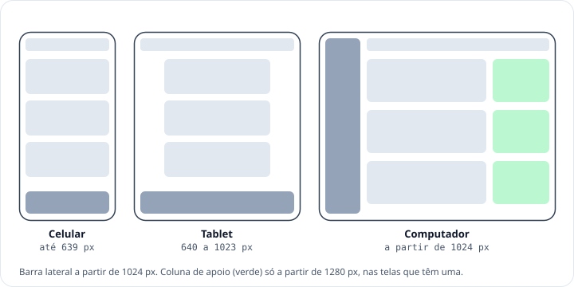

Esquemas: cinza-escuro = navegação · cinza = conteúdo principal · verde = coluna de apoio do computador (só a partir de 1280 px).

| Faixa | Largura | Quando vale (Tailwind) |
|---|---|---|
| Celular | até 639 px | padrão, sem prefixo |
| Tablet | 640 a 1023 px | `sm:` |
| Computador | a partir de 1024 px | `lg:` (barra lateral e modais centralizados) |
| Computador largo | a partir de 1280 px | `xl:` (colunas de apoio) |

| Faixa | Comportamento | Situação |
|---|---|---|
| Celular | Cabeçalho fixo no topo: logo, "Portal do Aluno" com o espaço ativo, calendário (o número é a quantidade de compromissos dos próximos 7 dias), notificações, avatar (a partir de 480 px) e saldo de pontos e XP (o XP some abaixo de 400 px). Uma coluna de conteúdo e barra inferior com 5 abas. Modais abrem de baixo para cima. O cabeçalho do professor mostra "Painel do professor", a disciplina e as turmas, as notificações e o menu da conta. Não há ícone de mensagens. | No protótipo. [Wireframes](./WIREFRAMES.md), telas 01–65 |
| Tablet | Mantém a barra inferior e o cabeçalho do celular. O conteúdo fica numa coluna central com largura máxima de leitura (640 px), sem esticar os cards até a borda; a Loja passa para 3 colunas e os blocos de métricas para 2 ou 3. Os modais continuam subindo de baixo, com no máximo 640 px de largura. | No protótipo (conferido na demonstração) |
| Computador | A barra inferior vira uma barra lateral de 248 px agrupada em Aprender, Competir e Você (aluno) ou Turmas, Engajamento e Comunidade (professor), com o perfil no rodapé. O saldo de pontos e o XP ficam no topo. O conteúdo ocupa até 1080 px. Modais aparecem centralizados. A partir de 1280 px, várias telas ganham uma coluna de apoio à direita; no Início do aluno ela traz campeonato em destaque, sua semana, quem está estudando agora e próximas provas. | No protótipo. [Wireframes](./WIREFRAMES.md), telas 66–67 |

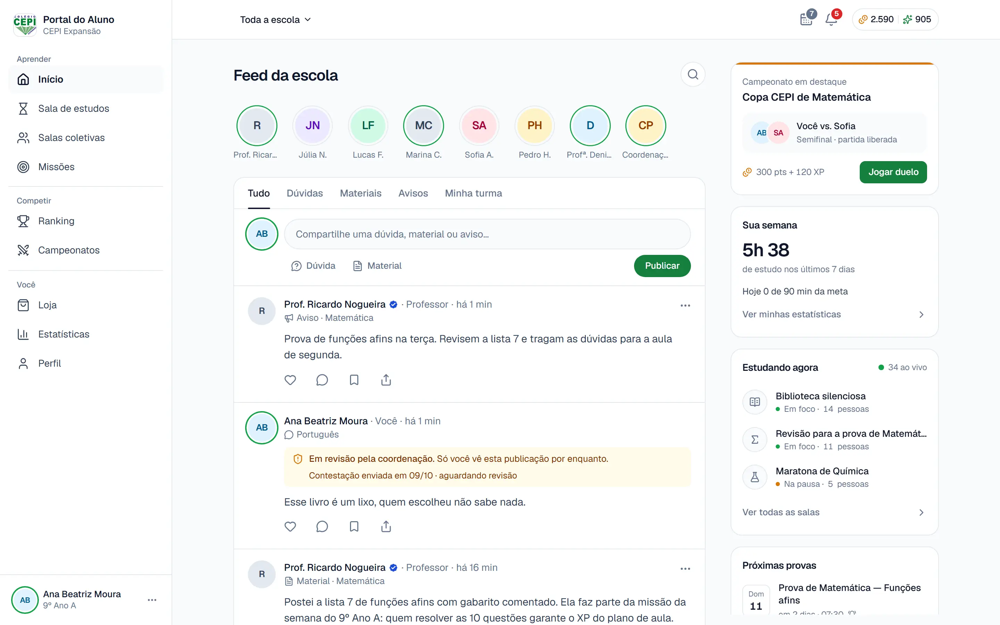

Computador: Início do aluno no protótipo, com a barra lateral e a coluna de apoio (tela 66 do [Wireframes](./WIREFRAMES.md)).

### Telas principais por faixa

Início e Painel do professor foram capturados nos wireframes (telas 66 e 67); o comportamento das demais telas abaixo foi conferido no código e na demonstração.

| Tela | Celular (até 639 px) | Tablet (640 a 1023 px) | Computador (1024 px ou mais) |
|---|---|---|---|
| Início (aluno) | Feed em uma coluna; filtros em abas roláveis (Tudo, Dúvidas, Materiais, Avisos, Minha turma); botão flutuante "+" ao rolar. | Feed em coluna central (640 px) e botão "+". | Feed em coluna central (até 680 px), composer sempre à mostra, sem o botão "+". **A partir de 1280 px**, coluna de apoio de 300 px: campeonato em destaque, sua semana, estudando agora, próximas provas. |
| Início (professor), "Feed da escola" | Mesmo feed, com filtros Tudo, Dúvidas, Sem resposta, Materiais, Avisos e Minhas turmas; faixa "N publicações aguardando revisão · Abrir moderação"; composer com Aviso e Material. | Igual ao celular, em coluna central. | A partir de 1280 px, coluna de apoio: dúvidas sem resposta, aguardando moderação, próximas entregas e atalhos "Publicar aviso" e "Compartilhar material". |
| Estudos | Tudo empilhado: timer, meta do dia, salas ao vivo, sessões recentes, ranking de foco e interclasses. Métricas Hoje, Semana e Sequência em uma linha, com "Ver minhas estatísticas". | Igual ao celular. | A partir de 1280 px, duas colunas: timer e sessões à esquerda; meta, salas, ranking e interclasses à direita. |
| Estatísticas (aluno) | Métricas em 2 colunas; gráficos em 1 coluna. | Métricas em 3 colunas. | Métricas em 6 colunas; gráficos em 2 e 3 colunas. |
| Missões | Uma coluna. | Uma coluna. | A partir de 1280 px, lista à esquerda e coluna lateral (sequência, missão coletiva, relatos). |
| Ranking | Resumo da semana no topo e lista abaixo; um "pino" com a sua posição aparece quando a sua linha sai da tela. | Igual ao celular. | A partir de 1280 px, lista à esquerda; resumo da semana, ligas e privacidade à direita. |
| Loja | Itens em 2 colunas. | 3 colunas. | 3 colunas até 1279 px e 4 colunas a partir de 1280 px. O saldo aparece no topo da página e no cabeçalho. |
| Painel do professor | Indicadores em 2 colunas (o último ocupa a linha toda); "Precisa de atenção" e "Para corrigir" empilhados. | Igual ao celular. | Os 5 indicadores em uma linha; "Precisa de atenção" e "Para corrigir" lado a lado. |

A tela de Mensagens (lista e conversa) saiu do sistema com a retirada das mensagens diretas.

### Como foi verificado

Na demonstração, nas larguras 320, 390, 639, 640, 1023, 1024, 1279 e 1280 px:

| O que | Resultado |
|---|---|
| Barra inferior × barra lateral | Barra inferior visível até 1023 px; barra lateral a partir de 1024 px |
| Loja | 2 colunas até 639 px; 3 de 640 a 1279 px; 4 a partir de 1280 px |
| Coluna de apoio do Início | Aparece em 1280 px, não em 1279 px |
| Painel do professor | Indicadores em 2 colunas até 1023 px; 5 em uma linha a partir de 1024 px |
| Largura do conteúdo | 640 px no tablet; 776 px em 1024 px; 1032 px em 1280 px |
| Rolagem horizontal | Nenhuma, em nenhuma das 8 larguras (16 telas em 320 e 390 px; Início, Loja, Estudos, Estatísticas, Ranking, Painel e Feed do professor nas demais) |
| Rolagem horizontal, repetida após o acabamento de 09/10/2026 | Nenhuma em 108 telas e janelas (aluno e professor, calendário, foco, modal de medalha, modal "Remover publicação", campeonatos e salas) em 320, 390 e 1280 px, nos dois temas, e nenhum erro ou aviso no console |

## 18 Feedback e validação

Como a interface responde às ações do usuário, a erros de validação e a falhas de integração ou da IA. As telas de cada estado estão no documento [Wireframes](./WIREFRAMES.md) (3.1.3, telas 68 a 79).

| Padrão | Quando usar | Exemplo | Onde no código | Situação |
|---|---|---|---|---|
| Notificação curta | Confirmação ou erro passageiro, sem interromper. | "Material compartilhado · +10 pontos por colaborar com a turma"; "Não conseguimos salvar seu progresso" | [`ui/Toaster.tsx`](../../src/components/ui/Toaster.tsx), [`store/ui.ts`](../../src/store/ui.ts) | No protótipo |
| Faixa no topo | Situação que continua enquanto durar. | "Sem conexão. Tentando retransmitir…" (e, se houver, "N publicações aguardando envio") | [`shell/FaixaConexao.tsx`](../../src/components/shell/FaixaConexao.tsx) | No protótipo (tela 71) |
| Aviso no card | Estado de um item específico. | "Em revisão pela coordenação"; "Aguardando envio · salvo neste aparelho"; "Progresso não salvo · Tentar novamente" | `feed/PostCard.tsx`, [`missoes/ProgressoNaoSalvo.tsx`](../../src/components/missoes/ProgressoNaoSalvo.tsx) | No protótipo. "Pontos em verificação" (tela 77) continua só como mockup |
| Erro de campo | Validação de formulário, ao lado do campo, antes de enviar. | "Escreva pelo menos 15 caracteres (faltam 2)."; "Escolha uma disciplina."; "Escolha onde publicar." | [`feed/ErroCampo.tsx`](../../src/components/feed/ErroCampo.tsx), [`ui/Campo.tsx`](../../src/components/ui/Campo.tsx) | No protótipo |
| Esqueleto | Carregamento de telas e listas. | Blocos cinza no lugar do conteúdo: um esqueleto geral (título, quatro blocos e três cartões), o mesmo para todas as telas | [`shell/Esqueleto.tsx`](../../src/components/shell/Esqueleto.tsx), classe `.skeleton` | No protótipo, no carregamento inicial e enquanto a guarda decide (tela 68) |
| Estado vazio | Lista sem conteúdo. | Ícone + frase + ação: "Nada por aqui ainda" + "Publicar"; "Você ainda não fez nenhuma troca" + "Ver itens da loja" | [`ui/Blocos.tsx`](../../src/components/ui/Blocos.tsx) (`Vazio`) | No protótipo (tela 79) |
| Falha da IA | Sugestão, busca ou triagem indisponível. | Aviso neutro e caminho manual; publicar nunca fica bloqueado pela IA | [`lib/ia.ts`](../../src/lib/ia.ts) | No protótipo (telas 73 e 74) |
| Tela de erro | A tela inteira não carregou. | "Não foi possível carregar agora" + "Tentar novamente" e "Voltar ao Início" | [`shell/LimiteDeErro.tsx`](../../src/components/shell/LimiteDeErro.tsx) | No protótipo (tela 72) |

Detalhes de cada padrão:

- **Notificação curta.** Aparece acima da barra inferior, com até 3 empilhadas, e some sozinha (de 2,4 a 6 segundos, 3,4 s por padrão). Tem 8 tipos de ícone (ganho de pontos, XP, gasto, informação, sequência, alerta, medalha e nível). Deslizar para o lado dispensa; tocar, quando tem destino, abre a tela. É anunciada por leitor de tela (`aria-live="polite"`).
- **Faixa no topo.** Fundo `amber-50`, ícone e texto: aviso, não erro. Aparece quando o navegador perde a conexão e some quando ela volta.
- **Aviso no card.** "Em revisão pela coordenação" também oferece "Isso foi um engano? Conteste aqui" ao autor (tela 75). Sem triagem automática, a denúncia diz que "está na fila com o motivo informado".
- **Erro de campo.** Só aparece depois da primeira tentativa de publicar e some ao corrigir. No texto, o mínimo é de 15 caracteres na Dúvida e de 5 nos outros tipos. Outras mensagens: "Reduza o texto para N caracteres (passou M)."
- **Falha da IA.** Em Nova publicação: "Sugestões indisponíveis no momento. Escolha a disciplina abaixo." Na busca do feed: "Resultados por palavra-chave. A busca por significado está indisponível agora." Cada função de IA tem tempo-limite e plano B (P01 2 s, P02 2,5 s, P04 2 s, P05 1 s, P07 3 s).
- **Estado vazio.** Nunca fica só texto: ícone, frase do que vai aparecer e, quando faz sentido, a ação para começar. A frase "Nenhuma conversa ainda" saiu com as mensagens diretas.

Qual padrão usar:

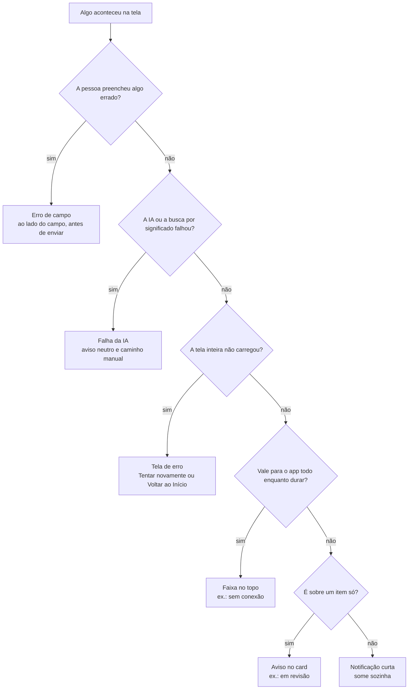

### Como mostrar cada estado na apresentação

Os estados de falha podem ser simulados só no **modo apresentação** (Alt+Shift+D, ou Perfil → Configurações → Modo apresentação). Depois, abra o **Roteiro guiado** (em Perfil → Configurações ou no menu da conta). No painel "Roteiro de apresentação", a seção "Simular falhas" liga cada simulação, uma de cada vez. Com o modo desligado, nada disso age.

| Simulação | O que aparece |
|---|---|
| Sem conexão | Faixa no topo e selo "Aguardando envio" nas publicações (a faixa também aparece com a conexão realmente caída) |
| IA indisponível | Aviso em Nova publicação (sugestões) e em Denúncia (triagem) |
| Busca por significado indisponível | Na lupa do feed, a busca cai para palavras-chave, com aviso |
| Falha ao salvar progresso | Em Missões, o avanço não é salvo e dá para tentar de novo |
| Falha ao carregar tela | A próxima tela aberta mostra "Não foi possível carregar agora" |

## Atualizações em relação ao PDF

Lista para a equipe atualizar o `Design_System_Squad38_1.pdf`. Os itens estão na ordem das seções.

**Seções 01, 02 e 05: cor do botão primário e tokens**

1. O botão primário e a etiqueta verde cheia usam `--color-acao` `#15803D` (hover `--color-acao-2` `#166534`), iguais nos dois temas. O verde `#16A34A` ficou só para anel de foco, barras, anéis de progresso, interruptor e pontos de status. O PDF mostrava o botão em `#16A34A`.
2. "Verde escuro `#15803D`: hover dos botões" deixa de valer: o hover é `#166534`. O `#15803D` agora é o fundo do botão e o texto de destaque.
3. A paleta passa a listar os nomes reais das variáveis CSS e os tokens que faltavam: `--color-acao`, `--color-acao-2`, `--color-acento`, `--color-verde-2`, `--color-superficie-2`, `--color-ouro`, `--color-ouro-claro`, `--color-sombra`.
4. Texto âmbar usa `--color-ouro` (`#B45309`); o âmbar `#D97706` fica só para ícones e barras.
5. Cores por disciplina: no tema claro, História (`#1AA775`), Português (`#C68700`) e Química (`#E56A99`) foram escurecidas para passar de 3 : 1 sobre branco (3,08, 3,06 e 3,06; antes 2,82, 2,17 e 2,69), mantendo o matiz. No escuro, todas já passavam e nada mudou. O nome da disciplina sempre acompanha a cor.

**Seções 03 e 04: tipografia e formas**

6. A tipografia ganhou tamanhos reais (22, 15, 14 a 15 e 12 a 13 px) e a informação de que Geist Mono é usada em timers e códigos, e Caveat só num item da Loja.
7. "Formas e bordas" ganhou a tabela de raios (8, 12 e 16 px, círculo) e a regra de que a única sombra é a dos elementos flutuantes.

**Seção 05: botões**

8. A "ação rápida" no código é fundo verde muito claro com texto verde (`rapido`), não "fundo branco com borda fina". Nenhuma tela usa essa variante hoje. As ações pequenas dos cards são botões redondos só com ícone, ou o botão secundário pequeno.
9. Os exemplos "+1 progresso" e "Simular ausência" só existem no modo apresentação. "Ver como professor" fica no Roteiro de apresentação, no Perfil e no menu da conta.
10. O botão "Perigo" usa texto `red-700` no claro e `--color-alerta` no escuro.

**Seções 06 a 09: cards, avatares, etiquetas e progresso**

11. Avatares: não citam mais "Mensagens" (retiradas). Há foto de perfil opcional no lugar das iniciais. O anel verde marca a moldura da Loja equipada e quem está ao vivo ou em destaque, não "o próprio aluno" em geral.
12. A etiqueta "Nível N · Título" é neutra (cinza), não verde. A raridade da Loja é texto colorido, não etiqueta: só o Exclusivo tem cor (ouro); "Raro" não tem contorno âmbar.
13. A etiqueta "Atrasada" (vermelha) e "Atenção" (âmbar) entram nos exemplos; "Pendente" de atividade é contorno.
14. Barra de progresso: altura de 10 px (6 px na versão fina), com `role="progressbar"`. O anel é um componente próprio (`Anel`).

**Seções 10 e 11: navegação e ícones**

15. Barra inferior do professor: **Painel · Feed · Alunos · Atividades · Estatísticas** (o PDF dizia Painel, Alunos, Atividades, Salas e Campeonatos). Salas, Campeonatos, Dúvidas e Moderação ficam a um toque no Painel.
16. Barra lateral do aluno: Aprender (Início, Sala de estudos, Salas coletivas, Missões) · Competir (Ranking, Campeonatos) · Você (**Loja, Estatísticas, Perfil**), sem Mensagens. Barra lateral do professor: Turmas · Engajamento · **Comunidade (Feed da escola, Dúvidas, Moderação)**. O título dos grupos agora aparece na tela.
17. No aluno, "Ranking" fica ativo também em Campeonatos, e "Perfil" fica ativo em Loja e Estatísticas.
18. Ícones: o de Mensagens saiu; XP é `Sparkles`; Compartilhar é `Share`; Respostas é `MessageCircle`. Entram Estatísticas (`ChartColumn`) e Feed (`Newspaper`).

**Seções 12 e 13: Loja e modal**

19. A raridade do item é texto (ver 12). O card mostra "faltam N" quando o saldo não basta e "Adquirido" quando o item não está equipado. Vouchers podem ser trocados de novo.
20. A frase de saldo insuficiente é "Saldo insuficiente: você possui X pontos e este item requer Y pontos."
21. O modal é inferior até 1023 px (inclusive no tablet) e centralizado a partir de 1024 px. Fecha por X, fundo, Esc e arrasto; o Esc fecha só o modal do topo. O rodapé com botões (`RodapeSheet`) empilha os dois botões, cada um com a largura inteira, quando não cabem lado a lado, em vez de quebrar o rótulo (telas 49 e 86 em 320 px).

**Seção 15: tema escuro**

22. A tabela do tema escuro ganhou as linhas do botão (`#15803D` nos dois temas), do verde de ênfase, do ouro, do âmbar, do azul e do alerta; as oito cores de disciplina no escuro; e os tons de apoio remapeados (amber, red, sky e blue). `--color-cepi` no escuro é `#93B4FB`.
23. O seletor de aparência também está no menu da conta e na tela de entrada. A opção "Sistema" é a "igual ao sistema" do PDF.

**Seção 16: acessibilidade**

24. Navegação por teclado: de "Especificado" para **No protótipo** (link "Pular para o conteúdo", Esc só no modal do topo, foco preso e devolvido). Abas, chips e controles segmentados trocam com ← e →, Home e End (parada de Tab só na aba ativa).
25. Texto alternativo: de "Especificado" para **No protótipo** (descrição opcional da imagem, "Imagem enviada por [nome]", resumo em texto em todos os gráficos).
26. Contraste: os dois ajustes recomendados foram aplicados. A tabela foi recalculada: "Aviso âmbar" passa de 6,84 para 8,73 : 1 e "Etiqueta verde" passa de 6,49 para 4,79 : 1 (a etiqueta atual usa outro par de cores). As 4 exceções que entraram (calendário, "Iniciar foco", horas do chat da sala) foram corrigidas em 09/10/2026, junto com mais três do mesmo tipo. Resta só uma nuance no hover dos links de pessoa, que esmaecem a 80%.
27. Movimento: também o número que sobe e o confete respeitam "reduzir movimento".
28. Alvo de toque: de "Especificado" para **No protótipo** (área de toque de 44 × 44 px no celular com o utilitário `alvo-toque`, inclusive nomes e avatares em listas, e campos de 44 px). Ressalva: nas séries de 30 dias cada barra é um vão de cerca de 10 px (5 px no Bimestre do aluno, com 60 barras); o vão agora é o botão inteiro, sem faixa morta, e o arrasto do dedo escolhe a barra. A exigência de 320 px e zoom de 200% sem rolagem horizontal foi conferida em 16 telas, sem exceção.
29. "Retida para revisão" virou "Em revisão pela coordenação". "Em verificação" continua só como mockup.

**Seção 17: responsividade**

30. O cabeçalho do celular não tem mais o ícone de mensagens. O número do calendário é a quantidade de compromissos dos próximos 7 dias.
31. Tablet: de "Especificado" para **No protótipo**.
32. A coluna de apoio do computador aparece a partir de **1280 px**, não de 1024 px. A barra lateral e os modais centralizados valem a partir de 1024 px.
33. Loja: 2 colunas no celular, 3 de 640 a 1279 px e 4 a partir de 1280 px (o PDF dizia 2 colunas no tablet e 4 no computador).
34. Início do aluno no computador: campeonato em destaque, **Sua semana**, quem está estudando agora e próximas provas. O professor tem coluna própria no feed.
35. Painel do professor: indicadores em 2 colunas no celular e no tablet; 5 em uma linha e as listas lado a lado só a partir de 1024 px. A linha "Mensagens" da tabela por tela saiu. Entram as linhas do feed do professor e de Estatísticas.
36. Estudos: os gráficos saíram da tela e foram para Estatísticas (`/estatisticas`, e `/professor/estatisticas` para a turma).

**Seção 18: feedback**

37. Erro de campo, faixa no topo, falha da IA, estado vazio e tela de erro estão **implementados**. O exemplo de estado vazio "Nenhuma conversa ainda" foi trocado (as mensagens diretas saíram).
38. Entra a tela de erro "Não foi possível carregar agora" como padrão, e a explicação de como simular os estados na apresentação (Alt+Shift+D, Roteiro, Simular falhas).
39. O esqueleto hoje aparece no carregamento inicial e enquanto a guarda de rotas decide; as listas do protótipo são locais e não esperam por rede.

**Documento**

40. A numeração 01 a 18 foi mantida. Os valores de cor são os reais (o PDF dizia "aproximados"). As imagens do PDF foram trocadas por esquemas em SVG ([`img/`](./img)) e por capturas e referências às telas do [Wireframes](./WIREFRAMES.md) (telas 45 e 66). Os dois mockups da seção 18 do PDF ("Erro de campo na Nova publicação" e "Notificação curta de confirmação") viraram texto na tabela de padrões.

### Pendências conhecidas do protótipo

Itens que a equipe de código ainda pode corrigir (conferidos em 09/10/2026). Já não são pendências: os quatro textos abaixo de 4,5 : 1 (seção 16), a navegação por setas nas abas (seção 16), as três cores de disciplina abaixo de 3 : 1 no tema claro (seção 02) e o alvo de toque estreito das barras, que melhorou e hoje é só o limite do dado (seção 16).

1. **Variante de botão `rapido` sem uso**; os tons de etiqueta `verde`, `ouro` e `escuro` também não aparecem em nenhuma tela.
2. **Links de pessoa no hover.** [`LinkPessoa`](../../src/components/ui/LinkPessoa.tsx) esmaece o link inteiro (80% no hover, 70% pressionado), e o texto cinza dentro dele cai abaixo de 4,5 : 1 enquanto o ponteiro está em cima (3,25 : 1 no claro). O componente é compartilhado e o conteúdo varia, então não foi alterado.
3. **Barras de 30 e 60 dias no celular** continuam com vãos de 5 a 11 px (uma barra por dia). Se a equipe quiser um alvo maior, o caminho é agrupar o Bimestre em semanas, como o painel do professor já faz.
