**Bloco 3 · RISEUP 2026.2**
**Squad 38 · Portal do Aluno**

# Navegação e Fluxos

Arquitetura de informação, componentes de interface, estados de tela, fluxos de usuário e escopo do MVP do aluno e do professor.

| Projeto | Empresa parceira | Squad | Programa |
| --- | --- | --- | --- |
| Rede social educacional | Zenix Code | 38 | Porto Digital × UNIT |

> Versão em Markdown de `Navegacao_e_Fluxos_Squad38_1.pdf`, atualizada para o protótipo v8 (09/10/2026). O que mudou em relação ao PDF está listado no fim, em [Atualizações em relação ao PDF](#atualizações-em-relação-ao-pdf).

Documentos do projeto: [Arquitetura da Solução](ARQUITETURA_DA_SOLUCAO.md) · [Design System](DESIGN_SYSTEM.md) · [Wireframes](WIREFRAMES.md) · [Índice](README.md)

---

Especificação completa de arquitetura de informação, componentes de interface, estados de tela e fluxos transacionais (User Flows) do Portal do Aluno (Squad 38). Toda a estrutura de navegação está ancorada na barra inferior fixa (Bottom Navigation Bar) no celular e no tablet, que vira uma barra lateral no computador, a partir de 1024 px, e em modais (janelas sobrepostas) contextuais. O acesso é separado por perfil: aluno e professor entram pela mesma tela de login e cada um vê a sua própria navegação.

**Como abrir o protótipo.** O app roda de dois jeitos idênticos, com a mesma moldura ([`AppShell`](../../src/components/shell/AppShell.tsx)) e a mesma guarda de rotas:

| Forma | Como abrir | Rotas |
| --- | --- | --- |
| Next.js | `npm run dev`, ou `npm run build` e `npm start` | Endereços normais, como `/feed`. A rota `/` só existe aqui: redireciona para o login ou para a página inicial do perfil. |
| Demonstração em HTML único | Abrir [`demonstração/Portal_do_Aluno.html`](../../demonstração/Portal_do_Aluno.html) (por `file://`). Gerada por `npm run demo` ([`scripts/demo/`](../../scripts/demo/)). | Por hash, como `#/feed`. São 20 rotas (as mesmas do Next, sem `/`). O título da aba acompanha a tela, como no Next (ex.: "Feed · Portal CEPI Expansão"). Antes de o app carregar, e em telas sem título próprio, o arquivo mostra "Portal do Aluno · CEPI Expansão", o mesmo título padrão do Next. |

---

## 01 · As 5 abas principais do aluno

**Navegação principal do aluno:** barra inferior no celular e no tablet; barra lateral a partir de 1024 px.

| Aba | Rota | O que reúne |
| --- | --- | --- |
| **Início** | `/feed` | Feed e filtros · Busca semântica · Nova publicação · Material e denúncia |
| **Estudos** | `/estudos` | Timer de foco · Meta do dia · Sessões recentes · Ranking de foco · Salas coletivas |
| **Missões** | `/missoes` | Sequência · Missões de hoje · Atividades do professor · Flashcards e desafios · Relatos à escola |
| **Ranking** | `/ranking` | Liga (XP) e Foco · Visibilidade · Campeonatos |
| **Perfil** | `/perfil` | Publicações · Conquistas · Configurações · Loja · Estatísticas |

**Cabeçalho fixo:** Calendário · Notificações · Saldo · seletor de espaço.

**Navegação do professor:** Painel · Feed · Alunos · Atividades · Estatísticas.

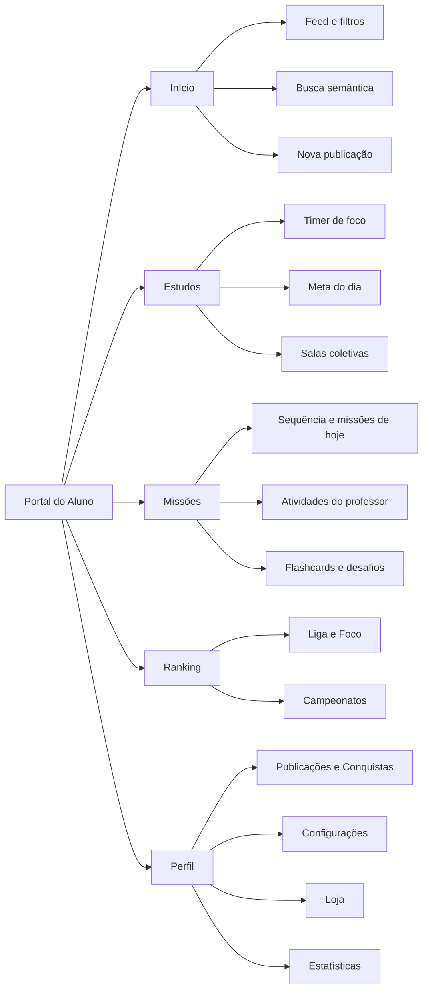

| Elemento | Como é |
| --- | --- |
| **Barra inferior do aluno** | `Início` · `Estudos` · `Missões` · `Ranking` · `Perfil`. As abas Ranking e Perfil ficam ativas também nas telas filhas: Campeonatos (em Ranking); Loja e Estatísticas (em Perfil). Definição em [`src/components/shell/abas.ts`](../../src/components/shell/abas.ts). |
| **Barra lateral do aluno** (computador) | Agrupa as áreas, com o título de cada grupo visível. **Aprender:** Início, Sala de estudos, Salas coletivas, Missões. **Competir:** Ranking, Campeonatos. **Você:** Loja, Estatísticas, Perfil. No rodapé, a conta da pessoa abre um menu com Aparência (claro, escuro ou sistema), Meu perfil e Sair. Não existe item de Mensagens. |
| **Cabeçalho fixo** (todas as telas do aluno) | **Celular e tablet:** logo do Colégio CEPI Expansão, o texto "Portal do Aluno" e o seletor do espaço ativo (Toda a escola, 9º Ano A, Clube de Robótica, Bilíngue Cultura Inglesa). À direita: ícone de **Calendário** (com o número de compromissos dos próximos 7 dias), **Notificações** (com contador de não lidas), o avatar que abre o Perfil (de 480 a 1023 px de largura) e o indicador do **saldo** (pontos e XP). **Computador:** a logo e o nome do portal ficam na barra lateral; o cabeçalho mantém o seletor de espaço, o calendário, as notificações e o saldo. Abaixo de 400 px o XP sai do botão de saldo (continua no painel "Seu saldo"). Não há ícone de mensagens (veja 4.12). |
| **Painel "Seu saldo"** | Abre ao tocar no saldo. Mostra **Pontos** ("Vêm de participação. Trocados na Loja.") e **XP** ("Vem de mérito. Nunca é gasto."), o nível (ex.: "Nível 3 · Estudante", com os XP que faltam), os dias seguidos de estudo e o aviso "Gastar pontos na Loja não muda seu XP nem sua posição no ranking." Botões **Ir para a Loja** e **Ver ranking**. |
| **Teclado nas abas e filtros** | As abas (Feed, Perfil, painel do professor), os filtros em pílula e os controles segmentados seguem o padrão ARIA de abas: **Tab** para só na aba ativa, **←** e **→** movem para a aba vizinha (do último volta ao primeiro), **Home** e **End** vão às pontas. A aba que recebe o foco pelas setas já fica selecionada. Detalhes no [Design System](./DESIGN_SYSTEM.md#navegação-por-teclado). |

### Rotas e acesso por perfil

O projeto tem 21 páginas (`page.tsx` em [`src/app/`](../../src/app/)). A regra de acesso está em [`src/lib/guarda.ts`](../../src/lib/guarda.ts) e roda no navegador, igual no Next e na demonstração.

| Rota | Tela | Aluno | Professor |
| --- | --- | --- | --- |
| `/` | Redireciona (só no Next) | sim | sim |
| `/login` | Entrar no portal | sim | sim |
| `/feed` | Feed da escola | sim | sim |
| `/estudos` | Sala de estudos | sim | volta ao Painel |
| `/estudos/salas` e `/estudos/salas/[id]` | Salas coletivas e sala | sim | sim |
| `/missoes` | Missões | sim | volta ao Painel |
| `/ranking` | Ranking | sim | volta ao Painel |
| `/campeonatos` e `/campeonatos/[id]` | Campeonatos e detalhe | sim | sim |
| `/perfil` | Perfil | sim | volta ao Painel |
| `/loja` | Loja | sim | volta ao Painel |
| `/estatisticas` | Estatísticas do aluno | sim | volta ao Painel |
| `/pessoas/[id]` | Perfil público | sim | sim |
| `/professor` | Painel | volta ao Feed | sim |
| `/professor/alunos` | Alunos | volta ao Feed | sim |
| `/professor/atividades` e `/professor/atividades/[id]` | Atividades e detalhe | volta ao Feed | sim |
| `/professor/duvidas` | Dúvidas | volta ao Feed | sim |
| `/professor/estatisticas` | Estatísticas da turma | volta ao Feed | sim |
| `/professor/moderacao` | Moderação | volta ao Feed | sim |

Rota que não existe mostra a página 404 ("Página não encontrada"), com o botão "Voltar ao Início" (aluno) ou "Voltar ao Painel" (professor).

### 1.1 Início (Feed: Comunidade, Dúvidas e Materiais)

| Elemento | Como é |
| --- | --- |
| **Título e busca** | "Feed da escola" com um botão de lupa. A lupa abre o campo "Buscar dúvidas e resoluções…". Com 3 ou mais caracteres, a busca mostra "N resultados · busca por assunto" (ex.: "3 resultados · busca por assunto"; é a busca por significado), a relevância de cada resultado (ex.: "82% relevante") e se ele tem resposta oficial. Sem resultado: "Nada parecido por aqui", com o botão "Publicar dúvida". Se a busca por significado estiver fora do ar, o feed usa palavras-chave e avisa: "Resultados por palavra-chave. A busca por significado está indisponível agora." |
| **Filtro de membros** (faixa de avatares, estilo stories) | Lista horizontal com avatares circulares, iniciais e nome curto de professores, colegas e coordenação. Um anel verde indica publicação das últimas 6 horas ainda não vista. O toque filtra a timeline para mostrar só as publicações do autor escolhido ("Publicações de Prof. Ricardo Nogueira · Limpar"). O nome na faixa leva ao perfil público (4.19). O filtro também abre por link: `/feed?autor=<id>`. |
| **Barra de filtros por categoria** (abas) | **Aluno:** `Tudo`, `Dúvidas`, `Materiais`, `Avisos` e `Minha turma`, com sublinhado no item ativo. A barra gruda abaixo do cabeçalho ao rolar. Os filtros do professor estão em 2.3. |
| **Caixa de publicação** | Avatar do aluno, campo "Compartilhe uma dúvida ou material…" (a partir de 640 px, "Compartilhe uma dúvida, material ou aviso…"), atalhos `Dúvida` e `Material` e botão `Publicar`. O campo e o botão abrem a modal "Nova publicação" no tipo Publicação; cada atalho abre no seu tipo. No celular e no tablet, quando a caixa sai da tela ao rolar, aparece o botão flutuante (+) "Nova publicação" no canto inferior direito. Veja a seção 03. |
| **Anatomia do card de conteúdo/dúvida** | Veja a tabela abaixo. |
| **Coluna lateral** (a partir de 1280 px) | **Campeonato em destaque** (com `Jogar duelo` quando há duelo liberado), **Sua semana** (minutos de estudo dos últimos 7 dias, "Hoje X de Y min da meta" e o link "Ver minhas estatísticas"), **Estudando agora** (salas abertas com gente dentro) e **Próximas provas** (as 3 próximas, com o link "Planejar a revisão", que abre a Sala de estudos). |

**Anatomia do card:**

| Parte | Como é |
| --- | --- |
| **Cabeçalho** | Nome do autor (leva ao perfil público), selo de verificado nas contas oficiais (professores e coordenação), papel ou turma (Professor, 9º Ano A, Você), tipo (Dúvida, Material, Aviso, Publicação), disciplina, tempo relativo (ex.: "há 15 min"), selo "Resolvida" e menu "Mais opções". O selo "Resolvida" só aparece quando há **resposta oficial** de professor. |
| **Menu "Mais opções"** | Aparece nas publicações de outras pessoas. Itens: "Copiar link" (ou "Compartilhar", quando o aparelho oferece) e, para o aluno, "Denunciar publicação" (vira "Denúncia já enviada" depois do envio). Para o professor, o segundo item é "Remover publicação" (2.3). |
| **Corpo** | Texto com as `#tags` destacadas em verde (até 3 tags sugeridas aparecem abaixo do texto). Quem escreveu uma dúvida vê o quadro "Parecidas com a sua", com dúvidas respondidas e materiais do Portal. Com arquivo anexado, o card mostra o nome (ex.: `lista-7-funcoes-afins.pdf`), número de páginas, tamanho e o botão `Baixar`; imagens aparecem em miniatura, com o texto alternativo que o autor escreveu ou "Imagem enviada por [nome]". O toque no arquivo abre a modal "Material". |
| **Modal "Material"** | Nome do arquivo, disciplina, páginas e tamanho; prévia do PDF (ou da imagem); autor e data; texto da publicação. Rodapé: ícone `Salvar` (marca e desmarca), `Abrir PDF` (ou "Abrir arquivo") e `Baixar`. |
| **Rodapé interativo** | Curtir (com contador), responder/comentar (com contador), salvar e compartilhar (copia o link). Curtir e salvar valem por pessoa: o aluno e o professor não mexem no coração um do outro. O link "Ver N respostas" (ou "Ver todas as N respostas", quando já existe a oficial) abre a lista; a **resposta oficial** do professor aparece fixada e destacada, mesmo com a lista recolhida. Em dúvidas, o autor vê o botão `Útil` nas respostas de colegas. Ao responder: "+15 pontos e +10 XP ao responder". |
| **Publicação retida** | Quando a triagem automática sinaliza o texto, só o autor vê o card, com o aviso "Em revisão pela coordenação. Só você vê esta publicação por enquanto." e o link "Isso foi um engano? Conteste aqui" (4.17). |

### 1.2 Estudos (Sala de Estudos e Salas Coletivas)

A tela se chama **"Sala de estudos"** ("Cronometre seu foco.") e tem o botão `Salas ao vivo` ao lado do título. Logo abaixo vem uma linha de números (Hoje · Semana · Sequência) e o link "Ver minhas estatísticas". Os gráficos não ficam mais aqui: estão em Estatísticas (1.7).

| Elemento | Como é |
| --- | --- |
| **Timer de foco** | Relógio (ex.: `25:00` · "25 min de foco, 5 de pausa"), seletor de disciplina (as 8 disciplinas), seletor de ritmo (`Pomodoro` 25/5, `Profundo` 50/10, `Livre`), campo "O que você vai estudar? (opcional)" e o botão `Iniciar foco · 25 min`. Legenda: "+1 ponto por minuto · +10 por ciclo completo · sair da tela por mais de 5 min perde o ciclo". |
| **Durante o foco** | Selo da fase (Focando · ciclo N, Pausa, Pausado), anel com o tempo restante, ciclos concluídos, minutos registrados, `Pausar`/`Retomar`, `Pular pausa` (só na pausa), `Encerrar` e `Modo imersivo` (tela cheia). Ao encerrar, a janela "Encerrar a sessão?" mostra quanto será salvo (`Continuar` ou `Encerrar e salvar`). O timer continua visível nas outras telas, numa pílula com o tempo e o botão de pausa. Os atalhos `Avançar 5 min (demo)` e `Simular saída da tela (demo)` só aparecem no modo apresentação. |
| **Saiu da tela** | Se a aba ou o aplicativo ficar fora de vista, o foco pausa e aparece "Você saiu por …" com a contagem do que resta e o botão `Retomar foco`. Passou de 5 min fora: "Foco perdido. Você ficou mais de 5 min fora. Esse ciclo não conta, mas sua sequência de dias continua.", com `Agora não` e `Começar de novo`. |
| **Meta do dia** | Anel com o percentual, tempo estudado e meta (padrão: 1h 30), "Faltam X · N Pomodoros" ou "Meta concluída", dias seguidos com estudo e o botão `Editar` (opções de 30 min a 3 h; `Salvar meta`). |
| **Salas ao vivo** | Cartão "Estudar com a turma" ("N salas ao vivo · M focando", "Mais cheia: …") que leva às salas coletivas. |
| **Sessões recentes** | Últimas sessões agrupadas por dia, com origem (Timer de foco, Sala coletiva, Manual · sem pontos). O botão `Registrar estudo manual` (1 a 300 min) entra nas métricas, mas não vale pontos. |
| **Ranking de foco** | Top 5 dos minutos da semana, com as abas `Turma · 9º A` e `Escola toda`, a posição da pessoa ("Você está em Nº de N · faltam X para passar …"), o link "Ver tudo" (leva ao Ranking) e o controle "Quem vê você nos rankings" (`Público`, `Anônimo`, `Invisível`). |
| **Interclasses do Foco** | Placar turma × turma em minutos de foco, com o selo "Ao vivo", uma frase de situação ("Faltam X para o 9º A passar o 9º B") e o prazo. Cada ciclo concluído soma na turma. Só aparece quando a turma da pessoa participa. |
| **Ordem das telas** | No celular: Timer, Meta do dia, Salas ao vivo, Sessões recentes, Ranking de foco, Interclasses do Foco. A partir de 1280 px: o timer e as sessões à esquerda, e uma coluna fixa à direita com a meta, as salas, o ranking e o Interclasses. |

**Salas coletivas** (atalho "Salas ao vivo", rota `/estudos/salas`):

| Elemento | Como é |
| --- | --- |
| **Lista** | Título "Salas de estudo", botão `Criar sala`, campo de código de convite ("Código de convite (ex.: SALA-7K2P)") com o botão `Entrar`, filtros (`Todas`, `Ao vivo`, `Oficiais`, uma pílula por disciplina e `Minhas`) e as listas **Abertas agora** e **Agendadas**. Cada sala mostra o ciclo, a capacidade, quem criou (selo "Oficial" para professores), quantas pessoas estão estudando e a fase atual (Em foco / Na pausa). |
| **Dentro da sala** | Timer sincronizado com o ciclo da turma, botões `Entrar na sala` / `Entrar e focar`, `Voltar a focar` e `Sair da sala`, presença dos participantes (quem foca e quem está na pausa), código de convite para copiar e o **Chat da sala**, com 5 reações rápidas. O chat é moderado automaticamente: "Mensagens ofensivas são retidas para revisão". Quem criou a sala também vê `Encerrar sala` (ou `Cancelar sala`, se ainda não abriu). |
| **Contagem de pontos** | Na sala contam só os minutos desde a entrada. O bônus de ciclo exige o ciclo inteiro: quem entra no meio do ciclo recebe o aviso "Conta o tempo a partir de agora; o bônus de ciclo vale a partir do próximo ciclo inteiro." |

### 1.3 Missões (Gamificação e Estudo Diário)

Título "Missões" ("Constância vale pontos; mérito acadêmico vale XP.").

| Elemento | Como é |
| --- | --- |
| **Card de sequência (streak)** | Contagem de dias seguidos (ex.: 13 dias seguidos), congeladores disponíveis (ex.: 2/2), os 7 dias da semana em bolinhas e o botão `Registrar estudo de hoje`. Texto de apoio: "Ciclos de foco também contam. A partir do dia 8, cada dia vale +50 pontos." Quando a sequência quebra, aparecem `Recuperar · 200 pontos` (em até 48 horas) e `Começar de novo`. O botão `Simular ausência (demo)` só existe no modo apresentação. |
| **Missões de hoje** | Lista que renova de verdade a cada dia, com o resumo (ex.: "Faltam 4 · valem +90 pontos e +35 XP" e o contador 0/4), a barra de progresso de cada missão, disciplina, recompensa e contador. A missão conclui fazendo a tarefa. As quatro missões de hoje são descritas abaixo. |
| **Atividades do professor** | Tarefas publicadas pelo professor, com tipo (lista de exercícios, entrega, leitura, quiz, projeto), disciplina, prazo (ex.: "vence em 2 dias"), recompensa máxima (ex.: "até +40 pontos e +30 XP"), anexo e os botões `Abrir material` e `Entregar`. Estados: **Pendente**, **Atrasada**, **Entregue** e **Corrigida**; a corrigida mostra a nota, os pontos e o comentário do professor (ex.: "Nota 9,5 · +19 pontos · +14 XP") e o link "Correção (PDF)". |
| **Flashcards (prática rápida)** | Escolha da disciplina (ou `Todas`), rodada de 10 cartas com repetição espaçada (caixas de Leitner: acertou, a carta volta em 1, 3, 7 e 15 dias; errou, volta para a caixa 1). Mostra "Carta 1 de 10", o contador de acertos, a pergunta, `Virar carta` e a autoavaliação `Errei` / `Acertei`; depois vem uma revisão das erradas. Também há `Revisar só as que errei` e `Criar meus flashcards` (cartas próprias). Rodada completa com pelo menos 1 acerto: **+10 pontos e +15 XP**, no máximo 1 vez por dia em cada disciplina. |
| **Desafios (pelo seu domínio)** | As 3 disciplinas de menor domínio da pessoa, entre as ainda não concluídas (ex.: "Domínio 45% · até +30 XP"), com o botão `Começar`. O desafio tem 3 questões; cada acerto vale **+5 pontos e +10 XP** (e sobe o domínio em 4%). |
| **Missão coletiva da semana** | Banner de cooperação da turma (ex.: "Maratona da Turma · 200 flashcards"), com o progresso do grupo (ex.: 163/200 · 82%), os avatares, a recompensa ("100 pontos divididos · +30 XP para cada") e o botão `Contribuir com 10 flashcards`, que abre uma rodada de flashcards (só os acertos em cartas vencidas contam). |
| **Relatos à escola** (ouvidoria) | Card "Relatar problema da escola" ("Estrutura, biblioteca, merenda, tecnologia. A coordenação valida.") com o botão `Abrir relato`, a recompensa de **+30 pontos** por relato validado e a lista dos relatos enviados com o status (**Validado**, **Em análise** ou **Não validado**). |
| **Falha ao salvar** | Quando o progresso não é gravado, a linha da missão mostra "Progresso não salvo" com o botão `Tentar novamente` (1.9). |

**As quatro missões de hoje** (resumo e pontos variam com o estado):

- "Responder 2 dúvidas de colegas" (+25 pontos · +10 XP · progresso 1/2). Botão `Ver dúvidas no feed`.
- "Acertar 5 flashcards" (+25 pontos · +10 XP). Vale qualquer disciplina, só acertos em cartas vencidas. Botão `Praticar flashcards`.
- "Revisar o mapa mental de Citologia" (+20 pontos · +10 XP). Botão `Abrir material`.
- "Completar um ciclo de foco na Sala de Estudos" (+20 pontos · +5 XP). Conclui sozinha ao fechar um ciclo. Botão `Ir para a Sala de Estudos`.

No modo apresentação aparecem os atalhos "+1 progresso (demonstração)" e "Marcar como feita (demonstração)".

### 1.4 Ranking (Ligas, Foco e Campeonatos)

| Elemento | Como é |
| --- | --- |
| **Abas superiores** | `Ranking` e `Campeonatos` (abas com sublinhado, só para o aluno). |
| **Seletor de métrica** | `Liga (XP)` ou `Foco` (minutos da Sala de Estudos). |
| **Cartão da liga** | "Liga Prata · Sua semana", posição ("Nº de 20"), XP na semana, a distância até a zona ("Faltam N XP para a zona de promoção"), a visibilidade atual e a contagem regressiva até o fechamento ("Fecha domingo, 23:59"). |
| **Seletor de escopo** | `Minha liga`, `Minha turma` e `Por disciplina` (com as pílulas das disciplinas). |
| **Régua de progressão de ligas** | Bronze, Prata, Ouro, Diamante (toque para ver outra liga), com a regra "Top 3 sobem · últimos 3 descem · fecha domingo, 23:59". |
| **Listagem do ranking** | Tabela ordenada com posição (1º, 2º, 3º…), avatar com iniciais, nome, turma, variação de posição (setas de sobe/desce e número de lugares) e XP da semana. As zonas de promoção e rebaixamento ficam destacadas. Se a linha da pessoa sai da tela, um pino fixo ("Você · 7º lugar") leva de volta a ela. Não existe ranking entre colégios. |
| **Visibilidade no ranking** | Seletor `Público` / `Anônimo` / `Invisível`, com a prévia de como os colegas veem a pessoa. No modo Invisível, o aluno sai das listas e só ele vê a própria posição. A visibilidade vale para os rankings; nos campeonatos em que a pessoa se inscreve, o nome aparece para os participantes. |
| **Ranking de foco** | Mesma tela, com `Minha turma` e `Escola toda`, os minutos da semana e o resumo da posição. |
| **Campeonatos** (`/campeonatos`) | Botão `Criar campeonato` (`Criar`, no celular); o destaque do próximo duelo (ex.: "Semifinal liberada — você × Sofia Andrade" com o botão `Jogar`); filtros `Em andamento`, `Inscrições`, `Encerrados` e `Meus`; cards com formato (Mata-mata, Pontos corridos, Interclasses), métrica (Duelos de quiz, Tempo de foco, XP), tipo (Oficial, Amistoso), participantes e prêmio; e os blocos **Sua campanha** e **Como se pontua**. |
| **Detalhe do campeonato** | Organizador, prazo, prêmio, **Chaveamento** (mata-mata), classificação ou placar das turmas, inscritos, regras, certificados e tabela (PDF e planilha) e, para quem organiza, a **Gestão** (iniciar, encerrar e premiar, excluir). Nos pontos corridos de quiz há 1 rodada por dia (5 perguntas, cada acerto vale 10 pontos). O texto é o mesmo em Detalhes e no aviso acima do botão `Jogar rodada`: "Uma rodada por dia, de 5 perguntas: cada acerto vale 10 pontos." Depois de jogar, o aviso passa a "Você já jogou a rodada de hoje. A próxima abre amanhã." e o botão vira "Próxima rodada amanhã" (desativado). Campeonato sem pontos termina sem campeão; o empate desempata por XP. |

### 1.5 Perfil (Publicações, Conquistas, Configurações e Loja)

| Elemento | Como é |
| --- | --- |
| **Cabeçalho do aluno** | Capa, avatar com as personalizações aplicadas, botões `Editar perfil`, `Minhas estatísticas` e `Loja`; nome completo (ex.: Ana Beatriz Moura), selo de nível ("Nível 3 · Estudante"), usuário e turma ("@ana.moura · 9º Ano A"), a bio e os números **Publicações**, **Respostas úteis**, **Medalhas** e **Dias seguidos**. |
| **Abas do perfil** | São 3: `Publicações`, `Conquistas` e `Configurações`. |
| **Publicações** | Dúvidas, materiais e publicações do aluno, com o atalho "Ver no feed". Publicações em revisão ganham o aviso "em revisão". |
| **Conquistas** | Nível com barra de progresso (ex.: "Faltam 110 XP para Destaque (nível 4)"), XP total e pontos, e a galeria de medalhas com estado bloqueado ou desbloqueado: Colaborador, Mestre de Química, Constante, Sem Congelador, Mentor, Polímata, Voz da Escola e Topo da Liga. Tocar numa medalha abre o critério e o progresso (4.6). No computador o card de nível fica numa coluna à direita. |
| **Configurações** | **Privacidade** (visibilidade no ranking), **Personalização** (itens da Loja equipados, com interruptor), **Aparência** (claro, escuro ou sistema) e **Conta**: interruptor "Modo apresentação" (atalho Alt+Shift+D); com ele ligado, aparecem "Roteiro guiado" e "Ver como professor"; depois vêm "Apagar dados deste dispositivo" (pede confirmação) e "Sair". |
| **Editar perfil** | Janela com foto (recortada em quadrado e guardada no aparelho), nome de exibição, @usuário, bio (até 160 caracteres) e os selos exibidos. |

**Loja de recompensas** (aberta pelo botão `Loja` do Perfil, pelo item "Loja" da barra lateral ou pelo saldo do cabeçalho; rota `/loja`):

| Elemento | Como é |
| --- | --- |
| **Saldo** | "Pontos para trocar" (o saldo em pontos), o número de trocas feitas e o aviso "XP não é gasto na Loja". |
| **Abas da Loja** | `Avatar`, `Perfil` e `Recompensas da escola`. |
| **Vitrine** | Cards com a prévia do item, raridade e tipo (Comum, Incomum, Raro, Especial, Exclusivo), nome, preço em pontos e a ação `Trocar` (ou "faltam N", ou "Equipado"/"Adquirido"). Avatar: Anel verde (Comum · 150), Fundo verde (Comum · 220), Selo de leitor (Incomum · 380), Anel dourado (Raro · 750), Estrela de destaque (Especial · 1.400). Perfil: Capa de perfil Caderno Pautado (160), Placa de perfil Turma 9º A (180), Capa verde (420), Fonte manuscrita no nome (690) e Selos do CEPI no perfil (1.500). A grade tem 2 colunas no celular, 3 de 640 a 1279 px e 4 a partir de 1280 px. |
| **Recompensas da escola** | Vouchers retirados na secretaria (ou na cantina, nos lanches), com código: Desconto de 10% na cantina (300), Squeeze CEPI Verde e Branco (1.200), Ingresso para o Sarau Literário (2.000), Camiseta da Feira de Ciências (2.600) e Vaga extra na Oficina de Robótica (Exclusivo · 3.500). Vouchers podem ser trocados de novo. Medalhas não estão à venda. |
| **Histórico de trocas** | Painel inferior com as trocas, a data, o código do voucher, "Aguardando retirada" ou "Entregue em …", o comprovante em PDF e os pontos debitados. |

### 1.6 Painéis do cabeçalho

As mensagens diretas foram **retiradas por decisão da banca**. Não existe ícone de mensagens no cabeçalho, nem item na barra lateral, nem atalho em Perfil (veja 4.12). O cabeçalho do aluno abre três painéis:

| Painel | Como é |
| --- | --- |
| **Calendário** | Janela "Calendário" ("Provas, trabalhos e prazos"). Aviso automático "Semana cheia: 4 avaliações e entregas nos próximos 7 dias" (regra fixa: 3 ou mais provas e trabalhos na semana, não é IA). Mês com os dias marcados por tipo (**Prova**, **Trabalho**, **Prazo**, **Evento**) e a lista "Próximos compromissos" (ou os compromissos do dia escolhido), com local e hora. Cada compromisso tem o sino de **lembrete** (avisos 72 h, 24 h e 2 h antes) e o link "Adicionar ao meu calendário" (arquivo `.ics`); a janela também oferece "Exportar agenda (.ics)". |
| **Notificações** | Janela "Notificações" ("N não lidas" ou "Tudo em dia"), com correções, pontos recebidos, avisos dos professores, lembretes, duelos liberados e salas abertas. Cada item abre a tela certa. O botão `Marcar todas como lidas` aparece quando há não lidas. Vazio: "Nenhuma notificação por enquanto". |
| **Saldo** | Painel "Seu saldo" (veja a seção 01). |

### 1.7 Estatísticas do aluno

Rota `/estatisticas` ("Estatísticas": "Seus números de estudo, evolução e desempenho."). Abre pelo item "Estatísticas" da barra lateral (grupo Você), pelo botão `Minhas estatísticas` do Perfil e pelos links "Ver minhas estatísticas" da Sala de estudos e do bloco "Sua semana".

| Elemento | Como é |
| --- | --- |
| **Filtros** | Período (`7 dias`, `30 dias`, `Bimestre`, que são 60 dias), disciplina ("Todas as disciplinas" ou uma) e as seções visíveis. Os filtros ficam no endereço (`?p=`, `?d=`, `?ocultar=`), então o link guarda o recorte. `Limpar filtros` desfaz tudo. |
| **Resumo** | Tempo de foco, sessões, ciclos, sequência, XP ganho e pontos ganhos no período. |
| **Foco e estudo** | Tempo por dia (com a linha da meta), Constância (mapa de calor), Horário de pico, Por disciplina (rosca) e Você × turma. |
| **Evolução** | XP no período (linha acumulada e barras por dia) e Pontos no período. |
| **Desempenho** | Notas das atividades, Duelos (vitórias) e Flashcards (acertos). |
| **Missões e medalhas** | Concluídas por semana (missões e atividades, últimas 8 semanas) e Medalhas conquistadas. |
| **Relatório** | O botão `Baixar relatório (PDF)` gera o PDF com as seções visíveis. |

Todo gráfico tem um resumo em texto para leitores de tela. As barras verticais são uma parada de Tab só (as setas, Home e End percorrem as barras). No celular, tocar ou arrastar na área do gráfico escolhe a barra sob o dedo, e a dica fica na tela até o próximo toque. Em "Por disciplina", cada disciplina tem uma cor fixa, sempre junto do nome ([Design System](./DESIGN_SYSTEM.md#cores-por-disciplina)).

### 1.8 Perfil público

Rota `/pessoas/[id]`, compartilhada por aluno e professor. Abre ao tocar no nome ou no avatar de qualquer pessoa (autor de card, resposta, faixa de membros, ranking, campeonato, notificação). Mostra nome, papel e turma; para aluno, o nível, o XP (que fica escondido no próprio perfil da aluna quando ela está no modo anônimo ou invisível), os dias seguidos, as medalhas e as publicações recentes; para professor, a disciplina, as turmas, os materiais e os avisos; para a coordenação, os avisos recentes. O botão `Ver publicações` leva a `/feed?autor=<id>`. Se a pessoa não existe: "Perfil não encontrado". Veja o fluxo 4.19.

### 1.9 Estados de tela

Resumo dos estados de erro e de vazio que o protótipo implementa. Os desenhos estão em [Wireframes](WIREFRAMES.md) (3.1.3, telas 68 a 79).

| Tela | Estado | O que aparece | Como ver |
| --- | --- | --- | --- |
| 68 | Carregando | Esqueleto geral em cinza: cabeçalho, título, quatro blocos e três cartões (o mesmo para todas as telas). Também aparece enquanto a guarda decide para onde ir. | Ao abrir qualquer página. |
| 69 e 70 | Publicação retida | Aviso "Em revisão pela coordenação. Só você vê esta publicação por enquanto." | Publicar um texto com termo ofensivo. |
| 71 | Sem conexão | Faixa "Sem conexão. Tentando retransmitir…" abaixo do cabeçalho e selo "Aguardando envio · salvo neste aparelho" na publicação. | Desligar a internet ou simular. |
| 72 | Timeout | "Não foi possível carregar agora" · "O servidor demorou para responder. Nada do que você escreveu foi perdido." · `Tentar novamente` e `Voltar ao Início`. Vale como limite de erro para qualquer tela que quebre. | Simular "Falha ao carregar tela". |
| 73 | Falha da IA | "Sugestões indisponíveis no momento. Escolha a disciplina abaixo." (Nova publicação) e "Triagem indisponível no momento. A denúncia entra na fila com o motivo que você escolheu." (Denúncia). | Simular "IA indisponível". |
| 74 | Busca | A busca cai para palavras-chave e avisa. | Simular "Busca por significado indisponível". |
| 75 | Contestação | "Isso foi um engano? Conteste aqui" e, depois do envio, "Contestação enviada em dd/mm · aguardando revisão". | Publicação retida (4.17). |
| 76 | Erro ao registrar missão | Aviso "Não conseguimos salvar seu progresso" e, na missão, "Progresso não salvo" com `Tentar novamente`. | Simular "Falha ao salvar progresso". |
| 77 | Pontos em verificação | Só desenhado (mockup). Depende da sinalização de IA externa, que é evolução futura (US10). | Não existe no protótipo. |
| 78 | Saldo insuficiente | "Saldo insuficiente: você possui X pontos e este item requer Y pontos." | Loja, item mais caro que o saldo. |
| 79 | Estado vazio | Ícone, frase curta e a ação para começar (ex.: "Nenhuma publicação ainda", "Nada por aqui ainda", "Nenhuma notificação por enquanto"). | Listas sem itens. |

As falhas 71, 72, 73, 74 e 76 podem ser **simuladas só no modo apresentação** (a 75 é um fluxo real, 4.17): Alt+Shift+D, abrir o **Roteiro de apresentação** e usar a seção **Simular falhas** (Sem conexão, IA indisponível, Busca por significado indisponível, Falha ao salvar progresso, Falha ao carregar tela; `Desligar todas` limpa tudo). A faixa de "Sem conexão" também aparece quando a conexão cai de verdade.

---

## 02 · Área do professor

O professor entra pela mesma tela de login e vê a sua própria navegação ([`abas.ts`](../../src/components/shell/abas.ts)).

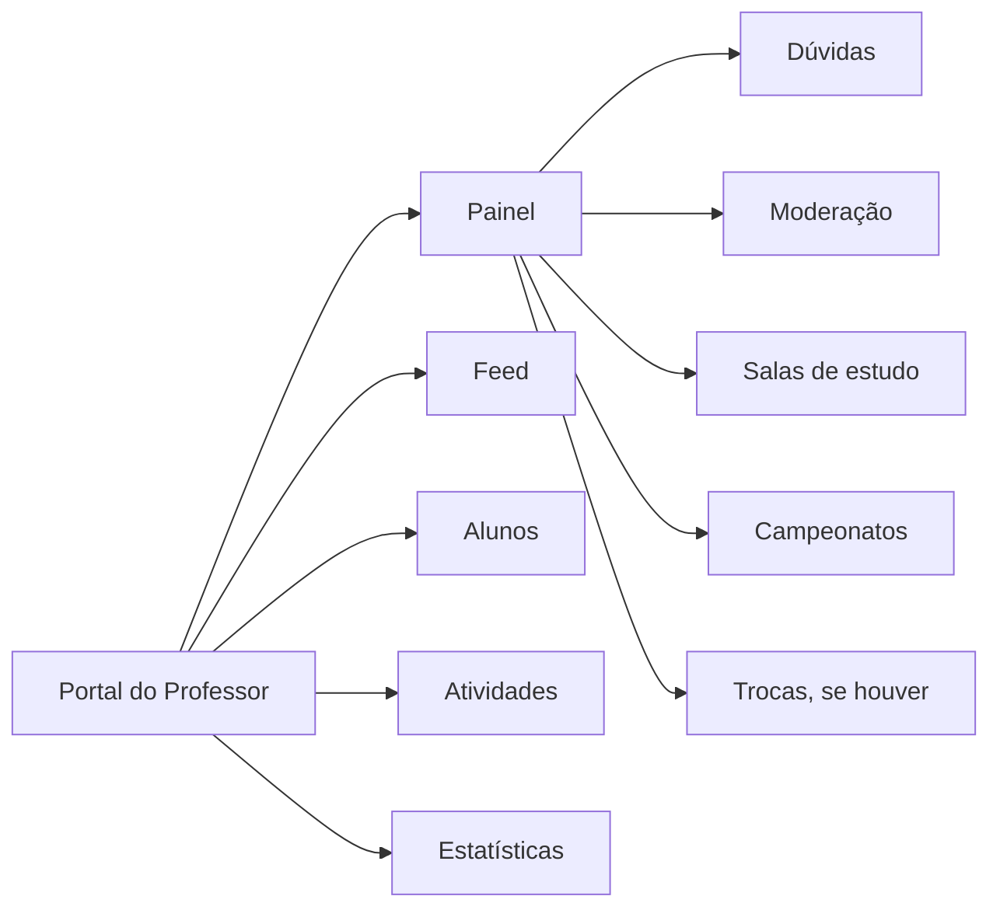

### 2.1 Navegação e cabeçalho do professor

| Elemento | Como é |
| --- | --- |
| **Barra inferior do professor** | `Painel` · `Feed` · `Alunos` · `Atividades` · `Estatísticas`. |
| **Barra lateral do professor** (computador) | **Turmas:** Painel, Alunos, Atividades, Estatísticas. **Engajamento:** Salas de estudo, Campeonatos. **Comunidade:** Feed da escola, Dúvidas, Moderação. O título de cada grupo fica visível. No rodapé: a conta (Aparência, Meu perfil, Sair). |
| **Salas, Campeonatos, Dúvidas e Moderação no celular** | Ficam a 1 toque do Painel, no bloco "Comunidade e engajamento", que é sempre visível. |
| **Cabeçalho** | "Painel do professor" e, abaixo, a disciplina e as turmas ("Matemática · 9º A, 9º B e 8º A"). À direita: Notificações (com contador) e o avatar com o menu da conta (Aparência, Meu perfil, Sair; no modo apresentação, também "Roteiro guiado" e "Ver como aluna (Ana)"). Não há seletor de espaço nem saldo. |

### 2.2 Painel

| Elemento | Como é |
| --- | --- |
| **Saudação e turma** | "Bom dia, Prof. Ricardo", a data e o seletor de turma (`9º A` / `9º B` / `8º A`). A turma escolhida vale também em Alunos. |
| **Indicadores** | Cinco números, cada um com link: **Ativos hoje**, **Estudo por aluno** (média em 7 dias), **Domínio médio**, **Em risco** e **Para corrigir**. |
| **Ações rápidas** | `Nova atividade`, `Publicar aviso`, `Abrir sala` e `Criar campeonato`. "Publicar aviso" abre a janela "Publicar aviso" (até 280 caracteres, destino Toda a escola, 9º A, 9º B ou 8º A). Usa a mesma regra do aviso do feed (2.3). |
| **Comunidade e engajamento** | Atalhos para **Dúvidas** (com o contador de dúvidas aguardando), **Moderação** (publicações e relatos para revisar), **Salas de estudo** e **Campeonatos**. Quando há recompensas para entregar, aparece também **Trocas**, que abre a janela "Trocas para entregar": o professor marca a recompensa como entregue e o aluno é avisado. |
| **Listas** | **Precisa de atenção** (alunos em risco, com `Lembrar` e `Dar pontos`) e **Para corrigir** (atividades com entregas aguardando nota), lado a lado no computador; **Destaques da semana** (os 3 alunos com mais XP, com o botão `Reconhecer os 3`) e **Atribuições recentes**. |
| **Estatísticas** | O Painel não tem gráficos. O link "Ver estatísticas" leva à tela de Estatísticas (2.9). |

### 2.3 Feed da escola (feed do professor)

O professor usa o mesmo `/feed` do aluno, com as ferramentas do papel dele. A rota é compartilhada pelos dois perfis ([`guarda.ts`](../../src/lib/guarda.ts)). O estado é um só: o aluno e o professor, abertos em duas abas do mesmo navegador, veem as publicações, respostas e remoções um do outro.

| Elemento | Como é |
| --- | --- |
| **Título e busca** | "Feed da escola" e a mesma lupa do aluno. Sem resultado: "Nada parecido por aqui", com o botão `Limpar busca`. |
| **Faixa de moderação** | Quando há publicações retidas ou denunciadas, aparece "N publicações aguardando revisão · Abrir moderação". Publicações retidas de outras pessoas não aparecem na lista do feed. |
| **Faixa de membros** | Igual à do aluno (1.1). |
| **Filtros** | `Tudo`, `Dúvidas`, `Sem resposta` (dúvidas sem resposta oficial, de qualquer disciplina), `Materiais`, `Avisos` e `Minhas turmas` (publicações das turmas do professor). Vazio de "Sem resposta": "Tudo respondido · Todas as dúvidas já têm resposta oficial." |
| **Caixa de publicação** | Campo "Compartilhe um aviso ou material com a turma…" (no celular, "Compartilhe um aviso ou material…"), atalhos `Aviso` e `Material` e o botão `Publicar`, que abre a modal no tipo **Aviso**. O botão flutuante (+) funciona como no aluno. Veja a seção 03. |
| **Card** | O mesmo card do aluno, com o selo de verificado do professor. Curtir e salvar valem por pessoa. No menu "Mais opções" de publicações de **alunos**, o item é **Remover publicação** (em vez de Denunciar). Publicações de outros professores e da coordenação só têm "Copiar link"; nas publicações do próprio professor não há menu. |
| **Responder** | A resposta do professor a uma **dúvida** é sempre **resposta oficial** ("Sua resposta fica fixada como oficial."): fica fixada, marca a dúvida como "Resolvida" e dá +20 pontos e +15 XP ao aluno autor, uma única vez. Em publicações e materiais é um comentário comum. Nas respostas de alunos a dúvidas, o botão `Útil` dá +25 pontos e +25 XP a quem respondeu. Veja 4.15. |
| **Coluna lateral** (a partir de 1280 px) | **Dúvidas sem resposta** (as 3 mais antigas, com `Responder`, que rola até o post e abre a caixa de resposta, e o link "Abrir todas as dúvidas"), **Aguardando moderação** (contador e link "Abrir moderação"), **Próximas entregas** (as 3 atividades com prazo aberto, com "N de M entregaram") e **Publicar para a turma** (atalhos `Publicar aviso` e `Compartilhar material`). Não há gráficos nem widgets de aluno (pontos, sequência, duelo). |

### 2.4 Alunos

| Elemento | Como é |
| --- | --- |
| **Cabeçalho** | Título "Alunos" ("Engajamento, domínio e pendências de cada aluno."), seletor de turma, busca ("Buscar em 9º Ano A…") e ordenação (`Risco primeiro`, `Nome (A–Z)`, `XP na semana`, `Minutos na semana`). |
| **Resumo da turma** | Total de alunos, em risco, ativos hoje e média de estudo por semana, com o botão `Só em risco`. |
| **Tabela** | XP da semana, estudo em 7 dias (com a tendência), sequência, domínio, pendências, situação (Em dia, Atenção, Risco alto) e último acesso. No celular vira uma lista. Tocar na linha abre a **ficha do aluno** (números da semana, atividades, histórico de pontos e XP recebidos e o boletim em PDF). |
| **Ações em lote** | Marque um ou vários alunos: `Lembrar` (no máximo 1 lembrete a cada 6 horas por aluno) e `Dar pontos/XP`, com motivo registrado (pontos até 300 e XP até 200 de cada vez). |
| **Exportações** | `Relatório da turma (PDF)` e `Exportar turma (CSV)`. |

### 2.5 Atividades

| Elemento | Como é |
| --- | --- |
| **Lista** | Botão `Nova atividade`, indicadores (**Abertas**, **Para corrigir**, **Entregues**), filtros por turma (`Todas`, `9º A`, `9º B`, `8º A`) e abas `Abertas` / `Encerradas` / `Todas`. Cada linha mostra tipo, disciplina, turma, prazo e o andamento das entregas. |
| **Nova atividade** | Janela com título, descrição, tipo, disciplina, turma, prazo de entrega (até 23h59 do dia), arquivo opcional e a recompensa pela nota 10 (pontos e XP). A turma é avisada na hora. |
| **Detalhe** | Cabeçalho com a descrição e o anexo; botões `Corrigir todas`, `Lembrar pendentes`, `Relatório da atividade (PDF)`, `Exportar notas (CSV)` e `Excluir` (pede confirmação); números (**Entregaram**, **Corrigidas**, **Pendentes**, **Média**) e as abas `Para corrigir` / `Corrigidas` / `Pendentes`, com o botão `Corrigir` em cada entrega. |
| **Corrigir** | Janela com a resposta do aluno, a nota de 0 a 10 (de meio em meio ponto), frases de feedback prontas, o campo de comentário e a prévia "recebe +N pontos e +N XP" (proporcional à nota). Botões `Enviar nota` e `Enviar e próxima`. |
| **Atividade de outro professor** | Só quem publicou vê as entregas, corrige, lembra ou exclui. |

### 2.6 Dúvidas

Rota `/professor/duvidas` ("Dúvidas": "Perguntas dos alunos no feed. Sua resposta fica fixada como oficial."). Filtros por disciplina (começa na do professor) e turma; abas `Pendentes` e `Respondidas`. Cada card mostra a dúvida, as respostas, o botão `Útil` nas respostas de alunos, a caixa "Escreva a resposta oficial…" (até 600 caracteres), o botão `Responder` (ou `Responder de novo`) e o link "Ver no feed". É o mesmo resultado de responder pelo feed (4.15).

### 2.7 Salas e Campeonatos

As mesmas telas do aluno (1.2 e 1.4), com `Criar sala oficial` (inclusive agendada; os alunos da turma são avisados quando abre) e `Criar campeonato`. Campeonatos oficiais valem pontos e XP. A aba "Meus" vira "Criados por mim"; em vez de "Sua campanha", a coluna lateral mostra o **Resumo** (em andamento, com inscrições, alunos disputando, turmas no interclasses).

### 2.8 Moderação

Rota `/professor/moderacao` ("A IA só prioriza; quem decide é você."). Botão `Exportar histórico (CSV)`.

| Elemento | Como é |
| --- | --- |
| **Indicadores** | **Na fila**, **Urgentes** (prioridade alta) e **Decisões** (decisões registradas). |
| **Abas** | `Publicações`, `Relatos` e `Histórico`. |
| **Publicações** | Lista "Aguardando revisão", ordenada com as contestadas primeiro, depois a prioridade e as mais recentes. O conteúdo fica borrado até o toque em `Mostrar conteúdo`. Cada item traz o selo (**Sinalizada**, **Denunciada**, **Contestada**), categoria, prioridade, confiança da triagem (ou "Indisponível" quando a IA estava fora do ar) e os botões `Liberar` e `Remover`. Remover pede o motivo e o autor recebe a explicação. |
| **Relatos** | Relatos à coordenação em análise, com `Validar (+30 pontos)` e `Recusar`; abaixo, os já decididos. |
| **Histórico** | Decisões com quem decidiu, quando e o motivo; as remoções feitas pelo feed aparecem como "Removida no feed". |

A IA só classifica e prioriza; quem decide é o professor ou a coordenação. Nenhuma punição é aplicada automaticamente.

### 2.9 Estatísticas da turma

Rota `/professor/estatisticas` ("Todos os gráficos num só lugar. Use os filtros para limpar a tela.").

| Elemento | Como é |
| --- | --- |
| **Filtros** | Turma (`Todas as turmas` ou uma), período (`7 dias`, `30 dias`, `Bimestre`), disciplina, aluno (busca opcional) e as seções visíveis. O recorte vai para o endereço (`?turma=`, `?periodo=`, `?disc=`, `?aluno=`, `?secoes=`). |
| **8 seções** | Engajamento, Foco e estudo, Desempenho, Missões e flashcards, Ranking e ligas, Campeonatos, Moderação e Em risco. |
| **Exportação** | `Exportar (PDF)` e `Dados (CSV)` do recorte atual. |

---

## 03 · Modal "Nova publicação"

A modal abre pela caixa de publicação do feed, pelo botão flutuante (+) ou pelos atalhos da coluna lateral. Há duas variantes, conforme o perfil: a do **aluno** e a do **professor**. O código está em [`NovaPublicacaoSheet.tsx`](../../src/components/feed/NovaPublicacaoSheet.tsx).

| Elemento | Aluno | Professor |
| --- | --- | --- |
| **Cabeçalho** | Título "Nova publicação" e botão de fechar (X) no canto superior direito. | Igual. |
| **Tipos** (3 abas) | `Publicação`, `Dúvida` e `Material`. | `Aviso`, `Material` e `Publicação`. Não há `Dúvida`. |
| **Destino** | Vai para o espaço escolhido no cabeçalho (com "Toda a escola" selecionado, vai para a turma, 9º Ano A). | **Publicar para · obrigatório:** `Toda a escola`, `9º Ano A`, `9º Ano B` ou `8º Ano A` (erro: "Escolha onde publicar."). |
| **Disciplina** | "Disciplina · obrigatória", seleção única entre Matemática, Biologia, História, Português, Química, Física, Geografia e Inglês (erro: "Escolha uma disciplina."). | Obrigatória só no `Material`. Em Aviso e Publicação fica fixa na disciplina do professor (selo "Matemática" e o texto "a sua disciplina"). |
| **Campo de texto** | Contador de caracteres (até 600) e a dica "Use #tags para facilitar a busca (ex.: #funcaoafim)." | Igual; o Aviso tem limite de 280. |
| **Anexo** | **Material:** "Anexar o material" (clique ou arraste; PDF, imagem ou documento, até 10 MB). Sem arquivo, o Portal gera um PDF com o texto escrito. Nos outros tipos: "Adicionar imagem (opcional)" (png, jpg, jpeg, heic · até 10 MB) com a "Descrição da imagem (opcional)" (até 200 caracteres), que serve de texto alternativo. | Igual. |
| **Sugestões da IA** (só em Dúvida) | A partir de **15 caracteres**: a faixa "Parece uma dúvida de Matemática" com as tags sugeridas e o botão `Usar Matemática`; a lista "Dúvidas parecidas já respondidas", com o percentual ("82% parecida") e a indicação "resposta oficial", ou a mensagem "Nenhuma dúvida parecida por enquanto. Pode publicar."; e o aviso "Você ganha +10 pontos quando um colega responder e +20 pontos e +15 XP com a resposta oficial." | Não se aplica. |
| **Ações do rodapé** | `Cancelar` (fecha sem salvar) e `Publicar`. | Igual. |

**Placeholders:**

- **Publicação:** para mensagens gerais da turma. "O que você quer compartilhar com a turma?"
- **Dúvida:** para perguntas sobre matérias. "Onde você travou? Conte o que já tentou…" (mínimo de 15 caracteres; antes disso a modal diz "A partir de 15 caracteres, mostramos dúvidas parecidas já respondidas.")
- **Material:** para envio de arquivos. "Descreva o material que você está compartilhando…"
- **Aviso** (professor): "Escreva o aviso para a turma…"

**Validação.** O botão `Publicar` fica sempre ativo. Ao clicar com algo faltando, a modal mostra o erro ao lado do campo e leva o foco até ele: destino, texto ("Escreva pelo menos 5 caracteres (faltam N)."; em Dúvida, 15) e disciplina. Se a triagem automática sinalizar o texto, a publicação vai para revisão e só o autor a vê (aviso: "Publicação enviada para revisão"). Sem conexão, a publicação fica salva no aparelho (4.20). O rascunho do texto não se perde ao fechar a modal.

**Recompensas ao publicar.** Material do aluno: "Material compartilhado · +10 pontos por colaborar com a turma". O professor não ganha pontos por publicar.

---

## 04 · Fluxos de usuário

### 4.1 Acesso por Perfil

Entrar no portal e chegar à área certa.

1. **Abertura.** Abre o portal e cai na tela "Entrar no portal".
2. **Perfil.** Escolhe a aba `Aluno` ou `Professor`.
3. **Credenciais.** Digita e-mail institucional e senha (ou abre "Usar conta de teste" e escolhe uma conta). Quem esqueceu a senha usa "Esqueci a senha": informa e-mail e matrícula, escolhe uma nova senha (mínimo de 6 caracteres) e volta ao login.
4. **Envio.** Clica em `Entrar`. Com dados errados aparece "E-mail ou senha incorretos."

**Resultado.** O aluno é levado ao Início (feed) e o professor ao Painel. Quem tentava abrir uma página antes de entrar volta para ela, se o perfil puder abri-la. Quem tenta abrir a área do outro perfil é redirecionado pela guarda de rotas ([`guarda.ts`](../../src/lib/guarda.ts)), que roda no navegador: enquanto ela decide, a tela mostra o esqueleto de carregamento e a página protegida nunca chega a montar. O aluno que abre `/professor/...` volta ao Feed; o professor que abre uma área só do aluno volta ao Painel; sem sessão, qualquer página leva ao login. A sessão é por aba do navegador.

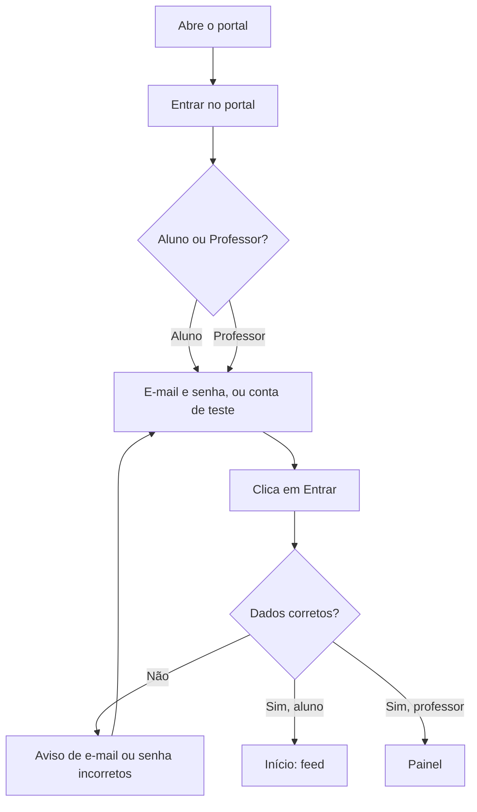

### 4.2 Publicação de Material (PDF) no Feed

Compartilhar um arquivo pedagógico ou resumo com a turma.

1. **Abertura.** Na aba Início, clica em `Material` na caixa de publicação (ou no botão flutuante +).
2. **Seleção de tipo.** Na modal "Nova publicação", confere a aba `Material`.
3. **Categorização.** Escolhe uma disciplina obrigatória (ex.: Biologia).
4. **Preenchimento.** Digita a descrição do material no campo de texto e anexa o arquivo (se não anexar, o Portal gera um PDF com o texto).
5. **Envio.** Clica no botão `Publicar`.

**Resultado.** A modal fecha, exibe o aviso "Material compartilhado · +10 pontos por colaborar com a turma" e insere o card com o arquivo e o botão `Baixar` no topo do Feed, destacado por alguns segundos.

### 4.3 Envio de Dúvida e Recomendação de IA

Submeter uma dúvida acadêmica e consultar recomendações automáticas.

1. **Abertura.** Na aba Início, clica em `Dúvida` na caixa de publicação (ou no botão flutuante +).
2. **Elaboração.** Digita a pergunta (15 ou mais caracteres). A IA sugere a disciplina e as tags ("Parece uma dúvida de Matemática") e o motor de busca semântica exibe automaticamente até 3 dúvidas parecidas já respondidas.
3. **Consulta.** Toca numa dúvida parecida para ver a resposta, se quiser.
4. **Categorização.** Aceita a sugestão (`Usar Matemática`) ou escolhe outra disciplina.
5. **Envio.** Clica em `Publicar` se as sugestões não responderem ao problema.

**Resultado.** A modal fecha e o card de dúvida é publicado no topo da timeline, aguardando respostas e a resposta oficial do professor, que marca a dúvida como "Resolvida". O professor da disciplina recebe a notificação "Nova dúvida". Se a IA estiver fora do ar, a tela avisa "Sugestões indisponíveis no momento. Escolha a disciplina abaixo." e o fluxo segue manual.

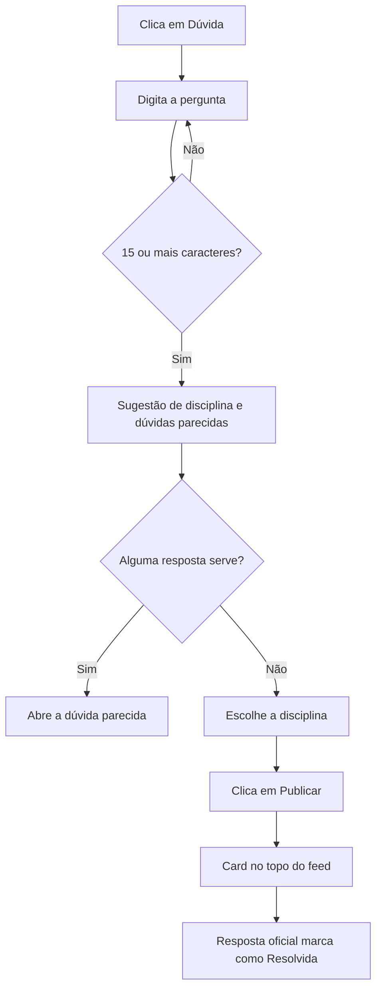

### 4.4 Resgate de Item na Loja (Checkout)

1. No Perfil, clica em `Loja` (ou no saldo do cabeçalho e depois em `Ir para a Loja`) e seleciona o produto desejado (ex.: Fundo verde no avatar, 220 pontos).
2. Abre a modal "Confirmar troca" com **Saldo atual**, **Custo do item** e **Saldo após a troca**, e o lembrete de que trocas não mudam o XP nem a posição no ranking.
3. Clica em `Trocar pontos`. O sistema valida o saldo, debita os pontos, equipa o item no perfil (ou gera o código do voucher para retirar na secretaria) e registra a transação no Histórico. Sem saldo, o botão fica desativado e a modal mostra "Saldo insuficiente: você possui X pontos e este item requer Y pontos."

Itens de avatar e de perfil são únicos (depois da troca, a modal vira "Seu item", com `Equipar` ou `Remover do perfil`). Vouchers podem ser trocados de novo, e cada troca gera um código novo.

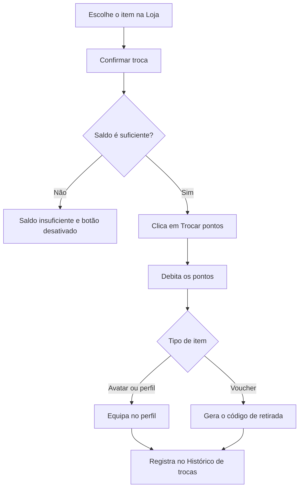

### 4.5 Reporte de Ouvidoria / Moderação

1. Na aba Missões, navega até o card "Relatar problema da escola" e clica em `Abrir relato`.
2. Abre a modal "Relatar problema da escola". Seleciona a categoria (Estrutura, Biblioteca, Merenda, Tecnologia, Convivência ou Outro), escreve o relato (mínimo de 10 caracteres) e clica em `Enviar relato`.
3. A modal fecha, exibe o aviso "Relato enviado para a coordenação" e o relato aparece com o status **Em análise**, aguardando retorno da coordenação (validado, vale +30 pontos; a pessoa recebe uma notificação com o resultado).

### 4.6 Inspeção de Conquistas (Medalhas)

1. Na aba Perfil, abre a aba `Conquistas` e toca em qualquer medalha da galeria.
2. Abre a modal informando o nome da medalha, o estado (**Conquistada** / **Ainda bloqueada**), a data de conquista ou o progresso atual e o critério de desbloqueio, com o lembrete de que medalhas vêm do mérito e não podem ser compradas. Medalha conquistada oferece `Baixar certificado (PDF)`, ao lado de `Fechar` no rodapé da janela (em celular muito estreito, de 320 px, os dois botões empilham).

### 4.7 Sessão de Foco na Sala de Estudos

Estudar com o timer e transformar o tempo em progresso.

1. **Abertura.** Na aba Estudos, escolhe a disciplina e o ritmo (Pomodoro, Profundo ou Livre).
2. **Início.** Opcionalmente descreve o que vai estudar e clica em `Iniciar foco`.
3. **Foco.** Acompanha o anel de tempo; pode `Pausar`, entrar no `Modo imersivo` ou navegar pelo app com o timer visível. Se sair da tela, tem até 5 minutos para voltar e tocar em `Retomar foco`; depois disso o ciclo é descartado ("Foco perdido").
4. **Encerramento.** Ao completar o ciclo (ou em `Encerrar`, depois `Encerrar e salvar`), a sessão é registrada.

**Resultado.** Pontos por minuto (+1) e bônus de +10 por ciclo completo creditados; meta do dia, sequência, ranking de foco e placar do Interclasses atualizados. Blocos com menos de 1 minuto não contam, e o registro manual não vale pontos.

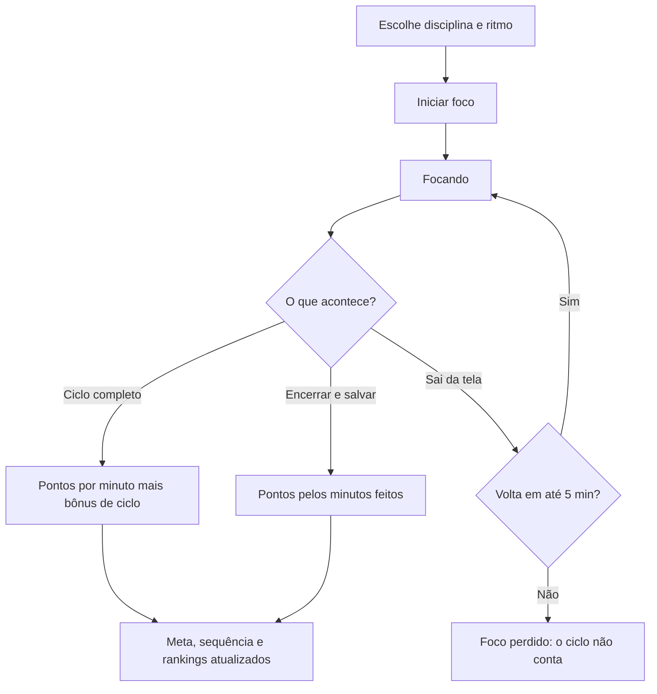

### 4.8 Sala Coletiva

1. Na aba Estudos, clica em `Salas ao vivo` e escolhe uma sala aberta (ou digita um código de convite).
2. Clica em `Entrar na sala` (ou `Entrar e focar`). O timer entra sincronizado com o ciclo da turma. O aluno vê a presença (quem está focando e quem está na pausa) e conversa no "Chat da sala".
3. Clica em `Sair da sala` para encerrar; os minutos focados desde a entrada entram na Sala de Estudos. O bônus de ciclo só vale para o ciclo inteiro.

### 4.9 Duelo em Campeonato

1. Na aba Ranking, abre `Campeonatos` e clica em `Jogar` no destaque do próximo duelo. O duelo abre direto.
2. Abre a tela "Duelo de quiz" com as regras (5 perguntas da disciplina, 20 s cada, empate vence quem teve o menor tempo total) e clica em `Começar duelo`.
3. Responde às perguntas e vê o resultado e os ganhos (XP e, em campeonatos oficiais, pontos). Depois clica em `Ver chaveamento` (ou `Jogar` a fase seguinte, se já estiver liberada). Sair no meio conta a partida como derrota, com os acertos até aqui.

### 4.10 Entrega e Correção de Atividade (Aluno → Professor)

1. **Aluno.** Na aba Missões, em "Atividades do professor", clica em `Entregar`. Escreve a resposta e/ou anexa o arquivo (é preciso pelo menos um dos dois) e confirma com `Entregar` (`Entregar com atraso`, se o prazo passou). O status passa a "Entregue", o card ganha o link "Ver minha entrega (PDF)" e o professor recebe uma notificação.
2. **Professor.** Em Atividades, abre a atividade, vai na aba `Para corrigir` e clica em `Corrigir` na entrega. Define a nota de 0 a 10 e o comentário (há frases prontas) e clica em `Enviar nota` ou `Enviar e próxima`.

**Resultado.** O aluno recebe a notificação com a nota e os pontos e XP proporcionais à nota.

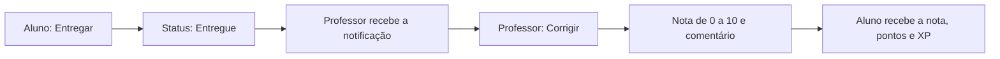

### 4.11 Denúncia e Moderação Humana

1. **Aluno.** No card, abre "Mais opções" e escolhe `Denunciar publicação`. Escolhe o motivo (Bullying, Ofensa, Assédio, Conteúdo inadequado, Spam ou golpe, Outro), descreve se quiser e mantém marcada a captura como evidência.
2. A "Triagem automática" mostra a categoria, a prioridade, a fila de destino e a confiança. Clica em `Enviar denúncia`. Se a IA estiver fora do ar, a denúncia entra na fila com o motivo informado.
3. **Professor ou coordenação.** Em Moderação, vê o caso na fila "Aguardando revisão", toca em `Mostrar conteúdo` e decide `Liberar` ou `Remover` (a remoção exige o motivo). O professor também pode remover publicações de alunos direto pelo feed (4.16). Nenhuma punição é aplicada automaticamente.

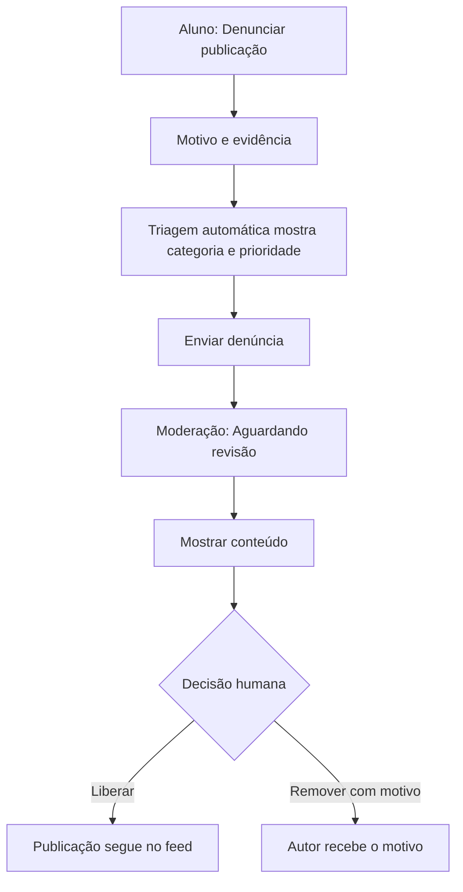

### 4.12 Mensagem direta

**Retirado.** As mensagens diretas foram retiradas do protótipo por decisão da banca (v4). Não existe ícone no cabeçalho, item na barra lateral, atalho em Perfil nem telas de conversa. A conversa entre pessoas acontece no feed (respostas e comentários) e no "Chat da sala" das salas coletivas, que passa pela mesma triagem de ofensas.

### 4.13 Consulta ao calendário

**MVP.** Ver as provas e entregas da semana e não perder prazos.

1. **Abertura.** Toca no ícone de calendário no cabeçalho, que mostra quantos compromissos há nos próximos 7 dias. (O bloco "Próximas provas" do Início, no computador, só lista as 3 próximas provas; não abre o calendário.)
2. **Leitura.** Vê o aviso "Semana cheia" quando há 3 ou mais avaliações e entregas nos próximos 7 dias, o mês com os dias marcados por tipo (Prova, Trabalho, Prazo, Evento) e a lista "Próximos compromissos".
3. **Lembrete.** Ativa o lembrete de um compromisso da lista (sino).

**Resultado.** O aluno recebe notificações 72 h, 24 h e 2 h antes de cada prova ou entrega; tocar na notificação de lembrete abre o calendário. O aviso de semana cheia é uma regra fixa do sistema, não IA.

### 4.14 Feed do professor: publicar aviso

O professor avisa uma turma (ou a escola toda) pelo feed. A regra é a mesma da ação "Publicar aviso" do Painel.

1. **Abertura.** No Feed da escola, usa o atalho `Aviso`, o campo de publicação ou o botão `Publicar aviso` da coluna lateral. A modal "Nova publicação" abre no tipo **Aviso**.
2. **Destino.** Em "Publicar para · obrigatório", escolhe `Toda a escola`, `9º Ano A`, `9º Ano B` ou `8º Ano A`.
3. **Texto.** Escreve o aviso (de 5 a 280 caracteres). A disciplina fica fixa na do professor.
4. **Envio.** Clica em `Publicar`.

**Resultado.** A modal fecha e o toast diz "Aviso publicado para 9º A" e quantos alunos foram notificados. O aviso aparece no topo do feed, nas duas abas. Cada aluno do destino recebe a notificação "Aviso de Prof. Ricardo Nogueira", que abre a publicação. Alunos de outras turmas não veem avisos de 9º B ou 8º A. O professor não ganha pontos por publicar. Se a triagem automática sinalizar o texto, o aviso fica retido e os alunos só são notificados quando ele for liberado na Moderação. O mesmo caminho vale para `Material` (com arquivo real; disciplina obrigatória) e `Publicação`.

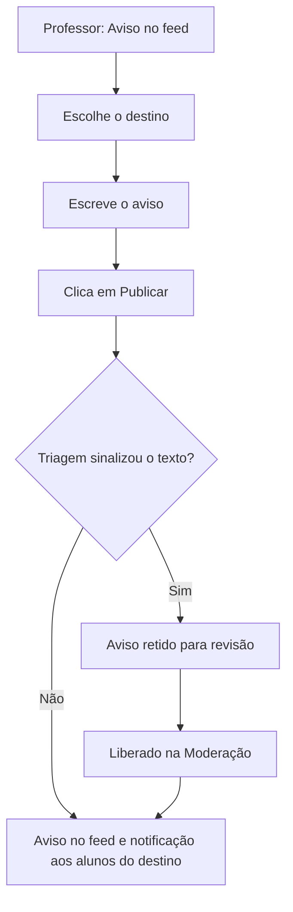

### 4.15 Feed do professor: resposta oficial e "Útil"

1. **Abertura.** No feed, filtra por `Sem resposta` (ou `Dúvidas`) ou usa `Responder` na coluna lateral, que rola até a dúvida e abre a caixa de resposta.
2. **Resposta.** Escreve a resposta (até 600 caracteres; o texto de apoio diz "Sua resposta fica fixada como oficial.") e clica em `Responder`.
3. **Útil.** Em respostas de alunos à mesma dúvida, toca em `Útil` para reconhecer a que ajudou.

**Resultado.** A resposta fica fixada como "Resposta oficial", a dúvida ganha "Resolvida" e o toast diz "Resposta oficial publicada". O aluno autor recebe a notificação e **+20 pontos e +15 XP, uma única vez**: uma segunda resposta oficial não premia de novo. Quem teve a resposta marcada como útil recebe **+25 pontos e +25 XP** e uma notificação. Respostas em publicações e materiais são comentários comuns.

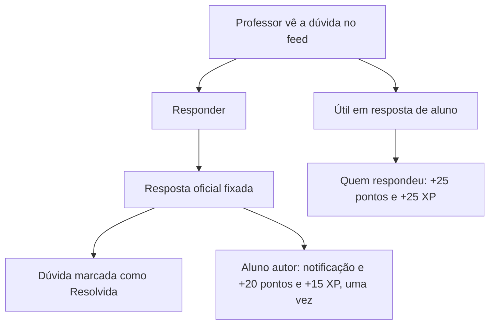

### 4.16 Feed do professor: remover publicação de aluno

1. **Abertura.** No card de uma publicação de aluno, abre "Mais opções" e toca em `Remover publicação`.
2. **Motivo.** Na janela "Remover publicação", lê o texto, escolhe o motivo (obrigatório: Bullying ou ofensa, Assédio, Conteúdo inadequado, Spam ou golpe, Fora do contexto escolar, Outro) e, se quiser, escreve uma observação (até 200 caracteres).
3. **Confirmação.** Clica em `Remover publicação`, no rodapé da janela, ao lado de `Cancelar` (em celular de 320 px os dois botões empilham).

**Resultado.** A publicação some do feed para todos, nas duas abas. O autor recebe a notificação "Sua publicação foi removida", com o motivo. A decisão fica registrada em Moderação › Histórico, como "Removida no feed", e conta nas **Decisões**. Publicações de professores e da coordenação não se removem por aqui. Nenhuma punição é aplicada automaticamente.

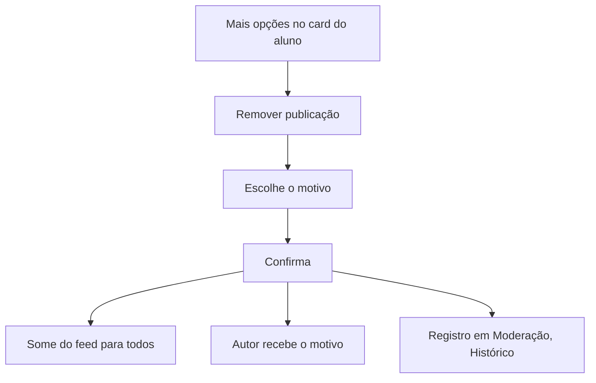

### 4.17 Contestar retenção

O aluno pede que a coordenação reveja uma publicação retida pela triagem automática.

1. **Retenção.** Ao publicar um texto sinalizado, o aluno vê o aviso "Publicação enviada para revisão". O card, visível só para ele, diz "Em revisão pela coordenação. Só você vê esta publicação por enquanto."
2. **Contestação.** Toca em "Isso foi um engano? Conteste aqui". Na janela "Contestar a revisão" ("A coordenação analisa e avisa você"), explica o motivo se quiser (até 300 caracteres) e clica em `Enviar contestação`.
3. **Revisão.** Em Moderação, o item sobe na fila com o selo "Contestada" e a frase da autora. O professor ou a coordenação decide `Liberar` ou `Remover`.

**Resultado.** O card passa a mostrar "Contestação enviada em dd/mm · aguardando revisão". Só cabe uma contestação por publicação. Liberada, a publicação volta a aparecer no feed e o autor é notificado; removida, ele recebe o motivo.

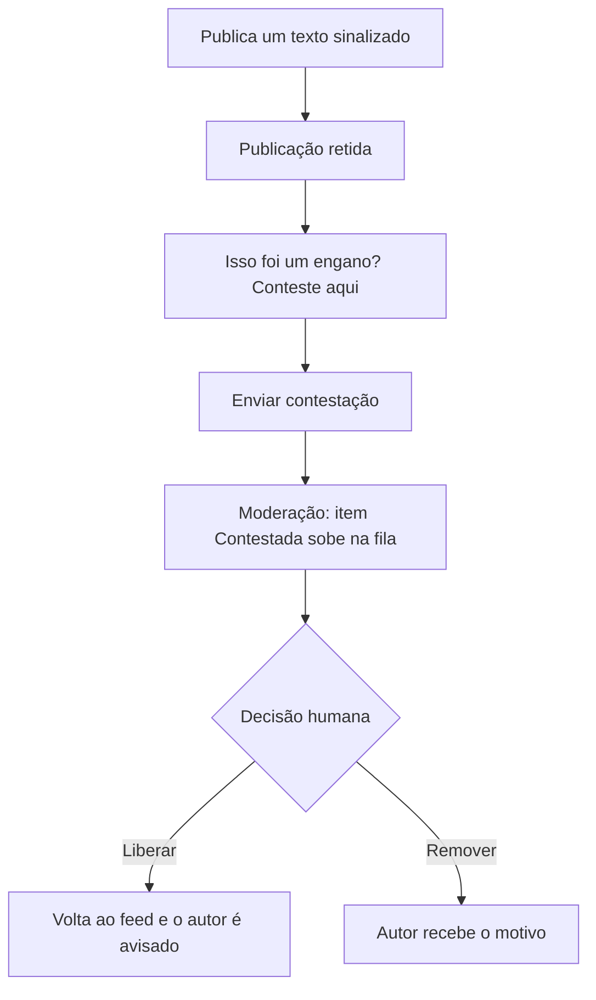

### 4.18 Estatísticas do aluno

Acompanhar o próprio estudo, a evolução e o desempenho.

1. **Abertura.** Abre `Estatísticas` na barra lateral (grupo Você), `Minhas estatísticas` no Perfil ou "Ver minhas estatísticas" na Sala de estudos.
2. **Recorte.** Escolhe o período (7 dias, 30 dias ou Bimestre), a disciplina e as seções que quer ver (Resumo, Foco e estudo, Evolução, Desempenho, Missões e medalhas).
3. **Leitura.** Lê os números e os gráficos de cada seção; cada gráfico tem um resumo em texto.
4. **Relatório.** Clica em `Baixar relatório (PDF)`, que traz as seções visíveis.

**Resultado.** O recorte fica no endereço da página, então o mesmo link volta à mesma visão. Se não houver estudo no período, a tela mostra um estado vazio com o atalho "Iniciar um foco".

### 4.19 Perfil público

Ver quem é uma pessoa e o que ela publicou.

1. **Abertura.** Toca no nome ou no avatar de uma pessoa (em card, resposta, faixa de membros, ranking, campeonato ou notificação). O professor abre o próprio perfil em "Meu perfil", no menu da conta.
2. **Leitura.** Vê nível, medalhas e publicações recentes (aluno), ou disciplina, turmas, materiais e avisos (professor). No próprio perfil da aluna, o XP fica escondido quando ela está no modo anônimo ou invisível.
3. **Feed filtrado.** Toca em `Ver publicações` para abrir o feed filtrado pelo autor ("Publicações de …", com `Limpar`), ou toca numa publicação para abri-la destacada no feed.

**Resultado.** A navegação volta com `Voltar` (ou com o botão do navegador). Link sem pessoa correspondente mostra "Perfil não encontrado".

### 4.20 Sair com envios pendentes

Sair da conta sem perder publicações feitas sem conexão.

1. **Sem conexão.** Com a internet fora (ou simulada), o aluno publica. A faixa "Sem conexão. Tentando retransmitir…" aparece abaixo do cabeçalho, com "N publicação aguardando envio", e o card ganha o selo "Aguardando envio · salvo neste aparelho".
2. **Saída.** Escolhe `Sair` (no menu da conta, na barra lateral, ou em Perfil › Configurações › Conta).
3. **Confirmação.** Se há envios pendentes, a janela "Sair do portal?" diz "Há N ações aguardando envio neste aparelho. Sair mesmo assim?". Sem pendências, sai na hora.
4. **Decisão.** `Continuar no portal` mantém a sessão; `Sair mesmo assim` encerra a sessão e leva ao login.

**Resultado.** Ficando, as publicações são confirmadas quando a conexão volta ("Publicação enviada" ou "N publicações enviadas"). Saindo, a fila de envio daquela pessoa é apagada (só a dela). Com backend configurado, a fila reenvia em 1 s, 2 s, 4 s e assim por diante, até 5 min; um erro do servidor não descarta o pedido, só os 7 dias de validade.

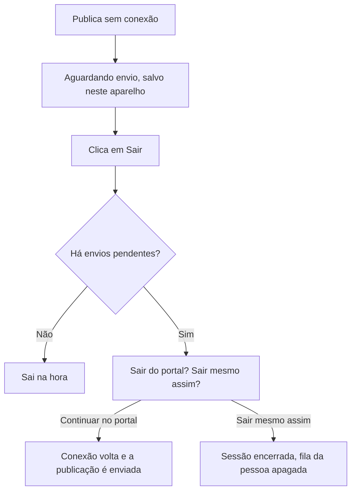

---

## 05 · Escopo do MVP e evolução futura

O Calendário continua no MVP. As **mensagens diretas foram retiradas** do protótipo por decisão da banca. A tabela mostra onde cada funcionalidade do backlog aparece na navegação e qual fluxo a descreve.

| Funcionalidade | Backlog | Situação | Onde aparece | Fluxo |
| --- | --- | --- | --- | --- |
| Feed, dúvidas, materiais e busca | US01–US03 · P0 | MVP | Aba Início | 4.2, 4.3 |
| Mensagens diretas | US01 · P0 | **Retirada (decisão da banca)** | Não existe no protótipo: sem ícone no cabeçalho, sem item na barra lateral e sem atalho em Perfil. A conversa acontece no feed e no chat das salas. | 4.12 (retirado) |
| Calendário | US04 · P1 | MVP | Ícone de calendário no cabeçalho (com contador dos próximos 7 dias); o bloco "Próximas provas" do Início só lista as provas | 4.13 |
| Denúncia e moderação | US05, US06 · P1 | MVP | Menu do post (aluno: denunciar; professor: remover), publicação retida e contestação; Moderação no painel do professor | 4.5, 4.11, 4.16, 4.17 |
| Pontos, XP e sequência | US07 · P1 | MVP | Saldo no cabeçalho; Missões; Perfil → Conquistas; Estatísticas do aluno | 4.7, 4.10, 4.18 |
| Estatísticas do aluno | US07 · P1 | MVP | Estatísticas (barra lateral, grupo Você; botão no Perfil) | 4.18 |
| Painel e estatísticas da turma (regras fixas) | US09A · P2 | Protótipo · P2 | Painel do professor e Estatísticas da turma | — |
| Feed do professor | Pedido do cliente (v8) | Protótipo | Barra inferior "Feed"; barra lateral › Comunidade › Feed da escola | 4.14, 4.15, 4.16 |
| Perfil público e filtro por autor | — | Protótipo | Toque no nome ou avatar de uma pessoa; faixa de membros do feed | 4.19 |
| Envio pendente (sem conexão) | — | Protótipo | Faixa de conexão, selo na publicação e a janela ao sair | 4.20 |
| Loja | US08 · P2 | Protótipo · P2 | Perfil → Loja e saldo no cabeçalho. Está no protótipo para mostrar o ciclo completo, mas fica fora do núcleo do MVP (H5 inconclusiva) | 4.4 |
| Desafios personalizados | US09B · P2 | Protótipo · P2 | Missões → Desafios, com banco fixo de questões. A geração por IA é evolução futura | — |
| Diagnóstico da turma por IA | US09A · P2 | Evolução futura | Previsto no Painel do professor. Hoje o Painel usa regras fixas, sem IA | — |
| Sinalização de IA externa | US10 · P3 | Evolução futura | Sem tela no protótipo; estado desenhado em Wireframes (3.1.3, tela 77) | — |
| Resumo da sala de estudos | Antiga US04 | Evolução futura | Previsto nas Salas coletivas; depende da decisão D1 do backlog | — |

**MVP** = entra na primeira versão. **Protótipo · P2** = já existe no protótipo, mas não faz parte do núcleo da primeira versão. **Protótipo** = existe no protótipo e não tem item próprio no backlog (pedido do cliente ou apoio a outra funcionalidade). **Evolução futura** = especificado, sem implementação nesta fase. **Retirada** = saiu do escopo por decisão da banca.

---

## Atualizações em relação ao PDF

Lista objetiva do que mudou entre `Navegacao_e_Fluxos_Squad38_1.pdf` e o protótipo v8, para a equipe atualizar o PDF.

**Gerais**

- Mensagens diretas retiradas (decisão da banca, v4): saem o ícone do cabeçalho, o item "Mensagens" da barra lateral (grupo Você), o atalho em Perfil → Configurações, a seção 1.6 "Mensagens", o fluxo 4.12 (vira "retirado") e a linha da tabela de escopo ("Retirada").
- Guarda de rotas única no cliente ([`src/lib/guarda.ts`](../../src/lib/guarda.ts)), sem `proxy.ts` nem cookie de papel. Em 4.1, "redirecionado antes de a página aparecer" vira: enquanto a guarda decide, aparece o esqueleto e a página protegida nunca monta. `/feed`, `/estudos/salas`, `/campeonatos` e `/pessoas` são compartilhadas pelos dois perfis. O professor em rota inexistente vê a página 404.
- O app roda no Next (`npm run dev` / `npm start`) e na demonstração em HTML único (`demonstração/Portal_do_Aluno.html`, gerada por `npm run demo`, rotas por hash). A rota `/` só existe no Next; na demo, o título da aba acompanha a tela. O `<title>` do arquivo, antes de o app carregar, é "Portal do Aluno · CEPI Expansão", igual ao título padrão do Next: o gerador ([`scripts/demo/build.mjs`](../../scripts/demo/build.mjs)) lê o nome da escola de [`src/data/escola.ts`](../../src/data/escola.ts) (`ESCOLA.curto`), a mesma fonte do app. São 21 páginas no Next e 20 rotas na demo.
- Teclado nas abas: abas, chips de filtro e controles segmentados trocam com ← e →, Home e End, e só a aba ativa entra no Tab (o PDF não tratava teclado). Rodapés de janela: os botões empilham em vez de quebrar o rótulo quando não cabem lado a lado (telas 49 e 86).
- Sem ranking entre colégios. Os gráficos do aluno ficam em Estatísticas (`/estatisticas`) e os da turma em `/professor/estatisticas`.
- Novas seções: Rotas e acesso por perfil, 1.7 Estatísticas do aluno, 1.8 Perfil público, 1.9 Estados de tela, 2.x numeradas para o professor.

**Navegação e cabeçalho**

- Barra lateral do aluno, grupo Você: Loja, **Estatísticas**, Perfil (sem Mensagens).
- **Navegação do professor** (barra inferior): Painel · **Feed** · Alunos · Atividades · **Estatísticas** (o PDF dizia Painel · Alunos · Atividades · Salas · Campeonatos). Barra lateral: **Turmas** (Painel, Alunos, Atividades, Estatísticas) · **Engajamento** (Salas de estudo, Campeonatos) · **Comunidade** (Feed da escola, Dúvidas, Moderação). Salas, Campeonatos, Dúvidas e Moderação ficam a 1 toque do Painel (bloco "Comunidade e engajamento"). Os títulos dos grupos agora aparecem na barra lateral.
- Cabeçalho do aluno: o número do Calendário conta os compromissos dos próximos 7 dias; no celular há um avatar que abre o Perfil (480 a 1023 px) e o XP some do saldo abaixo de 400 px. Cabeçalho do professor: "Painel do professor", disciplina e turmas, Notificações e menu da conta.
- Painel "Seu saldo": acrescentados os botões "Ir para a Loja" e "Ver ranking" e o texto de cada moeda.

**1.1 Início**

- O menu do card é "Copiar link" (ou "Compartilhar") mais "Denunciar publicação" (aluno) ou "Remover publicação" (professor). O PDF citava só "Denunciar".
- Modal "Material": ícone `Salvar`, `Abrir PDF` e `Baixar` (o PDF dizia "Salvar e Baixar PDF").
- "Resolvida" só aparece com resposta oficial de professor. A resposta oficial tem o botão `Útil` para o autor da dúvida; o autor também vê "Parecidas com a sua" depois de publicar.
- Filtro de membros: o toque filtra a timeline (como o PDF descrevia), e o filtro tem link `/feed?autor=`.
- Busca: campo "Buscar dúvidas e resoluções…", aviso de busca por palavra-chave quando a busca por significado cai, e estado vazio.
- Caixa de publicação: texto do campo e atalhos conforme o código (o botão flutuante só existe no celular e no tablet). Publicação aceita imagem opcional com descrição (texto alternativo).
- Coluna lateral do aluno (a partir de 1280 px): Campeonato em destaque, **Sua semana**, Estudando agora e Próximas provas (o PDF não citava "Sua semana"). O bloco "Próximas provas" não abre o calendário.

**1.2 Estudos**

- Tela "Sala de estudos" com ordem nova: timer, meta do dia, "Estudar com a turma", sessões recentes, ranking de foco e **Interclasses do Foco**. "Salas ao vivo" é um botão no título.
- Métricas viraram uma linha (Hoje, Semana, Sequência) com o link "Ver minhas estatísticas". Os gráficos (Tempo de estudo, Você × turma, Por disciplina, Constância, Horário de pico, Média diária, Maior sessão) saíram da Sala de estudos e vivem em `/estatisticas`.
- "Avançar 5 min (demo)" e "Simular saída da tela (demo)" só aparecem no modo apresentação. A legenda do timer inclui "sair da tela por mais de 5 min perde o ciclo", e há as telas "Você saiu por …" e "Foco perdido".
- Ranking de foco na Sala de estudos mostra o top 5 e o link "Ver tudo".
- Salas coletivas: só contam os minutos desde a entrada e o bônus exige o ciclo inteiro.

**1.3 Missões**

- "Simular ausência" só existe no modo apresentação; as missões renovam de verdade a cada dia.
- Lista real de missões: "Responder 2 dúvidas de colegas", "Acertar 5 flashcards" (qualquer disciplina), "Revisar o mapa mental de Citologia" e "Completar um ciclo de foco". A missão conclui fazendo a tarefa; os botões "+1 progresso" e "Marcar como feita" só aparecem no modo apresentação.
- Flashcards: rodada de 10 cartas por disciplina com repetição espaçada (Leitner), botões `Errei` / `Acertei` (o PDF dizia "Rever depois / Acertei"), cartas próprias, "Carta X de 10" mais revisão das erradas; +10 pontos e +15 XP com pelo menos 1 acerto, no máximo 1 vez por disciplina por dia.
- Desafios: 3 perguntas, +5 pontos e +10 XP por acerto (até +30 XP).
- Missão coletiva: "Contribuir com 10 flashcards" abre uma rodada de flashcards; só acertos em cartas vencidas contam.
- Atividades do aluno ganharam o estado "Atrasada"; a entrega exige texto ou arquivo.

**1.4 Ranking e campeonatos**

- A visibilidade (Público/Anônimo/Invisível) vale para os rankings; nos campeonatos em que o aluno se inscreve, o nome aparece aos participantes (texto na tela).
- Campeonatos: filtro `Meus`, detalhe com chaveamento, certificados e gestão. Pontos corridos de quiz têm 1 rodada por dia, de 5 perguntas, com 10 pontos por acerto (a tela diz o mesmo em Detalhes e no aviso do botão `Jogar rodada`); campeonato sem pontos termina sem campeão; empate desempata por XP.

**1.5 Perfil e Loja**

- O Perfil tem **3 abas** (Publicações, Conquistas, Configurações). A aba "Estudo" virou `/estatisticas` (botão "Minhas estatísticas"). Os números do cabeçalho são Publicações, **Respostas úteis**, Medalhas e Dias seguidos.
- Conquistas não mostram mais o domínio por disciplina (o domínio aparece em Desafios e, para o professor, em Alunos).
- Configurações = Privacidade, Personalização, Aparência e Conta (interruptor "Modo apresentação"; com ele ligado, "Roteiro guiado" e "Ver como professor"; "Apagar dados deste dispositivo"; "Sair"). Não há "Atalhos".
- Loja: o saldo mostra só os pontos e o número de trocas (sem o XP ao lado); a grade tem 2 colunas no celular, 3 de 640 a 1279 px e 4 a partir de 1280 px; vouchers podem ser trocados de novo; "Saldo insuficiente" aparece na modal de troca com a frase completa e o botão desativado.

**1.6 Cabeçalho**

- Seção virou "Painéis do cabeçalho": Calendário (com exportação `.ics` e lembretes 72 h, 24 h e 2 h), Notificações e Saldo.

**02 Área do professor**

- Painel: indicadores Ativos hoje, Estudo por aluno, Domínio médio, Em risco e Para corrigir; ações rápidas; bloco "Comunidade e engajamento"; "Precisa de atenção" (Lembrar, Dar pontos) e "Para corrigir" lado a lado; "Destaques da semana" (Reconhecer os 3); "Atribuições recentes". **Sem gráfico de Engajamento** (os gráficos ficam em Estatísticas). Aviso com destinos Toda a escola, 9º A, 9º B e 8º A (sem clubes).
- **Novo: Feed do professor** (2.3 e fluxos 4.14 a 4.16): Aviso, Material e Publicação com destino obrigatório; resposta oficial; "Útil"; remoção com motivo; filtros próprios; faixa de moderação; coluna lateral.
- Novas telas do professor, que não estão no PDF: Dúvidas (`/professor/duvidas`), Estatísticas da turma (`/professor/estatisticas`, 8 seções, PDF e CSV), exportações (turma em CSV e PDF, boletim em PDF, notas em CSV e PDF por atividade, histórico de moderação em CSV), "Lembrar" com trava de 6 horas, "Dar pontos/XP" em lote e Trocas da loja.
- Moderação: indicadores Na fila, Urgentes e Decisões; abas Publicações, Relatos e Histórico; `Exportar histórico (CSV)`; selo "Contestada"; remoções feitas pelo feed.
- Salas e Campeonatos do professor: "Criar sala oficial", aba "Criados por mim" e o bloco Resumo.

**03 Modal "Nova publicação"**

- A variante do professor (tipos Aviso, Material e Publicação; destino obrigatório; disciplina fixa nos tipos sem material) é nova.
- Material envia arquivo real (guardado no navegador) ou gera um PDF com o texto; o exemplo "material.pdf · 96 KB · arquivo de exemplo" não existe mais.
- Sugestões da IA a partir de **15** caracteres (">15" vira "15 ou mais"). O aviso de recompensa diz "+10 pontos quando **um colega** responder e +20 pontos e +15 XP com a resposta oficial".
- O botão `Publicar` não fica mais desativado: erros de campo aparecem ao lado ("Escolha uma disciplina.", "Escolha onde publicar.", "Escreva pelo menos 15 caracteres (faltam N).").
- Limites: 600 caracteres (aviso: 280); imagem opcional com descrição.

**04 Fluxos**

- **4.1** guarda no cliente, "Usar conta de teste" (o PDF dizia "Acesso de demonstração") e recuperação de senha.
- **4.2** o card fica destacado por alguns segundos.
- **4.3** ">15 caracteres" vira "15 ou mais"; aviso quando a IA está fora do ar; notificação ao professor.
- **4.4** sem saldo, a frase é "Saldo insuficiente: você possui X pontos e este item requer Y pontos." e o botão fica desativado; vouchers podem ser trocados de novo.
- **4.6** medalha conquistada oferece o certificado em PDF (botão ao lado de `Fechar`).
- **4.7** regra de saída da tela (5 min) e "Foco perdido".
- **4.8** os minutos contam desde a entrada.
- **4.9** "Jogar" abre o duelo direto; sair no meio conta a partida como derrota.
- **4.11** o professor também remove pelo feed.
- **4.12** retirado.
- **4.13** lembretes 72 h, 24 h e 2 h; o bloco "Próximas provas" não abre o calendário.
- **Novos:** 4.14 (aviso do professor), 4.15 (resposta oficial e "Útil"), 4.16 (remover publicação), 4.17 (contestar retenção), 4.18 (estatísticas do aluno), 4.19 (perfil público) e 4.20 (sair com envios pendentes).

**05 Escopo**

- Mensagens diretas: "Retirada (decisão da banca)". Calendário: o bloco "Próximas provas" só lista as provas. Desafios: banco fixo. US09A, US10 e o resumo da sala continuam como evolução futura. Linhas novas: Estatísticas do aluno, Painel e estatísticas da turma (regras fixas), Feed do professor, Perfil público e Envio pendente. A legenda ganhou "Protótipo" e "Retirada".
